# Divine 机器配方执行完整流程

## 概述

本文档描述带有并行控制器的 Divine 机器从接收配方到完成配方并进入排放态的完整流程。

---

## 1. 主流程图 — serverTick 事件总线

基于 `GoblinOracleOfScripture`（继承自 `RecipeLogic`）的 `serverTick()` 事件分支，
展示配方执行的完整生命周期。

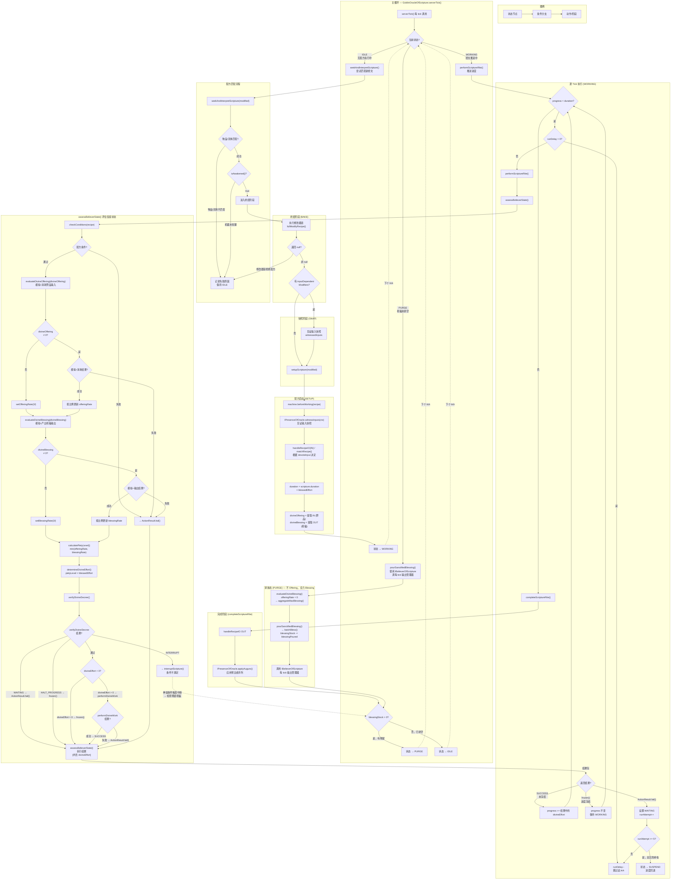

> **注**：PURGE 是主循环中的一等状态，与 IDLE、WORKING 同级。`blessingStock > 0` 的判断统一在 MAIN 的 `CHECK_PURGE` 节点完成，所有路径（配方完成输出后、中断配方后、排放完毕后）均汇聚至此。只需在机器类或神谕者中实现 `IBelieverOfScripture` 的每 tick 输出管理方法，无需接入 GTM 的 `handleTickRecipeIO`。

---

## 2. 烘焙阶段详解 (BAKE)

### 2.1 整体管线流程

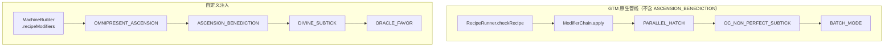

> **注意**：`ASCENSION_BENEDICTION` 和 `DIVINE_SUBTICK` 是 GTM **管线外的自定义修改器**。GTM 原生管线仅包含 `PARALLEL_HATCH → OC_NON_PERFECT_SUBTICK → BATCH_MODE`。Divine 机器在上述位置替换注入：`ASCENSION_BENEDICTION` 替代超频逻辑（有损），`DIVINE_SUBTICK` 替代 subtick 逻辑（无损），`ORACLE_FAVOR` 替代批处理逻辑（经文神谕者的小帮忙）。

### 2.2 修改器链执行机制

**调用入口：**

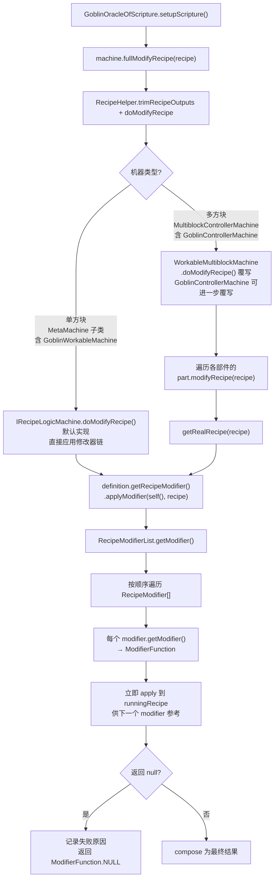

> **注意**：`verifyDivineDecree()` 祭品/祝福守卫检查不在 `doModifyRecipe()` 阶段，而是在逐 tick 执行的 `GoblinOracleOfScripture.assessBelieverState()` 中调用。`GoblinWorkableMachine` 和 `GoblinControllerMachine` 都遵循与普通机器相同的修改器链流程，区别仅在于单方块 vs 多方块的继承结构。

### 2.3 链式执行规则

来自 `RecipeModifierList.getModifier()` 的 4 步递进，定义了修改器之间的配合顺序。

```mermaid
flowchart TD
    S0["RecipeModifier[] = [OMNIPRESENT_ASCENSION, ASCENSION_BENEDICTION, DIVINE_SUBTICK, ORACLE_FAVOR]"]

    subgraph S1_STEP["Step 1: OMNIPRESENT_ASCENSION"]
        S1["getModifier(recipe)"] --> S1a
        S1a{"machine instanceof<br/>IOmnipresentAvatar?"}
        S1a -->|"否"| S1_id["IDENTITY"]
        S1a -->|"是"| S1b["avatarLimit = avatar.getOmnipresentAvatarLimit()"]
        S1b --> S1c["avatarCount = GoblinOracleOfOmnipresence<br/>.getOmnipresentAvatarCount(machine, scripture, avatarLimit)"]
        S1c --> S1d{"avatarCount >= 1?"}
        S1d -->|"否"| S1_reject["ModifierFunction.NULL"]
        S1d -->|"是"| S1e["ModifierFunction A<br/>设置 parallels = avatarCount<br/>+ multiplyContents(avatarCount)"]
        S1e --> S1f["runningRecipe = A.apply(recipe)"]
    end

    subgraph S2_STEP["Step 2: ASCENSION_BENEDICTION"]
        S2["getModifier(runningRecipe)"] --> S2a
        S2a{"machine instanceof<br/>IAscensionBlessed?"}
        S2a -->|"否"| S2_id["IDENTITY"]
        S2a -->|"是"| S2b["postParallelDemand = CAP.extractDemand()<br/>avatarCount = recipe.parallels<br/>unitDemand = postParallelDemand / avatarCount"]
        S2b --> S2c["scriptureRank = floor(log4(unitDemand / 8))<br/>devotionGrade = blessed.getDevotionGrade()<br/>maxOffering = ScriptureAptitude.CAP<br/>.getMaxOffering(machine)<br/>ascendTimes = floor(log4(maxOffering / postParallelDemand))"]
        S2c --> S2d1{"scriptureRank > devotionGrade?"}
        S2d1 -->|"是"| S2_reject1["ModifierFunction.NULL<br/>rank_exceeds_devotion"]
        S2d1 -->|"否"| S2d2{"ascendTimes?"}
        S2d2 -->|"小于 0"| S2_reject2["ModifierFunction.NULL<br/>insufficient_offering"]
        S2d2 -->|"等于 0"| S2_id
        S2d2 -->|"大于 0"| S2_loop["subtickOverflow = 0<br/>remaining = ascendTimes"]
        S2_loop --> S2_loop_check{"remaining > 0?"}
        S2_loop_check -->|"否"| S2_apply["ModifierFunction B<br/>demand ×= 4^applied<br/>yield ×= 4^applied<br/>duration ×= 0.5^applied<br/>recipe.subtickOverflow = overflow"]
        S2_loop_check -->|"是"| S2_ovf_check{"duration × 0.5 < 1?"}
        S2_ovf_check -->|"否"| S2_normal["duration ×= 0.5<br/>demand ×= 4<br/>yield ×= 4<br/>remaining -= 1<br/>applied += 1"]
        S2_ovf_check -->|"是，溢出！"| S2_ovf["subtickOverflow = remaining<br/>循环结束"]
        S2_normal --> S2_loop_check
        S2_ovf --> S2_apply
        S2_apply --> S2f["runningRecipe = B.apply(runningRecipe)"]
    end

    subgraph S3_STEP["Step 3: DIVINE_SUBTICK"]
        S3["getModifier(runningRecipe)"]

        S3 --> S3_type{"machine instanceof<br/>IBelieverOfScripture?"}
        S3_type -->|"否"| S3_id["IDENTITY"]
        S3_type -->|"是"| S3_read["subtickOverflow =<br/>recipe.subtickOverflow"]
        S3_read --> S3_check{"subtickOverflow > 0?"}
        S3_check -->|"否"| S3_id
        S3_check -->|"是"| S3_calc["subtickParallel =<br/>2^subtickOverflow<br/>cap at maxSubtickCount"]
        S3_calc --> S3_check2{"subtickParallel > 1?"}
        S3_check2 -->|"否"| S3_id
        S3_check2 -->|"是"| S3_apply["ModifierFunction C<br/>input ×= subtickParallel<br/>output ×= subtickParallel<br/>duration 不变"]
        S3_apply --> S3_final["runningRecipe = C.apply(runningRecipe)"]
        S3_id --> S3_final
    end

    subgraph S4_STEP["Step 4: ORACLE_FAVOR — 神谕恩惠"]
        S4["getModifier(runningRecipe)"]
        S4 --> S4a["ModifierFunction D<br/>神谕恩惠<br/>打包短经文"]
        S4a --> S4b["runningRecipe = D.apply(runningRecipe)"]
    end

    S1f --> S2
    S2_id --> S3
    S2f --> S3
    S3_final --> S4
    S4b --> S5["最终 result =<br/>D ∘ C ∘ B ∘ A"]
    S5 --> S5a["apply 时按 A→B→C→D 顺序执行"]
```

> 为什么需要 `runningRecipe` 逐级传递？因为每个 modifier 的 `getModifier()` 需要看到前一个修改后的配方来做判断。例如 `ASCENSION_BENEDICTION` 需要知道 `PARALLEL_HATCH` 已经确定了多少 `parallels`，才能正确计算 `totalDuration`。

### 2.4 遍在化现 (OMNIPRESENT_ASCENSION)

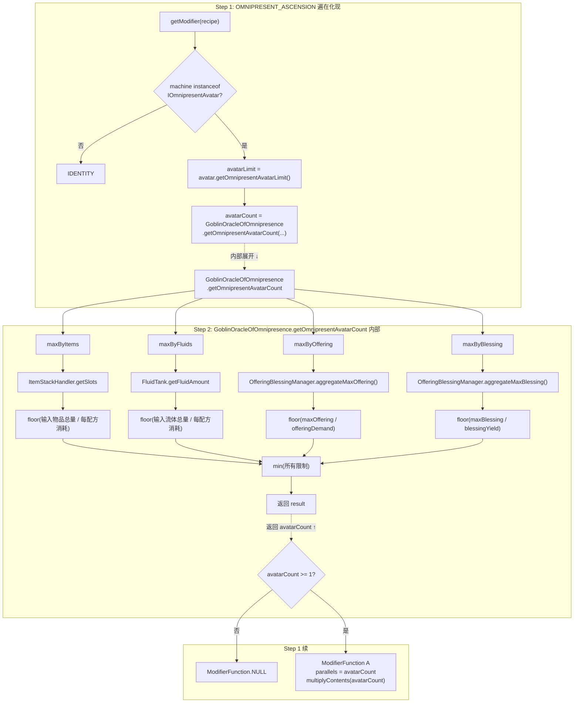

**祭品输入限制计算流程：**

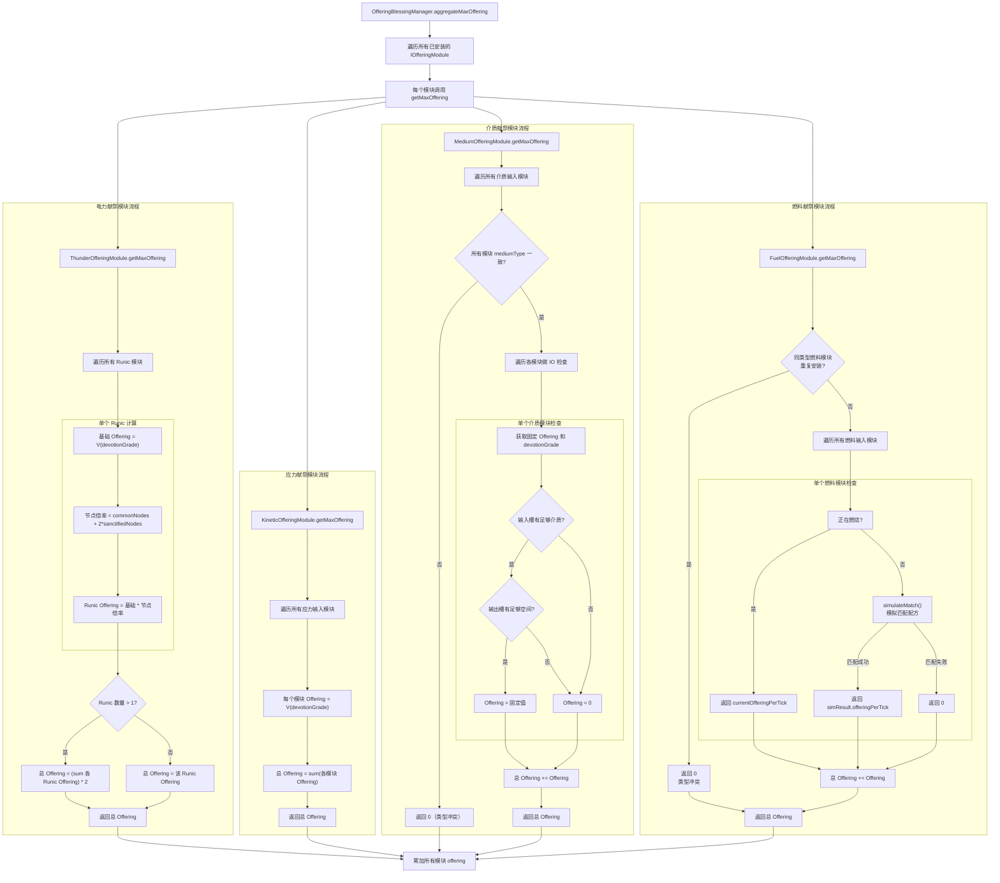

**规划中的献祭模块类型：**

| 模块类型 | 职责 |
|---------|------|
| `ThunderOfferingModule` | 电力献祭模块，管理 Runic 阵列 |
| `KineticOfferingModule` | 应力献祭模块，管理应力输入模块 |
| `FuelOfferingModule` | 燃料献祭模块，管理燃料输入模块 |
| `MediumOfferingModule` | 介质献祭模块，管理介质输入模块 |

**电力献祭模块计算规则：**

1. **单个 Runic 的 Endurance 计算：**
   - 基础 Endurance = `V[devotionGrade]`（ULV=8, LV=32, MV=128, HV=512...）
   - 节点倍率 = `commonRunicNodes + 2 × sanctifiedRunicNodes`
   - Runic Endurance = 基础 Endurance × 节点倍率

2. **电力献祭模块总 Endurance：**
   - 若 Runic 数量 > 1：总 Endurance = (Σ各 Runic Endurance) × 2
   - 若 Runic 数量 = 1：总 Endurance = 该 Runic Endurance

3. **电力献祭模块的 devotionGrade：**
   - 基础值 = 所有 Runic 的 devotionGrade 中的最大值
   - 若至少有两个 Runic 同时达到最大值：额外 +1

4. **OfferingBlessingManager 的总 devotionGrade：**
   - 取所有献祭模块的 devotionGrade 中的最大值

**示例：**

| 配置 | 总 devotionGrade | ThunderOfferingModule.getMaxOffering |
|------|-----------------|--------------------------------------|
| LV 单 Runic + 1 commonNode | LV (1) | 32 × 1 = 32 |
| LV 单 Runic + 1 sanctifiedNode | LV (1) | 32 × 2 = 64 |
| LV 单 Runic + 4 sanctifiedNodes | LV (1) | 32 × 8 = 256 |
| LV 4联 sanctified + MV 单 common | MV (2) | (32×8 + 128×1) × 2 = 768 |
| 4个 LV 4联 sanctified | MV (2) | (4 × 32 × 8) × 2 = 2048 |

**应力献祭模块计算规则：**

1. **单个应力输入模块的 Bosom** = `V[devotionGrade]`（ULV=8, LV=32, MV=128, HV=512...）
2. **应力献祭模块总 Bosom** = sum(各应力输入模块的 Bosom)
3. **应力献祭模块的 devotionGrade** = 各应力输入模块的 devotionGrade 中的最大值

> **注意**：应力献祭模块**不支持**多模块倍增机制，无论安装多少个应力输入模块，总 Bosom 仅为简单求和，不会触发额外倍率。

**介质献祭模块计算规则：**

1. **介质输入模块属性**（固定配置）：
   - `mediumType`：介质类型标识（如 `"steam"`、`"lava"`、`"water"` 等）
   - 固定 Bosom：模块定义时确定的固定值
   - 固定 devotionGrade：模块定义时确定

2. **互斥规则**（双层防护）：
   - **安装时**：检查机器是否已安装其他 `mediumType` 的介质输入模块，若已安装则禁止安装
   - **运行时**：`getMaxOffering()` 先检查所有已安装介质输入模块的 `mediumType` 是否一致，若不一致则直接返回 0（全部失效）

3. **模块安装时**：同时注册对应的介质输入/输出 IO 槽

4. **单个介质输入模块的有效 Offering**：
   - 输入槽有足够一 tick 消耗的介质
   - 输出槽有足够一 tick 输出的空间
   - 两者都满足：Offering = 固定值
   - 任一不满足：Offering = 0

5. **介质献祭模块总 Offering** = sum(所有模块的 Offering)<br/>（类型冲突时直接返回 0，无效模块返回 0 参与求和）

6. **介质献祭模块的 devotionGrade** = 各介质输入模块的 devotionGrade 中的最大值

> **注意**：介质献祭模块**不支持**多模块倍增机制，且同一机器只能安装一种介质类型，混装会导致全部失效。

**燃料献祭模块计算规则：**

1. **燃料输入模块属性**：
   - `fuelRecipeType`：支持的配方类型，可选 `COMBUSTION_GENERATOR_FUELS`（内燃）、`GAS_TURBINE_FUELS`（燃气）、`SEMIFLUID_GENERATOR_FUELS`（半流质）
   - `fluidTank`：流体燃料输入槽
   - `devotionGrade`：模块安装时确定的设备等级（如 MV=2、HV=3、EV=4）
   - 每个模块类型**最多安装一个**（内燃/燃气/半流质各一）

2. **两阶段燃料处理机制**：

   **第一阶段 — `simulateMatch()`（模拟匹配）**：
   - 在 `evaluateDivineOffering()` 阶段调用，**不消耗燃料**
   - 遍历所有燃料输入模块，调用 `RecipeHelper.matchRecipe()` 匹配 `fuelRecipeType` 对应的配方
   - 匹配成功时，计算理论 offeringPerTick = `recipe.duration × recipe.demand / recipe.duration`（即单位时间产出）
   - 返回 `SimulateResult` 包含：是否匹配成功、offeringPerTick、匹配到的配方引用
   - 实现 `IRecipeCapabilityHolder` 以利用 `RecipeHelper.matchRecipe()`，使用 dummy EU handler 绕过输出检查

   **第二阶段 — `ignite()`（实际点燃）**：
   - 在 `performDivineWork()` 阶段调用，**实际消耗燃料**
   - 接收 `simulateMatch()` 返回的配方 + 根据 `min(offeringRate, blessingRate)` 确定的燃烧倍率
   - 消耗 `multiplier × unitConsumption` 的燃料
   - 设置燃烧状态：`activeRecipe`、`remainingBurnTicks = duration`、`currentOfferingPerTick`
   - **一旦点燃，燃烧过程中不动态调整**（设计意图：燃料模块相对难用）

3. **燃烧状态管理**：

   | 状态字段 | 说明 |
   |---------|------|
   | `activeRecipe` | 当前燃烧的配方引用，null 表示未在燃烧 |
   | `remainingBurnTicks` | 剩余燃烧刻数，每 tick 递减 |
   | `currentOfferingPerTick` | 当前每刻产出的 Offering 量 |

   - `tickOffering()`：每 tick 调用，`remainingBurnTicks > 0` 时递减并返回 `currentOfferingPerTick`
   - 燃烧结束后：清除状态（`activeRecipe = null`），等待下次 `ignite()`

4. **Offering 计算规则**（`FuelOfferingModule.getMaxOffering()`）：
   - **互斥规则**：检查所有已安装的燃料输入模块是否有同类型（`fuelRecipeType`）重复安装，若有则直接返回 0（类型冲突）
   - 正在燃烧：直接返回 `currentOfferingPerTick`
   - 未燃烧时调用 `simulateMatch()`：
     - 匹配成功 → 返回 `simResult.offeringPerTick`（理论值，不消耗燃料）
     - 匹配失败 → 返回 0

5. **Offering 产出计算**（在 `performDivineWork()` 中）：
   - `actualOffering = min(offeringRate, blessingRate)` 确定实际用的 Offering 比例
   - `ignite()` 时的燃烧倍率 = `max(1, floor(actualOffering / unitOfferingPerTick))`
   - 如果 `blessingRate` 较低（祝福输出堵塞），则燃烧倍率降低，消耗更少燃料
   - 示例：MV 级内燃发电机配方，`offeringRate = 4.0`，`blessingRate = 2.0` → `actualOffering = 2.0` → 仅 2 倍消耗（而非 4 倍）

6. **燃料输入模块的 `devotionGrade`**：
   - 由模块安装时基于机器的 `machineTier` 确定
   - `FuelOfferingModule` 的 `devotionGrade` = 各燃料输入模块的 `devotionGrade` 中的最大值

> **注意**：燃料献祭模块**不支持**多模块倍增机制。`ignite()` 一旦发起，整轮燃烧期间不受祝福输出波动的影响，体现了燃料模块"一次点燃，烧完为止"的难用设计。

### 2.5 升腾烘焙 (ASCENSION_BENEDICTION)

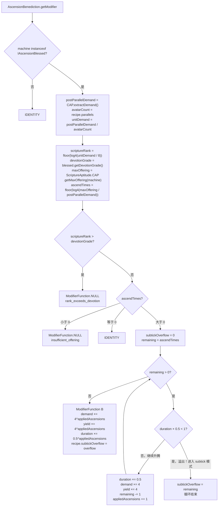

**关键逻辑说明：**

> ASCENSION_BENEDICTION 对标 GTM 的 `PERFECT_OVERCLOCK_SUBTICK`（参考 `OverclockingLogic.subTickParallelOC`）：当正常升腾导致 `duration × 0.5 < 1` 时，**停止减少 duration**，将剩余升腾次数记录为 `subtickOverflow`。后续由 `DIVINE_SUBTICK` 将溢出转化为并行补偿。

**devotionGrade 说明：**
- `devotionGrade` 是机器的**固定基础等级**（如 LV=1、MV=2、HV=3），**不受增益影响**。
- 由 `IAscensionBlessed.getDevotionGrade()` 直接返回。

**maxOffering 说明：**
- `maxOffering` 是机器的**实际祭品上限**（基础上限 × 增益）。
- 由 `ScriptureAptitude.CAP.getMaxOffering(machine)` 计算返回（内部调用 `OfferingBlessingManager.aggregateMaxOffering()`）。

**升腾参数计算公式：**

| 参数 | 公式 |
|------|------|
| 经文位阶 | `scriptureRank = floor(log4(unitDemand / 8))` |
| 升腾次数 | `ascendTimes = floor(log4(maxOffering / postParallelDemand))` |
| 有效升腾次数 | `appliedAscensions`：升腾循环中逐次判断 `duration × 0.5 ≥ 1` 的次数 |
| 溢出次数 | `subtickOverflow = ascendTimes - appliedAscensions`：因 duration 将低于 1 而转入 subtick 的剩余次数 |
| 每单位需求（升腾后） | `demand ×= 4^appliedAscensions` |
| 每单位产出（升腾后） | `yield ×= 4^appliedAscensions` |
| 每单位时长（升腾后） | `duration ×= 0.5^appliedAscensions` |

> **有损含义**：`ASCENSION_BENEDICTION` 采用有损路线：duration × 0.5^oc，demand/yield × 4^oc，即升腾后吞吐量提升（2x）慢于资源消耗速度（4x）。当 duration 无法再减半时，溢出升腾转为 subtick 并行（无损补偿）。

### 2.6 神圣子 tick (DIVINE_SUBTICK)

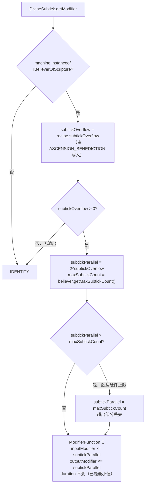

**参数说明：**

| 参数 | 来源 | 说明 |
|------|------|------|
| `subtickOverflow` | `ASCENSION_BENEDICTION` 写入 `recipe` | 升腾循环中因 `duration × 0.5 < 1` 而溢出的剩余升腾次数 |
| `subtickParallel` | `2^subtickOverflow` | 将溢出升腾转化为并行份数，每溢出 1 次升腾 = 2 倍并行 |
| `maxSubtickCount` | 机器硬件上限（如 1024） | subtick 并行数的硬件上限，超出部分丢失 |

**与 ASCENSION_BENEDICTION 的关系：**

- ASCENSION_BENEDICTION 在升腾循环中逐次判断 `duration × 0.5 < 1`，一旦触发即停止正常升腾，将剩余次数记为 `subtickOverflow`
- DIVINE_SUBTICK 读取 `subtickOverflow`，将其转化为 `subtickParallel = 2^subtickOverflow` 的并行补偿
- 并行补偿意味着配方在单 tick 内同时执行 `subtickParallel` 份，即 `input ×= subtickParallel`、`output ×= subtickParallel`
- 这是**无损补偿**：溢出的升腾本应进一步减少 duration（但有损于吞吐量），转为 subtick 后以并行方式弥补，且不额外延长 duration

> **对比原版**：GTM 的 `PERFECT_OVERCLOCK_SUBTICK`（`OverclockingLogic.subTickParallelOC`）在超频循环中，当 `duration × durationFactor < 1` 时，将剩余超频次数转化为并行（`parallel = 1 / durationFactor`）。Divine 的 `DIVINE_SUBTICK` 遵循相同逻辑：`subtickParallel = 2^subtickOverflow`（因为 divine 的 durationFactor = 0.5，1/0.5 = 2）。

### 2.7 神谕恩惠 (ORACLE_FAVOR)

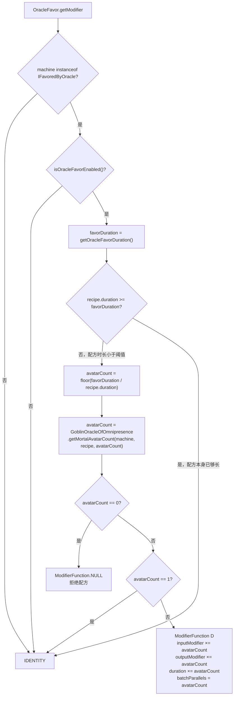

**参数说明：**

| 参数 | 来源 | 说明 |
|------|------|------|
| `favorDuration` | `IFavoredByOracle.getOracleFavorDuration()` | 神谕恩惠的参考时长阈值，短于此值 |
| `avatarCount` | `GoblinOracleOfOmnipresence.getMortalAvatarCount()` | 排除 EU 和 Divine 资源后仅凭世俗资源能打包的份数 |
| `getMortalAvatarCount` | 同时排除了 `EURecipeCapability.CAP` 和 `ScriptureAptitude.CAP` | 确保祭品/祝福不参与打包限制 |

**与 OMNIPRESENT_ASCENSION 的区别：**

| 对比维度 | OMNIPRESENT_ASCENSION | ORACLE_FAVOR |
|---------|----------------------|-------------|
| 触发条件 | 任何配方 | 仅短时长配方（duration < favorDuration） |
| 限制范围 | 所有资源（物品、流体、祭品、祝福） | 仅世俗资源（物品、流体） |
| 结果 | 完整遍在化现，所有资源 × avatarCount | 批量打包，不改变祭品/祝福消耗 |

### 2.8 接口定义

#### 2.8.1 IOmnipresentAvatar（可遍在化现的机器）

```java
package com.goblincoders.goblintech.api.machine.feature;

import com.gregtechceu.gtceu.api.machine.feature.IMachineFeature;

/**
 * 可同时显现多份化身执行工作的机器。
 * 为 OMNIPRESENT_ASCENSION 修改器提供化身上限。
 */
public interface IOmnipresentAvatar extends IMachineFeature {

    /**
     * @return 最大遍在化现数量
     */
    int getOmnipresentAvatarLimit();

    /**
     * @return 祭品祝福管理器，供 OMNIPRESENT_ASCENSION 中 GoblinOracleOfOmnipresence 调用
     */
    OfferingBlessingManager getOfferingBlessingManager();
}
```

#### 2.8.2 IAscensionBlessed（蒙祝福可升腾的机器）

```java
package com.goblincoders.goblintech.api.machine.feature;

import com.gregtechceu.gtceu.api.machine.feature.IMachineFeature;

/**
 * 被神祇赐福可执行倍率提升工作的机器。
 * 为 ASCENSION_BENEDICTION 修改器提供虔诚等级和祭品上限。
 */
public interface IAscensionBlessed extends IMachineFeature {

    /**
     * 虔诚等级 — 信徒的基础信仰位阶（LV=1、MV=2、HV=3...）。
     * 不受增益影响。
     *
     * @return 虔诚等级
     */
    int getDevotionGrade();

    /**
     * @return 祭品祝福管理器，供 ASCENSION_BENEDICTION 调用 aggregateMaxOffering() 等
     */
    OfferingBlessingManager getOfferingBlessingManager();
}
```

#### 2.8.3 IBelieverOfScripture（经文信徒）

```java
public interface IBelieverOfScripture extends IRecipeLogicMachine, IOmnipresentAvatar, IAscensionBlessed {
    // ... 原有方法保持不变
    // 详见第 7 部分接口总结
}
```

#### 2.8.4 IPresenceOfOracle（神谕在场）

```java
package com.goblincoders.goblintech.api.machine.feature;

import com.gregtechceu.gtceu.api.machine.feature.IMachineFeature;
import com.goblincoders.goblintech.api.recipe.Augur;
import com.goblincoders.goblintech.api.recipe.ScriptureContext;

import java.util.List;

/**
 * 声明此机器支持预言者（Augur）的介入。
 *
 * <p>当 GoblinScripture（哥布林经文）带有预言者时，setupScripture 会检查
 * 机器是否实现此接口——未实现则拒绝仪式。
 *
 * <p>两个职责：
 * <ul>
 *   <li>{@link #witnessInputs} — after beforeWorking, before handleRecipeIO(IN)（见证输入快照）</li>
 *   <li>{@link #applyAugurs} — after handleRecipeIO(OUT)（应用预言者）</li>
 * </ul>
 */
public interface IPresenceOfOracle extends IMachineFeature {

    /**
     * 见证当前输入槽位内容到 ctx，供预言者读取。
     * 调用时机：beforeWorking 之后、handleRecipeIO(IN) 之前。
     * 允许机器在 beforeWorking 中修改输入后再见证。
     */
    void witnessInputs(ScriptureContext ctx);

    /**
     * 遍历输出槽位，逐个应用预言者序列。
     * 调用时机：completeScriptureRite 中 handleRecipeIO(OUT) 之后。
     *
     * <p>默认实现：遍历 getCapabilitiesProxy().get(IO.OUT)，
     * instanceof NotifiableItemStackHandler → getSlots/getStackInSlot/setStackInSlot，
     * instanceof NotifiableFluidTank → getTanks/getFluidInTank/setFluidInTank。
     * 机器可覆写以适配非标准槽位结构。
     */
    default void applyAugurs(List<Augur> augurs, ScriptureContext ctx) {
        // 默认实现遍历输出槽位并应用预言者
    }
}
```

#### 2.8.5 IFavoredByOracle（蒙神谕恩惠者）

```java
package com.goblincoders.goblintech.api.machine.feature;

import com.gregtechceu.gtceu.api.machine.feature.IMachineFeature;

/**
 * 蒙神谕恩惠者 — 被经文神谕者青睐的机器。
 * 为 ORACLE_FAVOR 提供批处理开关，仅受物品/流体限制，不受神力资源影响。
 * 神谕恩惠：经文神谕者不忍心频繁惊扰 serverTick 大神，
 * 于是施以恩惠，将多份短经文打包成一份长经文，一次性呈递。
 */
public interface IFavoredByOracle extends IMachineFeature {

    boolean isOracleFavorEnabled();

    void setOracleFavorEnabled(boolean enabled);

    default int getOracleFavorDuration() {
        return ConfigHolder.INSTANCE.machines.batchDuration;
    }
}
```

### 2.9 烘焙计算示例

**基础示例（无 subtick，无恩惠）：**

```
原始配方：demand=32/unit, yield=16/unit, duration=100
机器：HV (machineTier=3), devotionGrade=3, maxBosom=512, maxEndurance=1024
物品输入可支持 parallels=4

Step 1: OMNIPRESENT_ASCENSION
  → avatarCount = 4
  → totalDemand = 128, totalYield = 64, parallels = 4

Step 2: ASCENSION_BENEDICTION
  → postParallelDemand = 128, unitDemand = 32
  → scriptureRank = floor(log4(32 / 8)) = floor(log4(4)) = 1
  → devotionGrade = 3, rank(1) ≤ 3 ✅
  → ascendTimes = floor(log4(512 / 128)) = floor(log4(4)) = 1
  → 升腾循环：duration × 0.5 = 100 × 0.5 = 50 ≥ 1 → 正常升腾
  → appliedAscensions = 1, subtickOverflow = 0
  → perUnitDemand = 32 × 4^1 = 128
  → perUnitYield  = 16 × 4^1 = 64
  → perUnitDuration = 100 × 0.5^1 = 50
  → totalDuration = 50 × 4 = 200

Step 3: DIVINE_SUBTICK
  → subtickOverflow = 0 → IDENTITY

Step 4: ORACLE_FAVOR
  → favorDuration = 200 (来自 IFavoredByOracle)
  → recipe.duration = 200 ≥ 200 → 无需打包 → IDENTITY

最终：
  - 4 个化身
  - 每化身 demand=128, yield=64, duration=50, 总 duration=200
```

**进阶示例（触发 subtick + 恩惠）：**

```
原始配方：demand=4/unit, yield=8/unit, duration=6
机器：HV, devotionGrade=3, maxBosom=4096, maxEndurance=256, maxSubtickCount=1024
物品可支持 parallels=8, favorDuration=200

Step 1: OMNIPRESENT_ASCENSION
  → maxByOffering = floor(4096 / 4) = 1024
  → maxByBlessing = floor(256 / 8) = 32
  → avatarCount = min(8, 1024, 32) = 8
  → totalDemand = 32, totalYield = 64, parallels = 8

Step 2: ASCENSION_BENEDICTION
  → postParallelDemand = 32, unitDemand = 4
  → scriptureRank = floor(log4(4 / 8)) = 0
  → devotionGrade = 3 ✅
  → ascendTimes = floor(log4(4096 / 32)) = floor(log4(128)) = 3
  → 升腾循环：
    1: duration = 6 × 0.5 = 3 ≥ 1 → 正常升腾
    2: duration = 3 × 0.5 = 1.5 ≥ 1 → 正常升腾
    3: duration = 1.5 × 0.5 = 0.75 < 1 → 溢出！subtickOverflow = 1
  → appliedAscensions = 2, subtickOverflow = 1
  → perUnitDemand = 4 × 4^2 = 64
  → perUnitYield = 8 × 4^2 = 128
  → perUnitDuration = 6 × 0.5^2 = 1.5

Step 3: DIVINE_SUBTICK
  → subtickOverflow = 1 → subtickParallel = 2^1 = 2
  → input ×= 2: perUnitDemand = 64 × 2 = 128
  → output ×= 2: perUnitYield = 128 × 2 = 256
  → duration 不变 = 1.5

Step 4: ORACLE_FAVOR
  → recipe.duration = 1.5 < 200 → 需要打包
  → avatarCount = floor(200 / 1.5) = 133
  → getMortalAvatarCount(recipe, 133) → 假设物品/流体支持 10 份
  → avatarCount = 10 > 1 → inputModifier ×= 10, outputModifier ×= 10, duration ×= 10

最终：
  - 8 个化身（OMNIPRESENT_ASCENSION）
  - 2 次有效升腾 + 1 次溢出（ASCENSION_BENEDICTION，×16 效能）
  - 2 倍 subtick 并行（DIVINE_SUBTICK，溢出升腾转化为并行补偿）
  - 10 倍恩惠打包（ORACLE_FAVOR）
  - 每化身 demand=128, yield=256, 总 duration=15
```

**进阶示例 2（yield-heavy 配方，高倍 subtick + 恩惠）：**

```
原始配方：demand=2/unit, yield=8/unit, duration=10
机器：HV, devotionGrade=3, maxBosom=16384, maxEndurance=256, maxSubtickCount=1024
物品可支持 parallels=8, favorDuration=200

Step 1: OMNIPRESENT_ASCENSION
  → maxByOffering = floor(16384 / 2) = 8192
  → maxByBlessing = floor(256 / 8) = 32
  → avatarCount = min(8, 8192, 32) = 8
  → totalDemand = 16, totalYield = 64, parallels = 8

Step 2: ASCENSION_BENEDICTION
  → postParallelDemand = 16, unitDemand = 2
  → scriptureRank = floor(log4(2 / 8)) = 0
  → devotionGrade = 3 ✅
  → ascendTimes = floor(log4(16384 / 16)) = floor(log4(1024)) = 5
  → 升腾循环：
    1: duration = 10 × 0.5 = 5 ≥ 1 → 正常升腾
    2: duration = 5 × 0.5 = 2.5 ≥ 1 → 正常升腾
    3: duration = 2.5 × 0.5 = 1.25 ≥ 1 → 正常升腾
    4: duration = 1.25 × 0.5 = 0.625 < 1 → 溢出！subtickOverflow = 2
  → appliedAscensions = 3, subtickOverflow = 2
  → perUnitDemand = 2 × 4^3 = 128
  → perUnitYield = 8 × 4^3 = 512
  → perUnitDuration = 10 × 0.5^3 = 1.25

Step 3: DIVINE_SUBTICK
  → subtickOverflow = 2 → subtickParallel = 2^2 = 4
  → input ×= 4: perUnitDemand = 128 × 4 = 512
  → output ×= 4: perUnitYield = 512 × 4 = 2048
  → duration 不变 = 1.25

Step 4: ORACLE_FAVOR
  → recipe.duration = 1.25 < 200 → 需要打包
  → avatarCount = floor(200 / 1.25) = 160
  → getMortalAvatarCount(recipe, 160) → 假设物品/流体支持 12 份
  → avatarCount = 12 > 1 → inputModifier ×= 12, outputModifier ×= 12, duration ×= 12

最终：
  - 8 个化身（OMNIPRESENT_ASCENSION）
  - 3 次有效升腾 + 2 次溢出（ASCENSION_BENEDICTION，×64 效能）
  - 4 倍 subtick 并行（DIVINE_SUBTICK，溢出升腾转化为并行补偿）
  - 12 倍恩惠打包（ORACLE_FAVOR）
  - 每化身 demand=512, yield=2048, 总 duration=15
```

**进阶示例 3（仅启恩惠，关闭升腾）：**

```
原始配方：demand=16/unit, yield=8/unit, duration=30
机器：LV, devotionGrade=1, maxBosom=32, maxEndurance=64, maxSubtickCount=1024
物品可支持 parallels=2, favorDuration=200

Step 1: OMNIPRESENT_ASCENSION
  → avatarCount = 2
  → totalDemand = 32, totalYield = 16, parallels = 2

Step 2: ASCENSION_BENEDICTION
  → postParallelDemand = 32, unitDemand = 16
  → scriptureRank = floor(log4(16 / 8)) = floor(log4(2)) = 0
  → devotionGrade = 1 ✅
  → ascendTimes = floor(log4(32 / 32)) = floor(log4(1)) = 0
  → 等于 0 → IDENTITY（不升腾）

Step 3: DIVINE_SUBTICK
  → subtickOverflow = 0 → IDENTITY

Step 4: ORACLE_FAVOR
  → favorDuration = 200
  → recipe.duration = 30 < 200 → 需要打包
  → avatarCount = floor(200 / 30) = 6
  → getMortalAvatarCount(recipe, 6) → 假设物品/流体支持 6 份
  → 6 > 1 → inputModifier ×= 6, outputModifier ×= 6, duration ×= 6
  → 修改后时长 = 180

最终：
  - 2 个化身（OMNIPRESENT_ASCENSION）
  - 6 倍恩惠打包（ORACLE_FAVOR）
  - 每化身 demand=16, yield=8, 总 duration=180
  - 相当于一次处理 2 × 6 = 12 份原始配方
  - 每次运行消耗 12 倍的世俗资源，产出 12 倍的世俗产物
  - 祭品/祝福消耗仍为 2 倍（仅受 OMNIPRESENT_ASCENSION 影响）
```

---

## 3. 快照阶段详解 (SNAP)

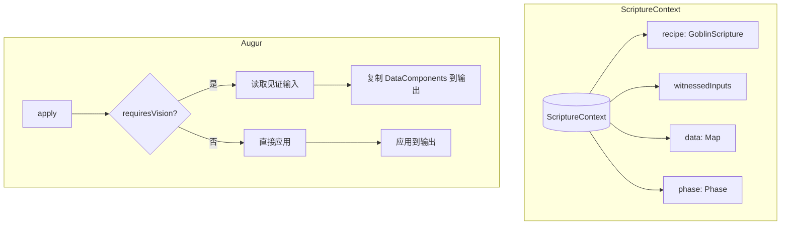

**ScriptureContext 字段说明：**

| 字段 | 说明 |
|------|------|
| `witnessedInputs` | 由 `IPresenceOfOracle.witnessInputs()` 在 `beforeWorking` 之后快照的输入内容 |
| `data` | 自定义数据 Map，供预言者存储临时数据 |
| `phase` | 当前经文执行阶段（SETUP/WORKING/FINISH） |

**Augur（预言者）requiresVision 说明：**

| requiresVision | 说明 |
|----------------|------|
| `true` | 需要读取 `witnessedInputs` 中的输入快照（如 `EchoOfOrigin`、`WhisperOfSustenance`） |
| `false` | 不需要输入快照，直接修改输出（如 `ImprintOfWill`、`MarkOfFaith`） |

---

## 4. 经文启动详解 (SETUP)

`setupScripture()` 是 `GoblinOracleOfScripture` 新增的方法（父类 `RecipeLogic` 无此方法），由覆写过的 `serverTick()` 调用，内联实现完整的启动流程并支持 RiteMode（仪式模式）和 Augur（预言者）体系：

```java
public void setupScripture(GTRecipe recipe) {
    boolean devoteInput = true;
    if (recipe instanceof GoblinScripture gs) {
        devoteInput = gs.devoteInput;
        // 有预言者时，机器必须实现 IPresenceOfOracle
        if (!gs.augurs.isEmpty() && !(machine instanceof IPresenceOfOracle)) {
            var reason = Component.translatable("goblintech.scripture.augur.unsupported");
            setStatus(Status.IDLE);
            putFailureReason(this, recipe, reason);
            return;
        }
        scriptureContext = new ScriptureContext(recipe);
    }

    if (!machine.beforeWorking(recipe)) {
        // ... 失败处理
        return;
    }

    // after beforeWorking: 见证输入（允许 beforeWorking 修改输入后再快照）
    if (recipe instanceof GoblinScripture gs && !gs.augurs.isEmpty()) {
        ((IPresenceOfOracle) machine).witnessInputs(scriptureContext);
    }

    boolean ioSuccess;
    if (devoteInput) {
        ioSuccess = handleRecipeIO(recipe, IO.IN).isSuccess();  // 奉献输入
    } else {
        ioSuccess = matchRecipe(recipe).isSuccess();             // 只验证，不奉献
    }

    if (ioSuccess) {
        // ... 状态初始化
        lastRecipe = recipe;
        setStatus(Status.WORKING);
        duration = recipe.duration * believer().getBlessedEffort();
        divineDemand = extractDivineDemand(recipe, IO.IN);
        divineOffering = extractDivineDemand(recipe, IO.OUT);
    }
}
```

**关键特性说明：**

| 特性 | 说明 |
|------|------|
| `devoteInput` | 控制是否消耗输入物品。`true`（默认）= 奉献祭品；`false`= 保留输入（如 VENERATION 仪式） |
| `IPresenceOfOracle` | 机器必须实现此接口才能使用预言者，否则拒绝仪式 |
| `witnessInputs()` | 在 `beforeWorking` 之后执行，允许机器在前置钩子中修改输入后再进行快照 |
| `matchRecipe()` | `devoteInput=false` 时使用，只验证输入是否匹配而不消耗 |

**RiteMode（仪式模式）行为矩阵：**

| RiteMode | devoteInput | 输入行为 | 输出行为 | 典型场景 |
|----------|-------------|----------|----------|----------|
| SACRIFICE | true（默认） | 奉献 input | 产出独立 output | 标准仪式 |
| SACRIFICE | false | 保留 input | 产出独立 output | 仪式展示 |
| BLESSING | false（强制） | 保留 input | 原地修改 input | 添加信仰印记/NBT |
| AURA | N/A | 无 IO | 无 IO | 环境条件仪式 |
| VENERATION | false（强制） | 保留 input | 产出独立 output | 桶仪式（冷却、腌制） |

---

## 5. 逐 Tick 执行详解 (TICK)

每 tick 调用 `assessBelieverState()` 评估信徒状态。与主流程图 WORKING_PHASE 中的 inline 展开对应。

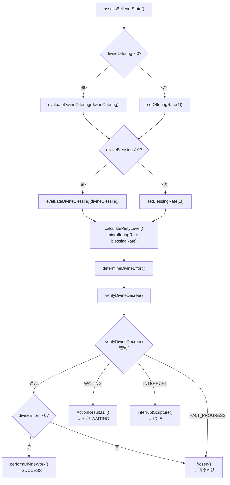

### 5.1 燃料献祭模块在逐 Tick 执行中的集成

燃料献祭模块的两阶段机制与 `assessBelieverState()` 的执行流程紧密配合：

#### `evaluateDivineOffering()` 阶段 — 模拟匹配

当 `divineOffering ≠ 0` 时，`evaluateDivineOffering()` 会遍历所有已安装的 `FuelOfferingModule`：

1. **检查燃烧状态**：
   - 正在燃烧 → 使用 `tickOffering()` 返回的 `currentOfferingPerTick` 作为此模块的 Endurance
   - 未燃烧 → 调用 `simulateMatch()` 尝试匹配燃料配方

2. **`simulateMatch()` 行为**：
   - 遍历燃料输入模块，调用 `RecipeHelper.matchRecipe()` 匹配 `fuelRecipeType` 对应的配方
   - 使用 dummy EU handler 绕过输出检查（仅验证输入燃料是否充足）
   - **不消耗燃料**
   - 返回 `SimulateResult`（offeringPerTick、配方引用、是否成功）

3. **Offering 聚合**：
   - 所有燃料输入模块返回的 offering 累加到总 Offering 中
   - 结合其他献祭模块（电力/应力/介质）的 Offering，形成最终的 `maxOffering`

#### `performDivineWork()` 阶段 — 实际点燃

当 `divineEffort > 0` 且 `verifyDivineDecree()` 通过后，`performDivineWork()` 执行：

1. **确定实际 Offering 用量**：
   - `actualOffering = min(offeringRate, blessingRate)`
   - 若 `offeringRate = 4.0`、`blessingRate = 2.0` → `actualOffering = 2.0`
   - （若某一 Rate 为默认值 1f，则不受该方向限制）

2. **燃料模块点燃决策**：
   - 遍历未在燃烧的燃料输入模块
   - 对每个模块，使用 `simulateMatch()` 阶段匹配到的配方引用
   - 计算燃烧倍率 = `max(1, floor(actualOffering / unitOfferingPerTick))`
   - 调用 `ignite(recipe, multiplier)` 实际消耗燃料

3. **`ignite()` 行为**：
   - 消耗 `multiplier × unitConsumption` 的流体燃料
   - 设置 `activeRecipe = recipe`、`remainingBurnTicks = recipe.duration`、`currentOfferingPerTick`
   - **一旦点燃，整轮燃烧期间不动态调整**——即使后续 tick 中 `blessingRate` 发生变化，已点燃的燃料模块仍按原倍率产出

4. **燃烧期间**：
   - 每 tick 调用 `tickOffering()`，递减 `remainingBurnTicks` 并返回 `currentOfferingPerTick`
   - 燃烧结束后自动清除状态，等待下一次 `evaluateDivineOffering()` → `performDivineWork()` 循环

#### 设计意图示例

| 情景 | offeringRate | blessingRate | actualOffering | 燃烧倍率 | 说明 |
|------|-------------|-------------|---------------|---------|------|
| 祝福输出充足 | 4.0 | 4.0 (或 1f) | 4.0 | 4x | 满负荷燃烧 |
| 祝福输出堵塞 | 4.0 | 2.0 | 2.0 | 2x | 减半燃烧，节约燃料 |
| 祝福完全堵塞 | 4.0 | 0 (但设 1f) | 1.0 | 1x | 最小倍率维持 |
| 无献祭（默认） | 1f | 1f | 1.0 | 1x | 默认值保底 |

> **各献祭模块的平衡机制**：各模块类型均有各自的"小毛病"作为平衡代价——
> - **电力献祭模块**：输出溢出时献祭量减少，减少的献祭量意味着更小的电阻，更小的电阻意味着更大的电流，可能烧坏机器
> - **介质献祭模块**：需同时管理介质输入模块的输入槽需求的介质和输出槽产生的介质，两者必须同时满足才能维持 Endurance
> - **应力献祭模块**：`performDivineWork()` 阶段不会根据降低的 offeringRate 减少实际扭矩，始终按满扭矩输出
> - **燃料献祭模块**：`ignite()` 后整轮燃烧期间不动态调整——即使 blessingRate 恢复也不会增产，"一次点燃，烧完为止"
>
> 这些设计使各模块各有优劣，玩家需要根据实际情况权衡选择。

---

## 6. 经文完成详解 (completeScriptureRite)

配方进度达到 duration 后触发 `completeScriptureRite()`：

```java
@Override
public void completeScriptureRite() {
    machine.afterWorking();
    if (lastRecipe != null) {
        handleRecipeIO(lastRecipe, IO.OUT);  // 产出祝福到输出槽
        
        // 应用预言者序列（如果经文带有预言者）
        if (lastRecipe instanceof GoblinScripture gs && 
            machine instanceof IPresenceOfOracle oracle) {
            oracle.applyAugurs(gs.augurs, scriptureContext);
        }
        
        // 检查祝福库存，决定是否进入排放态
        if (blessingStock > 0) {
            setStatus(Status.PURGE);
        } else {
            setStatus(Status.IDLE);
            checkNextRecipe();
        }
    }
}
```

**预言者应用流程：**

| 步骤 | 操作 | 说明 |
|------|------|------|
| 1 | `handleRecipeIO(OUT)` | 产出物品/流体到输出槽 |
| 2 | 检查 `instanceof IPresenceOfOracle` | 验证机器支持预言者 |
| 3 | `applyAugurs(augurs, ctx)` | 遍历预言者序列，逐个应用到输出槽 |
| 4 | 检查 `blessingStock` | 决定进入排放态或返回 IDLE |

**内置预言者列表：**

| 预言者 | requiresVision | 说明 |
|--------|---------------|------|
| `EchoOfOrigin`（起源回响） | true | 复制输入的全部 DataComponents 到输出 |
| `EchoOfSelf`（自身回响） | true | 复制输入的指定 DataComponent |
| `ImprintOfWill`（意志烙印） | false | 设置/覆盖输出的 DataComponent |
| `WhisperOfSustenance`（滋养低语） | true | 复制祭品的食物属性（TFC 集成） |
| `Reflection`（镜像映射） | true | 祝福 = 祭品的副本 |
| `MarkOfFaith`（信仰印记） | false | 给祝福添加 TFC trait 标签 |
| `Banishment`（放逐术） | false | 移除祝福上的 trait 标签 |
| `TouchOfFire`（烈焰之触） | false | 修改祝福温度 |

---

## 7. 排放态详解 (PURGE)

配方完成后若 `blessingStock > 0`（祝福未排空），进入排放态逐 tick 倾倒。

PURGE 态的核心逻辑：**不 Offering，全力 Blessing**。管线与 `assessBelieverState` 高度相似，但 `offeringRate` 固定为 0，完全不受 Offering 影响。

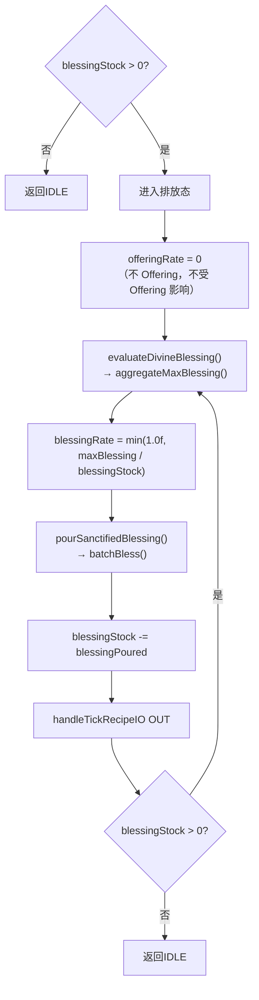

---

## 8. 其他

### 8.1 自定义 RecipeModifier 编写规范

**接口签名：**

```java
@FunctionalInterface
public interface RecipeModifier {
    @NotNull
    ModifierFunction getModifier(@NotNull MetaMachine machine, @NotNull GTRecipe recipe);
}
```

**ModifierFunction 返回值的含义：**

| 返回值 | 含义 |
|--------|------|
| `ModifierFunction.IDENTITY` | 不修改配方，原样通过 |
| `ModifierFunction.NULL` | 拒绝此配方（终止管线） |
| `ModifierFunction.cancel(Component)` | 拒绝配方并附带原因文本 |
| `ModifierFunction.builder().build()` | 通过 builder 构造具体修改 |

**ModifierFunction.Builder 常用方法：**

```java
ModifierFunction.builder()
    .eutMultiplier(double)           // EU/t 乘数
    .durationMultiplier(double)      // 时长乘数
    .modifyAllContents(ContentModifier)  // 所有内容的乘数
    .inputModifier(ContentModifier)      // 仅输入内容乘数
    .outputModifier(ContentModifier)     // 仅输出内容乘数
    .parallels(int)                  // 设置并行数
    .build();
```

### 8.2 参考实现

```java
public class DivineRecipeModifiers {

    /**
     * OMNIPRESENT_ASCENSION — 遍在化现，支持单方块机器和多方块机器的并行。
     * GoblinWorkableMachine 和 GoblinControllerMachine 均可使用。
     *
     * 流程：
     *   1. 获取 IOmnipresentAvatar 的 avatarLimit
     *   2. 调用 GoblinOracleOfOmnipresence.getOmnipresentAvatarCount()
     *   3. 应用并行修改
     */
    public static final RecipeModifier OMNIPRESENT_ASCENSION = DivineRecipeModifiers::omnipresentAscension;

    public static @NotNull ModifierFunction omnipresentAscension(@NotNull MetaMachine machine,
                                                                  @NotNull GTRecipe recipe) {
        if (!(machine instanceof IOmnipresentAvatar avatar)) {
            return ModifierFunction.IDENTITY;
        }

        int avatarLimit = avatar.getOmnipresentAvatarLimit();
        if (avatarLimit <= 1) return ModifierFunction.IDENTITY;

        int avatarCount = GoblinOracleOfOmnipresence.getOmnipresentAvatarCount(machine, recipe, avatarLimit);
        if (avatarCount <= 1) return ModifierFunction.IDENTITY;

        return ModifierFunction.builder()
                .modifyAllContents(ContentModifier.multiplier(avatarCount))
                .parallels(avatarCount)
                .build();
    }

    /**
     * ASCENSION_BENEDICTION — 对标 GTM NON_PERFECT_OVERCLOCK 的 Divine 有损超频。
     * GTM 有损(NON_PERFECT)：duration × 0.5, EUt × 4（总能耗翻倍）
     * GTM 无损(PERFECT)：    duration × 0.25, EUt × 4（总能耗不变）
     *
     * Divine 版：demand × 4, yield × 4, duration × 0.5（有损）。
     * 操作的是 ScriptureAptitude 内容（demand/yield），而非 EU。
     *
     * 升腾循环（对标 OverclockingLogic.subTickParallelOC）：
     *   逐次判断 duration × 0.5 < 1，一旦触发则停止正常升腾，
     *   将剩余次数写入 recipe.subtickOverflow 供 DIVINE_SUBTICK 读取。
     *
     * 两道拦截：
     *   1. recipeTier > machineTier → 拒绝（recipe_tier_too_high）
     *   2. ocs < 0 → 拒绝（insufficient_offering）
     */
    public static final RecipeModifier ASCENSION_BENEDICTION = DivineRecipeModifiers::ascensionBenediction;

    public static @NotNull ModifierFunction ascensionBenediction(@NotNull MetaMachine machine,
                                                                  @NotNull GTRecipe recipe) {
        if (!(machine instanceof IAscensionBlessed blessed)) {
            return ModifierFunction.IDENTITY;
        }

        long postParallelDemand = ScriptureAptitude.CAP.extractDemand(recipe);
        int avatarCount = recipe.parallels;

        if (postParallelDemand <= 0 || avatarCount <= 0) return ModifierFunction.IDENTITY;

        long unitDemand = postParallelDemand / avatarCount;
        int recipeTier = (int) (Math.log(unitDemand / 8.0) / Math.log(4));
        int machineTier = blessed.getDevotionGrade();

        // 第1道拦截：基础等级不够
        if (recipeTier > machineTier) {
            return ModifierFunction.cancel(
                Component.translatable("divine.recipe_modifier.recipe_tier_too_high"));
        }

        long maxOffering = ScriptureAptitude.CAP.getMaxOffering(machine).value();
        int ascendTimes = (int) (Math.floor(Math.log(maxOffering / (double) postParallelDemand) / Math.log(4)));

        // 第2道拦截：祭品不够
        if (ascendTimes < 0) {
            return ModifierFunction.cancel(
                Component.translatable("divine.recipe_modifier.insufficient_offering"));
        }

        if (ascendTimes == 0) return ModifierFunction.IDENTITY;

        double currentDuration = recipe.duration;
        int applied = 0;
        int remaining = ascendTimes;

        // 升腾循环：逐次判断 duration × 0.5 < 1
        while (remaining > 0) {
            if (currentDuration * 0.5 < 1) {
                break; // 溢出，剩余转为 subtick
            }
            currentDuration *= 0.5;
            applied++;
            remaining--;
        }

        int subtickOverflow = ascendTimes - applied;
        ScriptureAptitude.CAP.setSubtickOverflow(recipe, subtickOverflow);

        double divineMultiplier = Math.pow(4, applied);
        double durationMultiplier = Math.pow(0.5, applied);

        return ModifierFunction.builder()
                .inputModifier(ContentModifier.multiplier(divineMultiplier))
                .outputModifier(ContentModifier.multiplier(divineMultiplier))
                .durationMultiplier(durationMultiplier)
                .build();
    }

    /**
     * DIVINE_SUBTICK —— 神圣子 tick，将溢出的升腾转化为并行补偿。
     *
     * 触发条件：ASCENSION_BENEDICTION 在升腾循环中，当 duration × 0.5 < 1 时
     * 将剩余升腾次数写入 recipe.subtickOverflow。此处读取并转化为并行。
     *
     * 对标 GTM 的 PERFECT_OVERCLOCK_SUBTICK（OverclockingLogic.subTickParallelOC）：
     * 当 OC 导致 duration < 1 时，将剩余 OC 转化为并行（parallel = 1 / durationFactor）。
     * Divine 版：subtickParallel = 2^subtickOverflow（durationFactor = 0.5 → 1/0.5 = 2）。
     */
    public static final RecipeModifier DIVINE_SUBTICK = DivineRecipeModifiers::divineSubtick;

    public static @NotNull ModifierFunction divineSubtick(@NotNull MetaMachine machine,
                                                           @NotNull GTRecipe recipe) {
        if (!(machine instanceof IBelieverOfScripture believer)) {
            return ModifierFunction.IDENTITY;
        }

        int subtickOverflow = ScriptureAptitude.CAP.extractSubtickOverflow(recipe);
        if (subtickOverflow <= 0) {
            return ModifierFunction.IDENTITY;
        }

        int subtickParallel = (int) Math.pow(2, subtickOverflow);
        int maxSubtickCount = believer.getMaxSubtickCount();
        subtickParallel = Math.min(subtickParallel, maxSubtickCount);

        if (subtickParallel <= 1) {
            return ModifierFunction.IDENTITY;
        }

        return ModifierFunction.builder()
                .inputModifier(ContentModifier.multiply(subtickParallel))
                .outputModifier(ContentModifier.multiply(subtickParallel))
                .build();
    }

    /**
     * ORACLE_FAVOR — 神谕恩惠，经文神谕者的小帮忙。
     * 将多份短经文打包成一份长经文，减少反复 setupRecipe/finishRecipe 的开销。
     * 仅受物品/流体限制，不受神力资源影响。
     *
     * 流程：
     *   1. 检查机器是否实现了 IFavoredByOracle 且恩惠已启用
     *   2. 检查经文时长是否短于恩惠时长阈值
     *   3. 调用 GoblinOracleOfOmnipresence.getMortalAvatarCount() 计算化身数
     *   4. 应用批处理修改
     */
    public static final RecipeModifier ORACLE_FAVOR = DivineRecipeModifiers::oracleFavor;

    public static @NotNull ModifierFunction oracleFavor(@NotNull MetaMachine machine,
                                                         @NotNull GTRecipe recipe) {
        if (!(machine instanceof IFavoredByOracle favored) || !favored.isOracleFavorEnabled()) {
            return ModifierFunction.IDENTITY;
        }

        int favorDuration = favored.getOracleFavorDuration();
        if (recipe.duration >= favorDuration) {
            return ModifierFunction.IDENTITY;
        }

        int avatarCount = favorDuration / recipe.duration;
        avatarCount = GoblinOracleOfOmnipresence.getMortalAvatarCount(machine, recipe, avatarCount);

        if (avatarCount == 0) return ModifierFunction.NULL;
        if (avatarCount == 1) return ModifierFunction.IDENTITY;

        return ModifierFunction.builder()
                .inputModifier(ContentModifier.multiplier(avatarCount))
                .outputModifier(ContentModifier.multiplier(avatarCount))
                .durationMultiplier(avatarCount)
                .batchParallels(avatarCount)
                .build();
    }

    /**
     * GoblinOracleOfOmnipresence.getOmnipresentAvatarCount() 内部调用流程：
     *
     * maxByInput  → ScriptureAptitude.CAP.getMaxParallelByInput(holder, recipe, limit, tick)
     *   ├─ tick=true:  floor(maxOffering / offeringDemand)
     *   └─ tick=false: limit (不做限制)
     *
     * maxByOutput → ScriptureAptitude.CAP.limitMaxParallelByOutput(holder, recipe, limit, tick)
     *   ├─ tick=true:  floor(maxBlessing / blessingYield)
     *   └─ tick=false: limit (不做限制)
     *
     * 最终总 demand = perUnitDemand × avatarCount × 4^oc
     */
}

```

```java
package com.goblincoders.goblintech.api.recipe.modifier;

import com.gregtechceu.gtceu.api.capability.recipe.EURecipeCapability;
import com.gregtechceu.gtceu.api.machine.MetaMachine;
import com.gregtechceu.gtceu.api.machine.feature.IRecipeLogicMachine;
import com.gregtechceu.gtceu.api.recipe.modifier.ParallelLogic;

import com.goblincoders.goblintech.api.recipe.GoblinScripture;

import java.util.List;
import java.util.function.BooleanSupplier;

/**
 * GoblinOracleOfOmnipresence — 遍在神谕者，掌管化现数量。
 * 继承自 GTCEu {@link ParallelLogic}，为 Divine 体系扩展神棍化命名的方法。
 * 核心职责：计算机器能同时显现多少化身执行经文，排除神力资源干扰。
 *
 * <p>核心方法：
 * <ul>
 *   <li>{@link #getOmnipresentAvatarCount} — 计算遍在化现数量（含所有资源限制）</li>
 *   <li>{@link #getAvatarCountWithoutOffering} — 排除祭品限制的化现数</li>
 *   <li>{@link #getMortalAvatarCount} — 仅凭世俗资源（物品/流体）的化现数</li>
 * </ul>
 */
public class GoblinOracleOfOmnipresence extends ParallelLogic {

    public static int getOmnipresentAvatarCount(MetaMachine machine, GoblinScripture scripture, int avatarLimit) {
        return getParallelAmount(machine, scripture, avatarLimit);
    }

    public static int getAvatarCountWithoutOffering(MetaMachine machine, GoblinScripture scripture, int avatarLimit) {
        return getParallelAmountWithoutEU(machine, scripture, avatarLimit);
    }

    /**
     * 仅凭世俗资源的化现数 — 同时排除 EU（祭品）和 ScriptureAptitude（经文天赋）的限制，
     * 确保 batch 等场景只受物品/流体输入输出限制。
     */
    public static int getMortalAvatarCount(MetaMachine machine, GoblinScripture scripture, int avatarLimit) {
        if (avatarLimit <= 1) return avatarLimit;
        if (!(machine instanceof IRecipeLogicMachine rlm)) return 1;

        int maxAvatarByInput = getMaxAvatarByInput(rlm, scripture, avatarLimit,
                List.of(EURecipeCapability.CAP, ScriptureAptitude.CAP));
        if (maxAvatarByInput == 0) return 0;

        return limitAvatarByOutput(rlm, scripture, maxAvatarByInput, rlm::canVoidRecipeOutputs,
                List.of(EURecipeCapability.CAP, ScriptureAptitude.CAP));
    }

    public static int getMaxAvatarByInput(IRecipeLogicMachine rlm, GoblinScripture scripture,
                                           int avatarLimit, List<Object> excludedCaps) {
        return getMaxByInput(rlm, scripture, avatarLimit, excludedCaps);
    }

    public static int limitAvatarByOutput(IRecipeLogicMachine rlm, GoblinScripture scripture,
                                           int avatarLimit, BooleanSupplier canVoid,
                                           List<Object> excludedCaps) {
        return limitByOutputMerging(rlm, scripture, avatarLimit, canVoid, excludedCaps);
    }
}
```

### 8.3 在机器定义中注入修改器

**使用 `MachineBuilder.recipeModifiers()`：**

```java
// MachineBuilder.java 中的定义方法
public TYPE recipeModifiers(RecipeModifier... recipeModifiers) {
    this.recipeModifier = new RecipeModifierList(recipeModifiers);
    return getThis();
}

public TYPE recipeModifiers(boolean alwaysTryModifyRecipe,
                            RecipeModifier... recipeModifiers) {
    return this.recipeModifier(
        new RecipeModifierList(recipeModifiers), alwaysTryModifyRecipe);
}
```

**`alwaysTryModifyRecipe` 标志**（在 `WorkableElectricMultiblockMachine` 中使用）：

```
getDefinition().getRecipeModifier() instanceof RecipeModifierList list
    && Arrays.stream(list.getModifiers())
           .anyMatch(modifier -> modifier == GTRecipeModifiers.BATCH_MODE || modifier == DivineRecipeModifiers.ORACLE_FAVOR)
```

**完整注册示例：**

```java
public class DivineMachines {

    static {
        REGISTRATE
            .multiblock("simple_divine_furnace", SimpleDivineFurnace::new)
            .recipeModifiers(
                DivineRecipeModifiers.OMNIPRESENT_ASCENSION,
                DivineRecipeModifiers.ASCENSION_BENEDICTION,
                DivineRecipeModifiers.DIVINE_SUBTICK
            )
            .recipeType(DIVINE_FURNACE_RECIPES)
            .alwaysTryModifyRecipe(false)
            .register();

        REGISTRATE
            .multiblock("divine_array", DivineArray::new)
            .recipeModifiers(
                DivineRecipeModifiers.OMNIPRESENT_ASCENSION,
                DivineRecipeModifiers.ASCENSION_BENEDICTION,
                DivineRecipeModifiers.DIVINE_SUBTICK,
                DivineRecipeModifiers.ORACLE_FAVOR
            )
            .recipeType(DIVINE_ARRAY_RECIPES)
            .register();
    }
}
```

### 8.4 关键数据结构

**ScriptureContext（经文上下文）：**

```java
public class ScriptureContext {
    public final GoblinScripture scripture;
    public final IRecipeCapabilityHolder holder;

    public List<ItemStack> witnessedInputs;
    public Map<String, Object> data = new HashMap<>();
    public Phase phase = Phase.MATCHING;
}
```

**Augur（预言者）：**

```java
public interface Augur {
    Object apply(RecipeCapability<?> cap, Object output, ScriptureContext ctx);
    Set<RecipeCapability<?>> targetCapabilities();
    default boolean requiresVision() { return false; }
    AugurType<?> type();
}
```

### 8.5 关键代码位置

| 功能 | 类/方法 | 位置 |
|------|---------|------|
| 配方匹配守卫 | `IBelieverOfScripture.isAwakened()` | IBelieverOfScripture.java |
| 遍在化现接口 | `IOmnipresentAvatar.getOmnipresentAvatarLimit()` | IOmnipresentAvatar.java |
| 升腾祝福接口 | `IAscensionBlessed.getDevotionGrade()` `IAscensionBlessed.getOfferingBlessingManager()` | IAscensionBlessed.java |
| 祭品聚合 | `OfferingBlessingManager.aggregateMaxOffering()` `OfferingBlessingManager.aggregateOfferingContribution()` | OfferingBlessingManager.java |
| 祝福聚合 | `OfferingBlessingManager.aggregateMaxBlessing()` | OfferingBlessingManager.java |
| 祭品并行限制 | `ScriptureAptitude.CAP.getMaxParallelByInput()` | `ScriptureAptitude.java` |
| 祝福并行限制 | `ScriptureAptitude.CAP.limitMaxParallelByOutput()` | `ScriptureAptitude.java` |
| 遍在化现烘焙 | `DivineRecipeModifiers.OMNIPRESENT_ASCENSION` | `DivineRecipeModifiers.java` |
| 升腾烘焙 | `DivineRecipeModifiers.ASCENSION_BENEDICTION` | `DivineRecipeModifiers.java` |
| **修改器链注入** | `MachineBuilder.recipeModifiers(...)` | 具体机器注册类 |
| 每 Tick 评估 | `GoblinOracleOfScripture.assessBelieverState()` | GoblinOracleOfScripture.java |
| 配方完成 | `GoblinOracleOfScripture.completeScriptureRite()` | GoblinOracleOfScripture.java |
| 排放态 | `GoblinOracleOfScripture.pourSanctifiedBlessing()` | GoblinOracleOfScripture.java |
| 遍在神谕者 | `GoblinOracleOfOmnipresence` | `GoblinOracleOfOmnipresence.java` |
| 神谕恩惠接口 | `IFavoredByOracle.isOracleFavorEnabled()` | IFavoredByOracle.java |
| 神谕恩惠烘焙 | `DivineRecipeModifiers.ORACLE_FAVOR` | `DivineRecipeModifiers.java` |

### 8.6 神棍化命名映射表

| 工程概念 (GTCEu) | 神棍概念 (Goblin) | 解释 |
|---|---|---|
| Parallel（并行） | Omnipresence（遍在） | 神祇无处不在，同时显现 |
| Parallel instance（并行副本） | Avatar（化身） | 神祇的一个分身 |
| Recipe（配方） | Scripture（经文） | 已确立 |
| EU / Energy（能量） | Offering（祭品） | 已确立 |
| Item / Fluid（物品/流体） | Worldly Resource（世俗资源） | 凡间之物，非神力 |
| Input（输入） | Offering（祭品） | 奉献给神祇的物品 |
| Output（输出） | Blessing（祝福） | 神祇赐予的产物 |
| Modifier（修改器） | Augur（预言者） | 预言者对祝福施加影响 |
| Mode（模式） | RiteMode（仪式模式） | 仪式的不同执行方式 |

#### 类名映射

| 原类名 (GTCEu) | 新类名 (Goblin) | 包路径 |
|---|---|---|
| `ParallelLogic` | `GoblinOracleOfOmnipresence` | `api.recipe.modifier` |
| `GTRecipe` | `GoblinScripture` | `api.recipe`（已实现） |
| `RecipeLogic` | `GoblinOracleOfScripture` | `api.machine.trait`（已实现） |
| `RecipeContext` | `ScriptureContext` | `api.recipe`（经文上下文） |
| `RecipeOutputModifier` | `Augur` | `api.recipe`（预言者接口） |

#### 方法名映射

| 原方法名 (ParallelLogic) | 新方法名 (GoblinOracleOfOmnipresence) | 神棍含义 |
|---|---|---|
| `getParallelAmount(machine, recipe, limit)` | `getOmnipresentAvatarCount(machine, scripture, avatarLimit)` | 计算神祇能显现多少化身 |
| `getParallelAmountWithoutEU(machine, recipe, limit)` | `getAvatarCountWithoutOffering(machine, scripture, avatarLimit)` | 排除祭品限制的化身数 |
| `getParallelAmountWithoutDivine(machine, recipe, limit)` | `getMortalAvatarCount(machine, scripture, avatarLimit)` | 仅凭世俗资源能显现的化身数 |
| `getMaxByInput(holder, recipe, limit, excludedCaps)` | `getMaxAvatarByInput(holder, scripture, avatarLimit, excludedCaps)` | 根据输入计算最大化身数 |
| `limitByOutputMerging(holder, recipe, limit, canVoid, excludedCaps)` | `limitAvatarByOutput(holder, scripture, avatarLimit, canVoid, excludedCaps)` | 根据输出限制化身数 |
| `setupRecipe(recipe)` | `setupScripture(recipe)` | 开启经文仪式 |
| `onRecipeFinish()` | `completeScriptureRite()` | 完成经文仪式 |
| `captureInputs()` | `witnessInputs(ctx)` | 见证输入快照 |

#### 参数名/字段名映射

| 上下文 | 原参数名 | 新参数名 | 说明 |
|---|---|---|---|
| 所有 Oracle 方法 | `recipe` | `scripture` | 配方→经文 |
| 所有 Oracle 方法 | `parallelLimit` | `avatarLimit` | 并行上限→化身上限 |
| 返回值 | `maxInputMultiplier` | `maxAvatarByInput` | 最大输入倍数→最大化身数 |
| 返回值 | `parallel` / `parallels` | `avatarCount` | 并行数→化身数 |
| GoblinScripture | `consumesInput` | `devoteInput` | 消耗输入→奉献输入 |
| ScriptureContext | `capturedInputs` | `witnessedInputs` | 捕获输入→见证输入 |
| Augur | `dependsOnInput()` | `requiresVision()` | 依赖输入→需要视力 |

#### 修改器/常量名映射

| 原常量名 | 新常量名 | 神棍含义 |
|---|---|---|
| `GTRecipeModifiers.BATCH_MODE` | `DivineRecipeModifiers.ORACLE_FAVOR` | 神谕恩惠 — 经文神谕者的小帮忙 |
| `GTRecipeModifiers.PARALLEL_HATCH` | `DivineRecipeModifiers.OMNIPRESENT_ASCENSION` | 遍在化现 |
| `GTRecipeModifiers.OC_NON_PERFECT_SUBTICK` | `DivineRecipeModifiers.ASCENSION_BENEDICTION` | 升腾烘焙 |
| — | `DivineRecipeModifiers.DIVINE_SUBTICK` | 神圣子 tick |

#### 接口名映射

| 原接口名 | 新接口名 | 神棍含义 |
|---|---|---|
| `IRecipeLogicMachine` | `IBelieverOfScripture` | 经文信徒（已实现） |
| — | `IOmnipresentAvatar` | 可遍在化现的机器 |
| — | `IAscensionBlessed` | 蒙祝福可升腾的机器 |
| `IGoblinBatchMachine` | `IFavoredByOracle` | 蒙神谕恩惠者 |
| — | `IPresenceOfOracle` | 神谕在场（支持预言者介入） |

#### RiteMode（仪式模式）映射

| RiteMode | 神棍含义 | 输入行为 | 输出行为 |
|----------|----------|----------|----------|
| `SACRIFICE` | 献祭转化 | 奉献 input | 产出独立 output |
| `BLESSING` | 神圣祝福 | 保留 input | 原地修改 input |
| `AURA` | 灵光感应 | 无 IO | 无 IO |
| `VENERATION` | 供奉展示 | 保留 input | 产出独立 output |

### 8.7 需要避免的坑

1. **不要和原生 `BATCH_MODE` 同时挂在同一台多方块机器上** — 否则可能发生两次 modifier 叠加，导致输入/输出/duration 被重复放大。

2. **UI 检测不能复用 GTCEu 的原生判断** — `WorkableElectricMultiblockMachine.attachConfigurators()` 只检测 `modifier == GTRecipeModifiers.BATCH_MODE`，自定义 `ORACLE_FAVOR` 不会自动出现原生批处理按钮，需要自己补 UI/configurator。

3. **单方块 Jade 显示不会自动出现 batch 信息** — GTCEu `ParallelProvider` 只在 blockEntity 是 `MultiblockControllerMachine` 时读取 `lastRecipe.batchParallels`。

4. **`alwaysTryModifyRecipe` 对 batch 很重要** — `IRecipeLogicMachine.alwaysTryModifyRecipe()` 默认返回 true，配方完成后会重新对原始配方执行 modifier。这样当输入/输出条件变化时，batch 倍率能重新计算。

5. **Divine 配方进度缩放要确认不会和 duration × parallel 冲突** — `ORACLE_FAVOR` 会放大 `recipe.duration`。如果 `GoblinOracleOfScripture.setupScripture()` 还会再乘 `believer.getBlessedEffort()`，需要确认这是预期行为。

### 8.8 推荐实施方案

#### 最小可行方案

1. 新增 `IFavoredByOracle`
2. 在需要批处理的 Goblin 机器上实现：`isOracleFavorEnabled()`、`setOracleFavorEnabled(boolean)`、`getOracleFavorDuration()`
3. 新增 `ORACLE_FAVOR`
4. 在机器注册中替代原生 `GTRecipeModifiers.BATCH_MODE`
5. 暂时不做 UI，默认开启或通过机器配置控制

#### 完整方案

1. 新增 `IFavoredByOracle`
2. 新增可持久化/同步的 `oracleFavorEnabled` 字段
3. 新增 UI/configurator 按钮
4. 新增 `ORACLE_FAVOR`
5. 单方块和多方块统一使用该 modifier
6. Jade/显示文本补充 `batchParallels` 信息

### 8.9 保留不变的术语

| 术语 | 保留理由 |
|---|---|
| `duration` | 工程语义，无合适神棍替代 |
| `ModifierFunction` | GTCEu 核心 API，保持兼容 |
| `ContentModifier` | GTCEu 核心 API，保持兼容 |
| `parallels`（recipe 字段） | GTCEu 内部字段，改造成本高 |
| `batchParallels`（recipe 字段） | GTCEu 内部字段，改造成本高 |
| `IOmnipresentAvatar.getOmnipresentAvatarLimit()` | 已神棍化，保持 |
| `OfferingBlessingManager` | 已神棍化，保持 |

---

## 9. PURGE 状态与 serverTick() 重写方案

### 9.1 设计思路

PURGE 只对 Divine 机器（`GoblinOracleOfScripture`）有意义，不应污染 GTCEu 的 `RecipeLogic.Status` 枚举。方案是在 `GoblinOracleOfScripture` 内部定义一个专属枚举 `ScriptureStatus`，包含 PURGE 在内的 5 个值，然后覆写 `isIdle()` / `isWorking()` / `isWaiting()` / `isSuspend()` 让外部代码看到的是 `ScriptureStatus` 而非父类的 `Status`。

这样 GTCEu 基类完全不动，父类的 `status` 字段仍然存在且由 `setStatus()` 维护供模型渲染用，而 `GoblinOracleOfScripture` 的逻辑走向全由 `scriptureStatus` 控制。

### 9.2 ScriptureStatus 枚举定义

```java
// 在 GoblinOracleOfScripture.java 中

public enum ScriptureStatus {
    IDLE,
    WORKING,
    WAITING,
    SUSPEND,
    PURGE;
}
```

### 9.3 核心字段与方法覆写

```java
public class GoblinOracleOfScripture extends RecipeLogic {

    @SaveField
    @SyncToClient
    private ScriptureStatus scriptureStatus = ScriptureStatus.IDLE;

    // ── 覆写父类状态查询方法 ──
    @Override
    public boolean isIdle()    { return scriptureStatus == ScriptureStatus.IDLE; }

    @Override
    public boolean isWorking() { return scriptureStatus == ScriptureStatus.WORKING; }

    @Override
    public boolean isWaiting() { return scriptureStatus == ScriptureStatus.WAITING; }

    @Override
    public boolean isSuspend() { return scriptureStatus == ScriptureStatus.SUSPEND; }

    // ── 覆写 setStatus：把父类的状态变化同步过来 ──
    @Override
    public void setStatus(Status status) {
        scriptureStatus = switch (status) {
            case IDLE    -> ScriptureStatus.IDLE;
            case WORKING -> ScriptureStatus.WORKING;
            case WAITING -> ScriptureStatus.WAITING;
            case SUSPEND -> ScriptureStatus.SUSPEND;
        };
        super.setStatus(status);
    }

    // ── 进入 PURGE 态 ──
    public void enterPurgingStatus() {
        scriptureStatus = ScriptureStatus.PURGE;
        // 父类设成 IDLE（或 WORKING），不影响 blockstate 渲染
        // 因为 isIdle() 已被覆写返回 false，不会误触发配方搜索
        super.setStatus(Status.IDLE);
    }
}
```

**说明：**
- `@SaveField` / `@SyncToClient` 自动处理存档和同步
- `isIdle()` 覆写后在 PURGE 时返回 `false`，原生 `serverTick()` 不会进入 `findAndHandleRecipe()` 分支
- `setStatus()` 被覆写后，父类原有 `notifyStatusChanged` / `setRenderState` 仍然执行，模型渲染能正常响应
- PURGE 时父类 `status` 为 `IDLE`，blockstate 不会有未知枚举值，模型系统完全不受影响

### 9.4 serverTick() 重写方案

```java
@Override
public void serverTick() {
    if (!isSuspend()) {
        if (scriptureStatus == ScriptureStatus.PURGE) {
            conductBlessingPurge();
        } else if (!isIdle() && lastRecipe != null) {
            conductActiveScripture();
        } else if (lastRecipe != null) {
            seekAndInterpretScripture();
        } else if (shouldSeekScriptureThisTick()) {
            seekAndInterpretScripture();
            retryFailedScriptureCandidates();
        }
    }
    maintainOracleSubscription();
}

protected void conductActiveScripture() {
    if (progress < duration) {
        if (runDelay > 0) runDelay--;
        else performScriptureRite();
    }
    if (progress >= duration) {
        completeScriptureRite();
        enterBlessingPurgeIfNeeded();
    }
}

protected void maintainOracleSubscription() {
    boolean unsubscribe = shouldReleaseTickSubscription();
    if (isIdle()) {
        failureReasons.clear();
        failureReasons.addAll(failureReasonMap.values());
    }
    if (unsubscribe && subscription != null) {
        subscription.unsubscribe();
        subscription = null;
    }
}
```

### 9.5 PURGE 分支细节

**进入 PURGE 的条件：**

配方完成（`completeScriptureRite()`）或中断（`interruptScripture()`）后，若 `blessingStock > 0`（祝福未排空），进入 PURGE 态。

```java
protected void enterBlessingPurgeIfNeeded() {
    if (believer().getBlessingStock() > 0) {
        enterPurgingStatus();
    } else {
        setStatus(Status.IDLE);
    }
}
```

**PURGE 态执行体（不 Offering，全力 Blessing）：**

```java
protected void conductBlessingPurge() {
    // offeringRate 固定为 0，不受 Offering 影响
    float blessingRate = evaluateDivineBlessing();  // → aggregateMaxBlessing() → batchBless()
    
    var result = pourSanctifiedBlessing(blessingRate);
    if (!result.isSuccess()) {
        setStatus(Status.WAITING);
        return;
    }

    if (hasRemainingBlessing()) {
        scriptureStatus = ScriptureStatus.PURGE;
    } else {
        resetAfterBlessingPurge();
        setStatus(Status.IDLE);
    }
}
```

**排放方法**（由 `IBelieverOfScripture` 具体机器实现，接收 blessingRate 全功率排放）：

```java
protected ActionResult pourSanctifiedBlessing(float blessingRate) {
    // 通过 OfferingBlessingManager 设置节流阀并执行 batchBless()
    believer().getOfferingBlessingManager().setBlessingThrottle(blessingRate);
    return believer().getOfferingBlessingManager().batchBless();
}
```

### 9.6 对现有方法的影响

| 方法 | 调整内容 |
|------|---------|
| `completeScriptureRite()` | `handleRecipeIO(OUT)` 之后不立即寻找下一份经文，调用 `enterBlessingPurgeIfNeeded()` |
| `interruptScripture()` | 中断后如果有残留祝福，调用 `enterPurgingStatus()`，但不执行正常完成输出 |
| `findAndHandleRecipe()` | 可包装为 `seekAndInterpretScripture()` |
| `handleRecipeWorking()` | 可包装为 `performScriptureRite()` |
| `pourSanctifiedBlessing(blessingRate)` | 新增，接收 blessingRate 全功率排放，通过 Manager 执行 batchBless() |

### 9.7 订阅管理注意事项

- PURGE 态**不能取消 tick 订阅**，否则排放会停住
- `isIdle()` 在 PURGE 时返回 `false`，退订条件 `lastRecipe == null && isIdle() && ...` 不会意外触发
- `failureReasons` 的刷新只在 `isIdle()` 为 true 时执行（PURGE 不刷新）

```java
protected boolean shouldReleaseTickSubscription() {
    if (scriptureStatus == ScriptureStatus.PURGE) return false;
    if (isSuspend()) return true;
    return lastRecipe == null && isIdle() && !machine.keepSubscribing() && !recipeDirty && lastFailedMatches == null;
}
```

### 9.8 模型渲染建议

PURGE 态时父类 `status` 为 `IDLE`（见 `enterPurgingStatus()`），所以 blockstate 渲染的是 IDLE 纹理。有两种可选方案：

1. **复用 IDLE 纹理**（最简单）：PURGE 时外观显示为"空闲"，内部在排放祝福；可通过 Jade/tooltip 补充文字提示
2. **临时切父类 status 为 WORKING**：如果想在 PURGE 时显示"工作中"的覆盖层，把 `enterPurgingStatus()` 里的 `super.setStatus(Status.IDLE)` 改成 `super.setStatus(Status.WORKING)` 即可，完全不需要动 GTMachineModels

推荐方案 2：PURGE 时父类 `status` 设为 `WORKING`，外观上机器看起来在工作，tooltip 再额外显示排放态信息。
