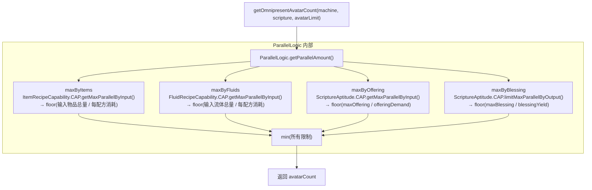

# GoblinOracleOfOmnipresence — 遍在神谕者

## 概述

`GoblinOracleOfOmnipresence` 继承自 GTCEu 的 `ParallelLogic`，为 Divine 体系提供神棍化命名的并行计算能力。核心职责：在 BAKE 阶段计算机器能同时显现多少化身（并行副本）执行经文。

**包路径**：`com.goblincoders.goblintech.api.recipe.modifier`

**父类**：`com.gregtechceu.gtceu.api.recipe.modifier.ParallelLogic`

---

## 1. 类定义

```java
package com.goblincoders.goblintech.api.recipe.modifier;

import com.gregtechceu.gtceu.api.capability.recipe.EURecipeCapability;
import com.gregtechceu.gtceu.api.machine.MetaMachine;
import com.gregtechceu.gtceu.api.machine.feature.IRecipeLogicMachine;
import com.gregtechceu.gtceu.api.recipe.modifier.ParallelLogic;

import com.goblincoders.goblintech.api.recipe.GoblinScripture;
import com.goblincoders.goblintech.api.recipe.capability.ScriptureAptitude;

import java.util.List;
import java.util.function.BooleanSupplier;

/**
 * 遍在神谕者 — 掌管化现数量。
 * 继承 ParallelLogic，为 Divine 体系扩展神棍化命名的方法。
 */
public class GoblinOracleOfOmnipresence extends ParallelLogic {

    /** 计算遍在化现数量（含所有资源限制：物品、流体、祭品、祝福）。 */
    public static int getOmnipresentAvatarCount(MetaMachine machine, GoblinScripture scripture, int avatarLimit) {
        return getParallelAmount(machine, scripture, avatarLimit);
    }

    /** 排除祭品限制的化现数（排除 EURecipeCapability.CAP）。 */
    public static int getAvatarCountWithoutOffering(MetaMachine machine, GoblinScripture scripture, int avatarLimit) {
        return getParallelAmountWithoutEU(machine, scripture, avatarLimit);
    }

    /**
     * 仅凭世俗资源的化现数 — 同时排除 EU 和 ScriptureAptitude 的限制，
     * 确保 batch 等场景只受物品/流体输入输出限制。
     */
    public static int getMortalAvatarCount(MetaMachine machine, GoblinScripture scripture, int avatarLimit) {
        if (avatarLimit <= 1) return avatarLimit;
        if (!(machine instanceof IRecipeLogicMachine rlm)) return 1;

        int maxAvatarByInput = getMaxAvatarByInput(rlm, scripture, avatarLimit,
                List.of(EURecipeCapability.CAP, ScriptureAptitude.CAP));
        if (maxAvatarByInput == 0) return 0;

        return limitAvatarByOutput(rlm, scripture, maxAvatarByInput, rlm::canVoidRecipeOutputs,
                List.of(EURecipeCapability.CAP, ScriptureAptitude.CAP));
    }
}
```

---

## 2. 核心方法

| 方法 | 用途 | 调用者 |
|------|------|--------|
| `getOmnipresentAvatarCount()` | 计算遍在化现数量（含所有资源限制） | `OMNIPRESENT_ASCENSION` |
| `getAvatarCountWithoutOffering()` | 排除祭品限制的化现数 | 特殊场景 |
| `getMortalAvatarCount()` | 仅凭世俗资源（物品/流体）的化现数 | `ORACLE_FAVOR` |

---

## 3. 内部计算流程

`getOmnipresentAvatarCount()` 委托给 `ParallelLogic.getParallelAmount()`，内部取四个维度的最小值：



**关键点**：`maxByOffering` 和 `maxByBlessing` 并非 `GoblinOracleOfOmnipresence` 自身实现，而是通过 GTCEu 的 `ParallelLogic.getMaxByInput()` / `limitByOutputMerging()` 遍历配方 capabilities 时，调用 `ScriptureAptitude.CAP.getMaxParallelByInput()` / `limitMaxParallelByOutput()` 完成。

**流程补丁说明**：流程图采用简化表示，将四个限制因素并列展示。实际执行流程分为两个阶段：
1. **输入限制阶段**：`ParallelLogic.getParallelAmount()` → `getMaxByInput()` → 遍历 `recipe.inputs` 和 `recipe.tickInputs`，调用各 `RecipeCapability.CAP.getMaxParallelByInput()`（含 `ItemRecipeCapability`、`FluidRecipeCapability`、`ScriptureAptitude.CAP`）
2. **输出限制阶段**：`getParallelAmount()` → `limitByOutputMerging()` → 遍历 `recipe.outputs` 和 `recipe.tickOutputs`，调用各 `RecipeCapability.CAP.limitMaxParallelByOutput()`（含 `ScriptureAptitude.CAP`）

`maxByBlessing` 的计算发生在第二阶段，由 `limitByOutputMerging()` 触发。接口调用逻辑与流程图一致，故简化表示是合理的。

---

## 4. 与 ScriptureAptitude 的交互

`GoblinOracleOfOmnipresence` 本身不直接持有 `OfferingBlessingManager`。它依赖 `ScriptureAptitude.CAP` 的并行限制方法来完成 Divine 维度的计算。

### 4.1 调用链

```
GoblinOracleOfOmnipresence.getOmnipresentAvatarCount(machine, scripture, avatarLimit)
  └── ParallelLogic.getParallelAmount(machine, scripture, avatarLimit)
        ├── getMaxByInput(machine, scripture, avatarLimit)
        │     └── 遍历 recipe.tickInputs 的每个 capability
        │           └── ScriptureAptitude.CAP.getMaxParallelByInput(machine, recipe, limit, tick=true)
        │                 ├── 从 machine 获取 OfferingBlessingManager
        │                 │     └── machine instanceof IOmnipresentAvatar → getOfferingBlessingManager()
        │                 ├── maxOffering = manager.aggregateMaxOffering().value()
        │                 └── return floor(maxOffering / offeringDemand)
        │
        └── limitByOutputMerging(machine, scripture, avatarLimit)
              └── 遍历 recipe.tickOutputs 的每个 capability
                    └── ScriptureAptitude.CAP.limitMaxParallelByOutput(machine, recipe, limit, tick=true)
                          ├── 从 machine 获取 OfferingBlessingManager
                          ├── maxBlessing = manager.aggregateMaxBlessing().value()
                          └── return floor(maxBlessing / blessingYield)
```

### 4.2 接口要求

| ScriptureAptitude 方法 | 需要的机器接口 | 获取的数据 |
|------------------------|--------------|-----------|
| `getMaxParallelByInput()` | `IAwakened` | `OfferingBlessingManager.aggregateMaxOffering()` |
| `limitMaxParallelByOutput()` | `IAwakened` | `OfferingBlessingManager.aggregateMaxBlessing()` |

> **说明**：两个方法的准入条件统一为 `IAwakened`，通过该接口获取 `OfferingBlessingManager`。`IOmnipresentAvatar` 和 `IAscensionBlessed` 都继承自 `IAwakened`，因此实现任一接口的机器都可使用经文配方。

---

## 5. 排除机制

`getMortalAvatarCount()` 用于 ORACLE_FAVOR 打包场景——需要排除 Divine 资源限制，仅凭世俗资源（物品/流体）计算并行数：

```java
// 排除 EURecipeCapability 和 ScriptureAptitude
List.of(EURecipeCapability.CAP, ScriptureAptitude.CAP)
```

GTCEu 的 `ParallelLogic.getMaxByInput()` 支持传入 `excludedCaps` 列表，遍历时跳过这些 capability。

---

## 6. 调用场景

| 场景 | 方法 | 说明 |
|------|------|------|
| OMNIPRESENT_ASCENSION | `getOmnipresentAvatarCount()` | BAKE 阶段计算并行数，含全部四个维度 |
| ORACLE_FAVOR | `getMortalAvatarCount()` | 打包短经文，仅凭世俗资源限制 |
| 特殊场景 | `getAvatarCountWithoutOffering()` | 排除祭品限制 |

---

## 7. 与 OMNIPRESENT_ASCENSION 修改器的协作

```java
// DivineRecipeModifiers.omnipresentAscension()
public static ModifierFunction omnipresentAscension(MetaMachine machine, GTRecipe recipe) {
    if (!(machine instanceof IOmnipresentAvatar avatar)) {
        return ModifierFunction.IDENTITY;
    }

    int avatarLimit = avatar.getOmnipresentAvatarLimit();
    if (avatarLimit <= 1) return ModifierFunction.IDENTITY;

    // 调用遍在神谕者计算化现数
    int avatarCount = GoblinOracleOfOmnipresence.getOmnipresentAvatarCount(machine, recipe, avatarLimit);
    if (avatarCount <= 1) return ModifierFunction.IDENTITY;

    return ModifierFunction.builder()
            .modifyAllContents(ContentModifier.multiplier(avatarCount))
            .parallels(avatarCount)
            .build();
}
```

---

## 8. 关键代码位置

| 功能 | 类/方法 | 位置 |
|------|---------|------|
| 遍在神谕者 | `GoblinOracleOfOmnipresence` | `GoblinOracleOfOmnipresence.java` |
| 遍在化现修改器 | `DivineRecipeModifiers.OMNIPRESENT_ASCENSION` | `DivineRecipeModifiers.java` |
| 祭品并行限制 | `ScriptureAptitude.CAP.getMaxParallelByInput()` | `ScriptureAptitude.java` |
| 祝福并行限制 | `ScriptureAptitude.CAP.limitMaxParallelByOutput()` | `ScriptureAptitude.java` |
| 遍在化现接口 | `IOmnipresentAvatar` | `IOmnipresentAvatar.java` |
| 升腾祝福接口 | `IAscensionBlessed` | `IAscensionBlessed.java` |
