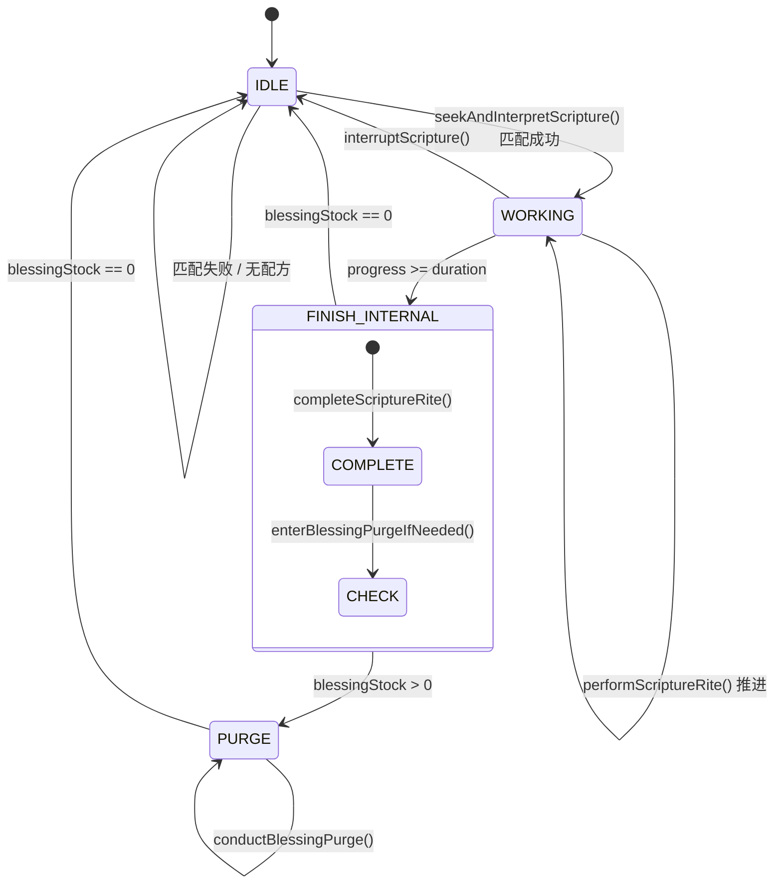
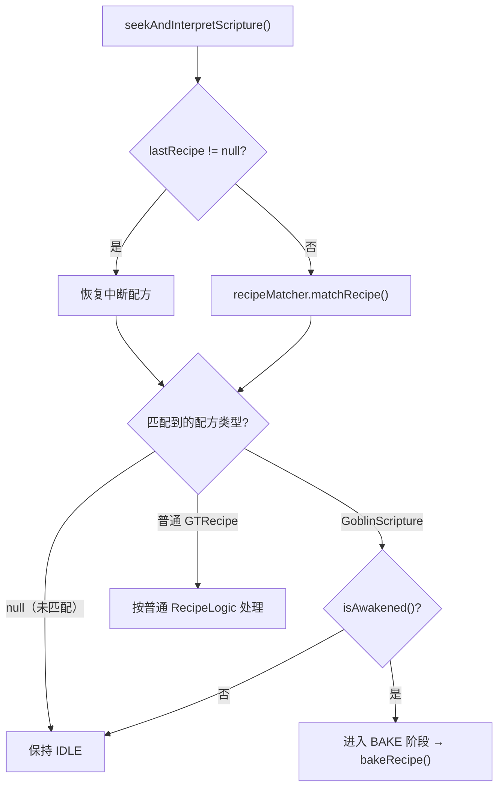
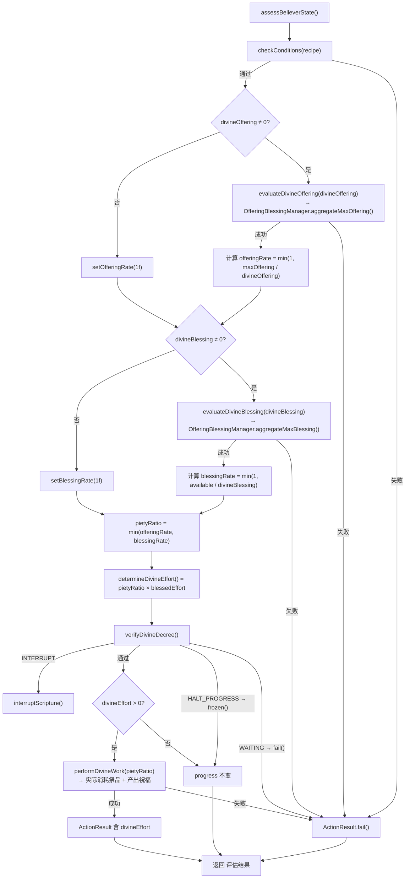
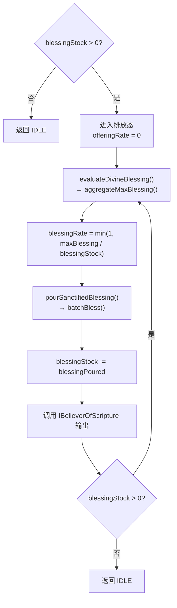
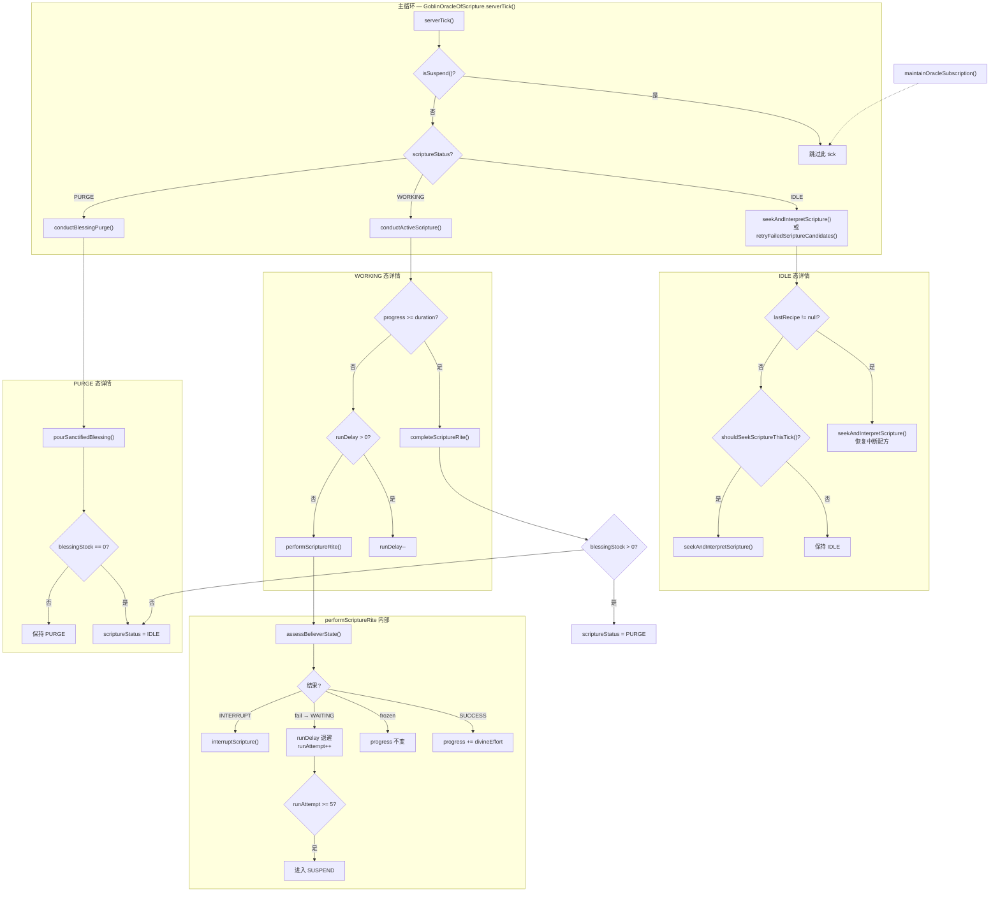

# GoblinOracleOfScripture — 经文神谕者

## 概述

`GoblinOracleOfScripture` 是经文系统的中枢编排器，负责驱动完整的七阶段执行模型。它位于机器逻辑层之上，通过 `IAwakened` 等接口与机器通信，管理 `RiteMode`（仪式模式）和 `ScriptureStatus`（经文状态）两个核心枚举的状态切换。

**包路径**：`com.goblincoders.goblintech.api.recipe.logic`

**类层次**：`GoblinOracleOfScripture` 继承 GTCEu 的 `RecipeLogic`，通过关联的 `IAwakened` 机器实例获取能力。

```
RecipeLogic  (GTCEu)
  └── GoblinOracleOfScripture    ← 掌管七阶段编排 + 状态机
        ├── 通过 machine (IAwakened) 取得 OfferingBlessingManager
        ├── 通过 machine (IBelieverOfScripture) 取得容量/速率
        ├── 通过 machine (IPresenceOfOracle) 取得预言者支持
        └── 通过 machine (IFavoredByOracle) 取得神谕恩惠等级
```

---

## 1. RiteMode — 仪式模式

`RiteMode` 是配方级别的枚举，定义经文的四种仪式类型。在配方 JSON 的 `riteMode` 字段中声明，由 `GoblinScripture` 携带。

### 1.1 枚举值

| 值 | 含义 | 典型场景 | 在执行阶段的差异 |
|----|------|---------|----------------|
| `SACRIFICE` | 献祭转化 | 消耗祭品产出祝福 | SETUP 阶段消耗输入物品 (`devoteInput=true`) |
| `BLESSING` | 神圣祝福 | 无需祭品，直接产出 | SETUP 阶段仅匹配配方不消耗 (`devoteInput=false`) |
| `AURA` | 灵光感应 | 被动/环境型经文 | 可能触发 AMBIENT 模式条件 |
| `VENERATION` | 供奉展示 | 物品供奉、属性转移 | 结合预言者体系进行数据组件映射 |

### 1.2 模式对执行流程的影响

```
RiteMode
  ├── SACRIFICE    → devoteInput=true  → handleRecipeIO(IN) 消耗输入
  ├── BLESSING     → devoteInput=false → matchRecipe() 仅匹配不消耗
  ├── AURA         → devoteInput=false → AMBIENT 参数化条件检查
  └── VENERATION   → devoteInput=true  → augur 序列遍历输出槽
```

### 1.3 类定义

```java
public enum RiteMode {
    SACRIFICE,   // 献祭转化
    BLESSING,    // 神圣祝福
    AURA,        // 灵光感应
    VENERATION   // 供奉展示
}
```

---

## 2. ScriptureStatus — 经文状态

`ScriptureStatus` 是运行时状态枚举，由 `GoblinOracleOfScripture` 在 `serverTick()` 中切换，控制机器在每个 tick 执行哪个阶段。

### 2.1 枚举值

| 值 | 含义 | 触发条件 | 退出条件 |
|----|------|---------|---------|
| `IDLE` | 空闲态 | 初始化 / PURGE 完毕 / 配方中断 | `shouldSeekScriptureThisTick()` 或 `lastRecipe != null` |
| `WORKING` | 工作态 | SETUP 完成后 | `progress >= duration` 或 `interruptScripture()` |
| `PURGE` | 排放态 | FINISH 后 `blessingStock > 0` | `blessingStock == 0` |

### 2.2 状态转换图



### 2.3 类定义

```java
public enum ScriptureStatus {
    IDLE,     // 空闲态 — 等待配方匹配或排放完毕
    WORKING,  // 工作态 — 配方正在执行
    PURGE     // 排放态 — 祝福残留未排空
}
```

---

## 3. GoblinOracleOfScripture — 类定义

### 3.1 继承与关联

```java
public class GoblinOracleOfScripture extends RecipeLogic {

    private final IAwakened awakenedMachine;
    private ScriptureStatus scriptureStatus = ScriptureStatus.IDLE;
    private GoblinScripture currentScripture;
    private ScriptureContext scriptureContext;

    // 进度
    private int progress;
    private int duration;

    // 祭品 / 祝福（每 tick 需求）
    private int divineOffering;
    private int divineBlessing;

    // 延迟计数（WAITING 退避）
    private int runDelay;
    private int runAttempt;
}
```

### 3.2 核心职责

| 职责 | 涉及方法 | 阶段 |
|------|---------|------|
| 状态机调度 | `serverTick()` | 全部 |
| 配方发现与匹配 | `seekAndInterpretScripture()` | MATCHING |
| 修改器链执行 | `bakeRecipe()` / `fullModifyRecipe()` | BAKE |
| 配方启动 | `setupScripture()` | SETUP |
| 逐 tick 推进 | `performScriptureRite()` → `assessBelieverState()` | WORKING |
| 配方完成 | `completeScriptureRite()` | FINISH |
| 残留排放 | `conductBlessingPurge()` | PURGE |
| 中断恢复 | `interruptScripture()` / `retryFailedScriptureCandidates()` | 异常路径 |

---

## 4. 方法目录（按阶段）

### 4.1 主循环 — serverTick()

```java
public void serverTick() {
    if (awakenedMachine.isSuspend()) return;

    switch (scriptureStatus) {
        case PURGE:
            conductBlessingPurge();
            if (machine.getBlessingStock() == 0)
                scriptureStatus = ScriptureStatus.IDLE;
            break;

        case WORKING:
            conductActiveScripture();
            break;

        case IDLE:
            if (lastRecipe != null) {
                seekAndInterpretScripture();  // 从上次中断恢复
            } else if (shouldSeekScriptureThisTick()) {
                seekAndInterpretScripture();
            }
            retryFailedScriptureCandidates();
            break;
    }

    maintainOracleSubscription();
}
```

**核心方法对照：**

| 方法 | 职责 |
|------|------|
| `conductActiveScripture()` | WORKING 阶段入口 — 管理 progress 推进与完成判断 |
| `conductBlessingPurge()` | PURGE 阶段执行体 — 倾倒残留祝福 |
| `enterBlessingPurgeIfNeeded()` | 检查 `blessingStock > 0` 决定是否进入 PURGE |
| `maintainOracleSubscription()` | 管理 tick 订阅（用于 `GoblinOracleOfOmnipresence` 并行计算） |

### 4.2 MATCHING 阶段 — 配方匹配

```java
/**
 * 在 IDLE 态触发，尝试匹配经文配方。
 *
 * 流程：
 * 1. 守卫检查：isAwakened() — 神谕未觉醒则直接返回
 * 2. 若 lastRecipe != null → 尝试恢复上次中断的配方
 * 3. 否则通过 recipeMatcher.matchRecipe() 在当前输入中寻找匹配
 * 4. 分流：
 *    - 匹配到 GoblinScripture → 进入 BAKE 阶段
 *    - 匹配到普通 GTRecipe → 按普通配方处理
 *    - 未匹配 → 保持 IDLE
 */
void seekAndInterpretScripture();

/**
 * 判断当前 tick 是否应尝试匹配新经文。
 * 由机器实现的具体逻辑决定（如冷却时间、输入槽变化检测等）。
 */
boolean shouldSeekScriptureThisTick();

/**
 * 重试之前匹配失败但有再次尝试价值的候选配方。
 */
void retryFailedScriptureCandidates();
```

**`seekAndInterpretScripture` 内部流程图：**



### 4.3 BAKE 阶段 — 烘焙

```java
/**
 * 对匹配到的 GoblinScripture 执行修改器链。
 *
 * 链式执行顺序：
 *   OMNIPRESENT_ASCENSION → ASCENSION_BENEDICTION → DIVINE_SUBTICK → ORACLE_FAVOR
 *
 * 每个修改器通过 machine.instanceof 检查接口支持：
 *   - IOmnipresentAvatar → OMNIPRESENT_ASCENSION
 *   - IAscensionBlessed   → ASCENSION_BENEDICTION
 *   - IBelieverOfScripture → DIVINE_SUBTICK
 *   - IFavoredByOracle    → ORACLE_FAVOR
 *
 * 修改器由机器接口自动触发，无需配方 JSON 声明。
 */
GoblinScripture bakeRecipe(GoblinScripture scripture);
```

修改器链的详细实现参见 [scripture-modifiers.md](file:///d:/Program%20Files%20(x86)/GoblinTechMotive/GoblinTechMotiveCore/docs/skills/scripture-modifiers.md)。

### 4.4 SETUP 阶段 — 经文启动

```java
/**
 * 经文启动，在 BAKE 阶段成功后执行。
 *
 * 流程：
 * 1. machine.beforeWorking(recipe)         — 进入工作前回调
 * 2. IPresenceOfOracle.witnessInputs(ctx)  — 预言者见证输入（若有 augur 且机器支持）
 * 3. 根据 RiteMode 处理输入：
 *    - SACRIFICE / VENERATION → handleRecipeIO(IN) 消耗输入
 *    - BLESSING / AURA         → matchRecipe() 仅匹配不消耗
 * 4. duration = scripture.duration × getBlessedEffort() / maxSubtickCount
 * 5. 提取 divineOffering / divineBlessing
 * 6. getOfferingBlessingManager().beginWork() — 建立模块快照
 * 7. setStatus(WORKING)
 */
void setupScripture(GoblinScripture scripture);
```

**关键数据提取：**

| 提取项 | 来源 | 用途 |
|--------|------|------|
| `divineOffering` | `ScriptureAptitude.CAP` 从 `tickInputs.divine` 提取 | 每 tick 的祭品需求，传给 `evaluateDivineOffering()` |
| `divineBlessing` | `ScriptureAptitude.CAP` 从 `tickOutputs.divine` 提取 | 每 tick 的祝福产出，传给 `evaluateDivineBlessing()` |
| `duration` | `scripture.duration × blessedEffort` | 配方总工作量 |

### 4.5 WORKING 阶段 — 逐 tick 推进

#### conductActiveScripture()

```java
/**
 * WORKING 阶段统一入口。
 *
 * 流程：
 * 1. progress >= duration → completeScriptureRite() → enterBlessingPurgeIfNeeded()
 * 2. progress < duration && runDelay > 0 → runDelay--，跳过此 tick
 * 3. progress < duration && runDelay == 0 → performScriptureRite()
 */
void conductActiveScripture();
```

#### performScriptureRite()

```java
/**
 * 每 tick 执行一次经文的实际推进。
 *
 * 流程：
 * 1. assessBelieverState() — 评估信徒状态
 * 2. 根据返回结果分流：
 *    - SUCCESS（未冻结）→ progress += divineEffort
 *    - frozen()           → progress 不变，保持 WORKING
 *    - ActionResult.fail()→ 设置 WAITING，runAttempt++，退避计数
 *    - INTERRUPT          → interruptScripture()
 * 3. WAITING 累积 runAttempt >= 5 且无防掉电 → 状态 → SUSPEND，进度回退
 */
void performScriptureRite();
```

#### assessBelieverState()

这是 WORKING 阶段的核心方法，评估当前 tick 的信徒状态，返回包含 `divineEffort` 的结果包。

```java
/**
 * 逐 tick 评估信徒状态，返回评估结果。
 *
 * 内部调用链：
 *   checkConditions(recipe)
 *   → evaluateDivineOffering(divineOffering)
 *   → evaluateDivineBlessing(divineBlessing)
 *   → calculatePietyLevel() → pietyRatio
 *   → determineDivineEffort()
 *   → verifyDivineDecree()
 *   → performDivineWork(pietyRatio)（条件满足时）
 *
 * @return ActionResult — 内含 divineEffort
 */
ActionResult assessBelieverState();
```

**内部方法调用链：**



**子方法详解：**

| 方法 | 职责 | 关键行为 |
|------|------|---------|
| `checkConditions(recipe)` | 检查配方条件 | 调用机器 `checkConditions()` |
| `evaluateDivineOffering(offering)` | 评估祭品供给能力 | 调用 `OfferingBlessingManager.aggregateMaxOffering()`，不实际消耗 |
| `evaluateDivineBlessing(blessing)` | 评估祝福容纳能力 | 调用 `OfferingBlessingManager.aggregateMaxBlessing()`，不实际输出 |
| `calculatePietyLevel()` | 计算虔诚等级 | `= min(offeringRate, blessingRate)`，结果作为 `pietyRatio` 传入后续 |
| `determineDivineEffort()` | 计算神圣努力值 | `= ceil(pietyRatio × blessedEffort)` |
| `verifyDivineDecree()` | 验证神谕条件 | 检查 `IFavoredByOracle` 条件是否满足 |
| `performDivineWork(pietyRatio)` | 实际执行神圣工作 | 调用 `Manager.performDivineWork(pietyRatio)`，内部 `batchOffer`/`batchBless` 应用 `effective = throttle × pietyRatio` |

**verifyDivineDecree 的四种返回：**

| 结果 | 行为 | 说明 |
|------|------|------|
| `通过` | 进入 `performDivineWork(pietyRatio)` | 神谕条件满足 |
| `WAITING` | `ActionResult.fail()` → 设置 WAITING 态 | 外部等待（如燃料未点燃） |
| `HALT_PROGRESS` | `frozen()` → 进度冻结 | 暂停执行但保持 WORKING |
| `INTERRUPT` | `interruptScripture()` | 中断配方，返回 IDLE |

### 4.6 FINISH 阶段 — 经文完成

```java
/**
 * 经文完成，在 progress >= duration 时触发。
 *
 * 流程：
 * 1. handleRecipeIO(OUT)           — 将配方输出物放入输出槽
 * 2. IPresenceOfOracle.applyAugurs() — 对输出槽应用预言者序列（若有 augur 且机器支持）
 * 3. getOfferingBlessingManager().endWork() — 清理快照、恢复节流阀
 * 4. enterBlessingPurgeIfNeeded()  — 检查 blessingStock > 0，决定进入 PURGE 还是 IDLE
 */
void completeScriptureRite();
```

**endWork 清理流程：**

| 步骤 | 操作 |
|------|------|
| 清除模块快照 | 调用 `snapshot.clear()` 释放快照数据 |
| 逐个模块 `onWorkComplete()` | 通知各献祭模块工作已完成（燃料模块在此清理燃烧状态和匹配缓存） |
| 恢复节流阀 | `throttleRate` 恢复为配置值 |

### 4.7 PURGE 阶段 — 祝福排放

```java
/**
 * 检查是否需要进入排放态。
 *
 * @return true → scriptureStatus = PURGE
 */
boolean enterBlessingPurgeIfNeeded();

/**
 * PURGE 态每 tick 执行体。
 *
 * 核心逻辑：不 Offering，全力 Blessing。
 * offeringRate 固定为 0，完全不依赖祭品输入。
 */
void conductBlessingPurge();
```

**排放态流程图：**



```java
/**
 * 将残留祝福倾倒到输出系统。
 * 通过 IBelieverOfScripture 的每 tick 输出方法将祝福转换为实际输出。
 */
ActionResult pourSanctifiedBlessing();
```

### 4.8 异常路径

```java
/**
 * 中断当前配方执行。
 *
 * 触发条件：
 *   - verifyDivineDecree() 返回 INTERRUPT
 *   - 神谕条件不再满足
 *
 * 执行后：
 *   - 保留 blessingStock（可能进入 PURGE）
 *   - 状态返回 IDLE
 */
void interruptScripture();

/**
 * 管理 tick 订阅 — 用于 GoblinOracleOfOmnipresence 的并行计算。
 * 每 tick 调用一次，确保神谕者订阅必要的 tick 事件。
 */
void maintainOracleSubscription();
```

---

## 5. 完整执行流程图



---

## 6. 与机器接口的关系

`GoblinOracleOfScripture` 通过 `IAwakened` 基接口与机器通信。不同接口提供不同的能力，决定修改器是否触发和业务流程分支：

| 机器接口 | GoblinOracleOfScripture 中的使用点 | 影响的阶段 |
|---------|----------------------------------|-----------|
| `IAwakened` | `isAwakened()` 守卫、`getOfferingBlessingManager()` | MATCHING、SETUP、WORKING、FINISH |
| `IOmnipresentAvatar` | `getOmnipresentAvatarLimit()` → 触发 `OMNIPRESENT_ASCENSION` | BAKE |
| `IAscensionBlessed` | `getDevotionGrade()` → 触发 `ASCENSION_BENEDICTION` | BAKE |
| `IBelieverOfScripture` | `getMaxBosom()`/`getMaxEndurance()` → 容量限制，`pourSanctifiedBlessing()` → 输出 | BAKE（DIVINE_SUBTICK）、WORKING、PURGE |
| `IPresenceOfOracle` | `witnessInputs()` / `applyAugurs()` | SNAP、SETUP、FINISH |
| `IFavoredByOracle` | `getOracleFavorLevel()` → 触发 `ORACLE_FAVOR` | BAKE |

接口详细定义参见 [divine-machine-interfaces.md](file:///d:/Program%20Files%20(x86)/GoblinTechMotive/GoblinTechMotiveCore/docs/skills/divine-machine-interfaces.md)。

---

## 7. 关键数据流

### 7.1 配方执行过程中的数据传递

```
配方 JSON（tickInputs/tickOutputs）
  │
  ▼
GoblinScripture（devoteInput, augurs, riteMode, requiresVision）
  │  BAKE 阶段：修改器链倍增
  ▼
ScriptureContext（demand, yield, parallel, augurs）
  │  SETUP 阶段：提取 divineOffering / divineBlessing
  ▼
assessBelieverState()
  ├── divineOffering → evaluateDivineOffering() → offeringRate
  ├── divineBlessing  → evaluateDivineBlessing()  → blessingRate
  ├── pietyRatio = min(offeringRate, blessingRate)
  └── divineEffort = pietyRatio × blessedEffort
      │  performDivineWork(pietyRatio)：实际消耗祭品 + 产出祝福
      ▼
      progress += divineEffort
      │  progress >= duration
      ▼
      completeScriptureRite() → handleRecipeIO(OUT) → 输出物品
```

### 7.2 容量与速率的关系

```
机器容量（IBelieverOfScripture）
  ├── maxBosom（祭品槽上限）     → 限制 getMaxParallelByInput
  ├── maxEndurance（祝福槽上限）  → 限制 limitMaxParallelByOutput
  ├── offeringStock（当前祭品存量）→ 不影响速率但用于监控
  └── blessingStock（当前祝福存量）→ >0 触发 PURGE

逐 tick 速率
  ├── offeringRate（祭品供给率）   → 由 evaluateDivineOffering 计算
  ├── blessingRate（祝福容纳率）   → 由 evaluateDivineBlessing 计算
  ├── pietyRatio（虔诚等级）       → = min(offeringRate, blessingRate)
  └── divineEffort（神圣努力值）   → = pietyRatio × blessedEffort（默认 16）
```