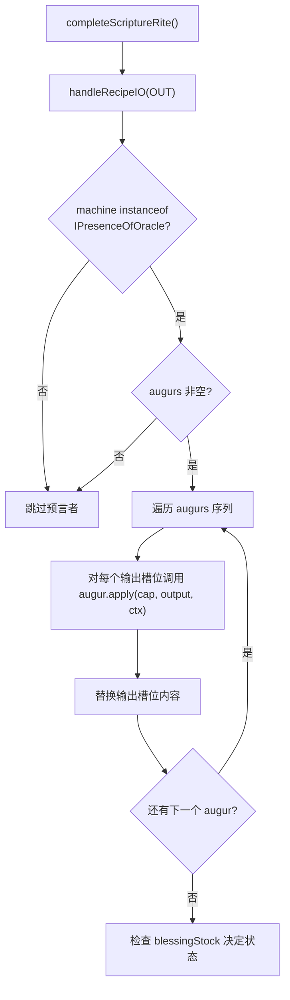
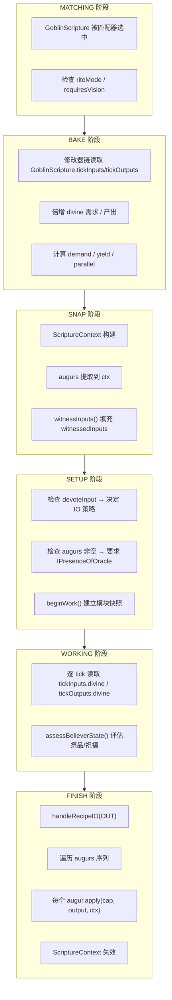

# GoblinScripture — 经文配方、上下文与预言者

## 概述

本文档涵盖经文系统的三个核心数据结构：`GoblinScripture`（经文配方）、`ScriptureContext`（经文上下文）和 `Augur`（预言者体系）。它们共同构成经文的"数据面"——配方定义、执行上下文、输出后处理，与 `GoblinOracleOfScripture`（编排面）协作完成七阶段执行。

**包路径**：`com.goblincoders.goblintech.api.recipe`

**三者在管道中的位置：**

```
配方 JSON ──→ GoblinScripture ──→ BAKE 修改器链 ──→ SNAP: ScriptureContext 构建
                                    │
                                    ▼
                              FINISH: Augur 序列应用到输出槽
```

---

## 1. GoblinScripture — 经文配方

### 1.1 概述

`GoblinScripture` 是经文系统的配方载体，继承自 GTCEu 的 `GTRecipe`（或自定义 `GoblinRecipe`），在原有配方字段基础上扩展了经文特有的元数据。

### 1.2 类定义

```java
public class GoblinScripture extends GTRecipe {
    /** 是否奉献输入 — true=消耗输入物品，false=仅匹配不消耗 */
    private boolean devoteInput;

    /** 预言者列表 — 在 FINISH 阶段按序应用到输出槽 */
    private List<Augur> augurs;

    /** 仪式模式 — 决定输入/输出行为 */
    private RiteMode riteMode;

    /** 是否需要神谕视野 — 要求机器实现 IPresenceOfOracle */
    private boolean requiresVision;
}
```

### 1.3 字段详解

| 字段 | 类型 | 默认值 | 说明 |
|------|------|--------|------|
| `devoteInput` | `boolean` | `true` | 是否奉献输入物品。`true` → `handleRecipeIO(IN)` 消耗；`false` → `matchRecipe()` 仅验证 |
| `augurs` | `List<Augur>` | `[]` | 预言者序列，在 FINISH 阶段 `handleRecipeIO(OUT)` 后按序应用 |
| `riteMode` | `RiteMode` | `SACRIFICE` | 仪式模式，决定输入/输出行为和 `devoteInput` 的默认值 |
| `requiresVision` | `boolean` | `false` | 若为 `true`，机器必须实现 `IPresenceOfOracle` 才能执行此经文 |

### 1.4 RiteMode 与字段的联动

| RiteMode | devoteInput 默认 | 含义 |
|----------|-----------------|------|
| `SACRIFICE` | `true` | 献祭转化 — 消耗输入，产出独立输出 |
| `BLESSING` | `false`（强制） | 神圣祝福 — 保留输入，原地修改输出 |
| `AURA` | `false`（强制） | 灵光感应 — 无 IO，仅环境条件 |
| `VENERATION` | `false`（强制） | 供奉展示 — 保留输入，产出独立输出 |

> **注意**：`BLESSING`、`AURA`、`VENERATION` 的 `devoteInput` 为强制值，配方 JSON 中声明无效。

### 1.5 配方 JSON 格式

```json
{
  "type": "goblintech:scripture",
  "riteMode": "SACRIFICE",
  "devoteInput": true,
  "requiresVision": false,
  "augurs": [
    { "type": "goblintech:echo_of_origin" }
  ],
  "inputs": {
    "items": [{ "item": "minecraft:diamond" }]
  },
  "outputs": {
    "items": [{ "item": "minecraft:emerald" }]
  },
  "tickInputs": {
    "divine": [32]
  },
  "tickOutputs": {
    "divine": [16]
  },
  "duration": 200
}
```

**字段说明：**

| 字段 | 必填 | 说明 |
|------|------|------|
| `type` | 是 | 固定为 `goblintech:scripture` |
| `riteMode` | 否 | 默认 `SACRIFICE` |
| `devoteInput` | 否 | 仅 `SACRIFICE` 模式可设，其他模式强制 |
| `requiresVision` | 否 | 默认 `false`，若 `augurs` 非空且含 `requiresVision=true` 的预言者则自动设为 `true` |
| `augurs` | 否 | 预言者类型列表，按序执行 |
| `tickInputs.divine` | 否 | 每 tick 祭品需求（`offeringDemand`） |
| `tickOutputs.divine` | 否 | 每 tick 祝福产出（`blessingYield`） |

### 1.6 在七阶段中的流转

各阶段对 `GoblinScripture` 字段的使用：

| 阶段 | 使用的字段 | 用途 |
|------|-----------|------|
| MATCHING | `riteMode` | 配方匹配器可据此筛选经文 |
| BAKE | `tickInputs.divine`, `tickOutputs.divine` | 修改器链读取并倍增 Divine 需求 |
| SNAP | `augurs`, `requiresVision` | 构建 `ScriptureContext`，见证输入 |
| SETUP | `devoteInput`, `augurs`, `riteMode` | 决定 IO 策略、检查预言者支持 |
| WORKING | `tickInputs.divine`, `tickOutputs.divine`, `duration` | 逐 tick 评估祭品/祝福 |
| FINISH | `augurs` | 应用预言者序列到输出槽 |
| PURGE | — | 仅使用 `blessingStock`（运行时状态） |

---

## 2. ScriptureContext — 经文上下文

### 2.1 概述

`ScriptureContext` 是经文执行期间的上下文容器，在 SNAP 阶段构建，贯穿 SETUP → FINISH 阶段，携带配方信息、见证输入和执行状态。

### 2.2 类定义

```java
public class ScriptureContext {
    /** 当前经文 */
    public GoblinScripture recipe;

    /** 祭品需求总量 */
    public long demand;

    /** 祝福产出总量 */
    public long yield;

    /** 并行数（化身数） */
    public int parallel;

    /** 预言者序列 — 由配方反序列化器从 JSON augurs 数组解析填充，不可手动写入 */
    public final List<Augur> augurs;

    /** 见证输入快照 — 由 witnessInputs() 在 beforeWorking 之后填充 */
    public Map<RecipeCapability<?>, List<Object>> witnessedInputs;

    /** 自定义数据 Map — 供预言者存储临时数据 */
    public Map<String, Object> data;

    /** 当前执行阶段 */
    public Phase phase;
}
```

### 2.3 字段详解

| 字段 | 类型 | 构建时机 | 说明 |
|------|------|---------|------|
| `recipe` | `GoblinScripture` | SNAP 阶段 | 当前执行的经文引用 |
| `demand` | `long` | BAKE 后 | 经修改器链倍增后的祭品需求总量 |
| `yield` | `long` | BAKE 后 | 经修改器链倍增后的祝福产出总量 |
| `parallel` | `int` | BAKE 后 | 遍在化现确定的并行数 |
| `augurs` | `List<Augur>` | SNAP 阶段 | 从经文中提取的预言者序列 |
| `witnessedInputs` | `Map<...>` | SNAP → SETUP | `IPresenceOfOracle.witnessInputs()` 填充 |
| `data` | `Map<String, Object>` | 任意阶段 | 预言者临时存储（如 `EchoOfOrigin` 存储复制的 DataComponent） |
| `phase` | `Phase` | 持续更新 | 当前阶段（MATCHING / SETUP / WORKING / FINISH） |

### 2.4 生命周期


### 2.5 与 IPresenceOfOracle 的交互

```java
// SNAP → SETUP 阶段：见证输入
if (recipe instanceof GoblinScripture gs && !gs.augurs.isEmpty()) {
    ((IPresenceOfOracle) machine).witnessInputs(scriptureContext);
}

// FINISH 阶段：应用预言者
if (machine instanceof IPresenceOfOracle oracle) {
    oracle.applyAugurs(gs.augurs, scriptureContext);
}
```

---

## 3. Augur — 预言者体系

### 3.1 概述

预言者是经文输出后处理的核心机制，在 FINISH 阶段 `handleRecipeIO(OUT)` 之后，对输出槽位应用数据组件修改。预言者序列在配方 JSON 中声明，按序执行。

### 3.2 接口定义

```java
public interface Augur {
    /**
     * 对单个输出槽位应用预言者效果。
     *
     * @param cap     目标 RecipeCapability（如 ItemRecipeCapability）
     * @param output  当前输出内容
     * @param ctx     经文上下文，含见证输入和临时数据
     * @return 修改后的输出内容
     */
    Object apply(RecipeCapability<?> cap, Object output, ScriptureContext ctx);

    /** 此预言者能处理的 RecipeCapability 集合 */
    Set<RecipeCapability<?>> targetCapabilities();

    /** 是否需要神谕视野 — true 时依赖 witnessInputs() 的输入快照 */
    default boolean requiresVision() { return false; }

    /** 预言者类型标识 */
    AugurType<?> type();
}
```

### 3.3 requiresVision 说明

`requiresVision` 区分预言者是否需要读取输入快照：

| requiresVision | 含义 | 典型预言者 |
|----------------|------|-----------|
| `true` | 需要 `witnessedInputs` 中的输入快照（如复制 DataComponent） | `EchoOfOrigin`、`WhisperOfSustenance` |
| `false` | 不需要输入快照，直接修改输出 | `ImprintOfWill`、`MarkOfFaith` |

**设计约束**：若经文包含 `requiresVision=true` 的预言者，`GoblinScripture.requiresVision` 自动设为 `true`，且机器必须实现 `IPresenceOfOracle`。`setupScripture()` 在 SETUP 阶段检查此约束：

```java
if (!gs.augurs.isEmpty() && !(machine instanceof IPresenceOfOracle)) {
    var reason = Component.translatable("goblintech.scripture.augur.unsupported");
    setStatus(Status.IDLE);
    return;
}
```

### 3.4 调用时序



### 3.5 内置预言者列表

#### 核心预言者

| 预言者 | requiresVision | 目标 Capability | 说明 |
|--------|---------------|----------------|------|
| `EchoOfOrigin`（起源回响） | `true` | 物品 | 复制输入物品的**全部** DataComponents 到输出物品 |
| `EchoOfSelf`（自身回响） | `true` | 物品 | 复制输入物品的**指定** DataComponent 到输出物品 |
| `ImprintOfWill`（意志烙印） | `false` | 物品 | 设置/覆盖输出物品的 DataComponent（无需输入参考） |

#### TFC 集成预言者

| 预言者 | requiresVision | 目标 Capability | 说明 |
|--------|---------------|----------------|------|
| `WhisperOfSustenance`（滋养低语） | `true` | 物品 | 复制输入物品的食物属性到输出（如营养值、水分） |
| `Reflection`（镜像映射） | `true` | 物品 | 输出 = 输入的完全副本（含全部 DataComponent） |
| `MarkOfFaith`（信仰印记） | `false` | 物品 | 给输出添加 TFC trait 标签 |
| `Banishment`（放逐术） | `false` | 物品 | 移除输出上的 trait 标签 |
| `TouchOfFire`（烈焰之触） | `false` | 物品 | 修改输出物品的温度属性 |

### 3.6 预言者实现要点

#### EchoOfOrigin（起源回响）

```java
public class EchoOfOrigin implements Augur {
    @Override
    public boolean requiresVision() { return true; }

    @Override
    public Object apply(RecipeCapability<?> cap, Object output, ScriptureContext ctx) {
        // 从 witnessedInputs 中获取输入物品的全部 DataComponents
        var inputItems = ctx.witnessedInputs.get(cap);
        if (inputItems == null || inputItems.isEmpty()) return output;

        // 将输入的 DataComponents 复制到输出
        return copyAllComponents(inputItems.get(0), output);
    }
}
```

#### ImprintOfWill（意志烙印）

```java
public class ImprintOfWill implements Augur {
    @Override
    public boolean requiresVision() { return false; }

    @Override
    public Object apply(RecipeCapability<?> cap, Object output, ScriptureContext ctx) {
        // 从 ctx.data 读取预定义的 DataComponent 配置
        var component = ctx.data.get("imprint:component");
        if (component == null) return output;

        // 直接设置/覆盖输出物品的 DataComponent
        return applyComponent(output, component);
    }
}
```

### 3.7 预言者链式执行规则

预言者按配方 JSON 中 `augurs` 数组的顺序依次执行，每个预言者看到的输出内容是前一个修改后的结果：

```
输出槽位原始内容
  │  augur[0].apply()
  ▼
修改后内容
  │  augur[1].apply()
  ▼
修改后内容
  │  ...
  ▼
最终输出
```

**设计含义**：可以利用此特性进行组合，例如先 `EchoOfOrigin` 复制全部 DataComponent，再 `MarkOfFaith` 添加 trait 标签，最后 `TouchOfFire` 修改温度。

---

## 4. 三者在七阶段中的协作



---

## 5. 配方 JSON 完整示例

### 5.1 标准献祭仪式

```json
{
  "type": "goblintech:scripture",
  "riteMode": "SACRIFICE",
  "devoteInput": true,
  "inputs": {
    "items": [{ "item": "minecraft:iron_ingot" }]
  },
  "outputs": {
    "items": [{ "item": "minecraft:gold_ingot" }]
  },
  "tickInputs": { "divine": [32] },
  "tickOutputs": { "divine": [16] },
  "duration": 200
}
```

### 5.2 带预言者的祝福仪式

```json
{
  "type": "goblintech:scripture",
  "riteMode": "BLESSING",
  "augurs": [
    { "type": "goblintech:echo_of_origin" },
    { "type": "goblintech:mark_of_faith", "data": { "trait": "tfc:fine" } }
  ],
  "inputs": {
    "items": [{ "item": "minecraft:diamond" }]
  },
  "outputs": {
    "items": [{ "item": "minecraft:diamond" }]
  },
  "tickInputs": { "divine": [64] },
  "duration": 400
}
```

### 5.3 灵光感应仪式

```json
{
  "type": "goblintech:scripture",
  "riteMode": "AURA",
  "tickInputs": { "divine": [8] },
  "tickOutputs": { "divine": [4] },
  "duration": 100
}
```