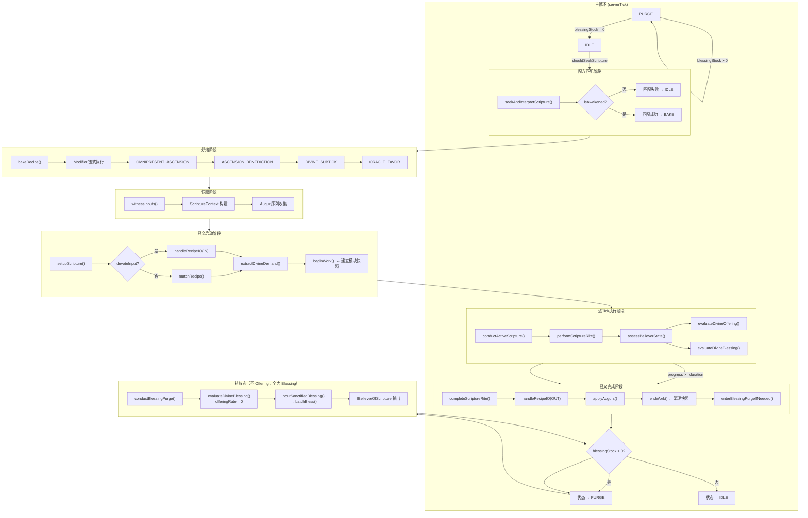
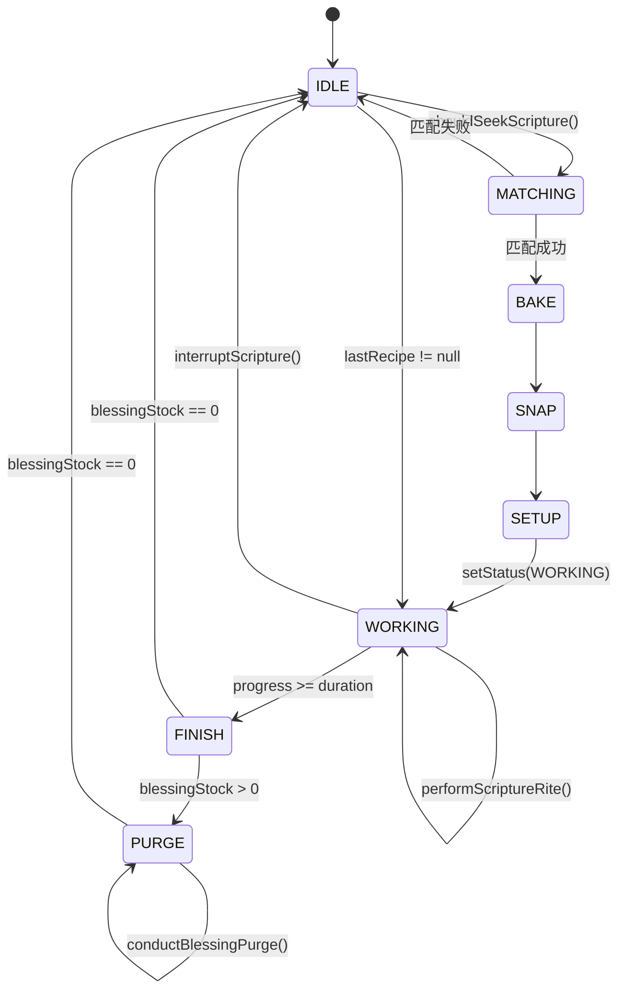
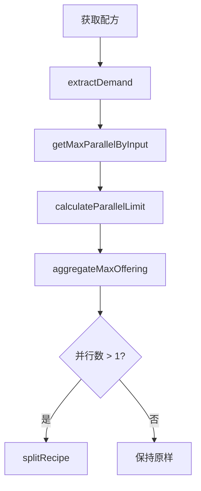
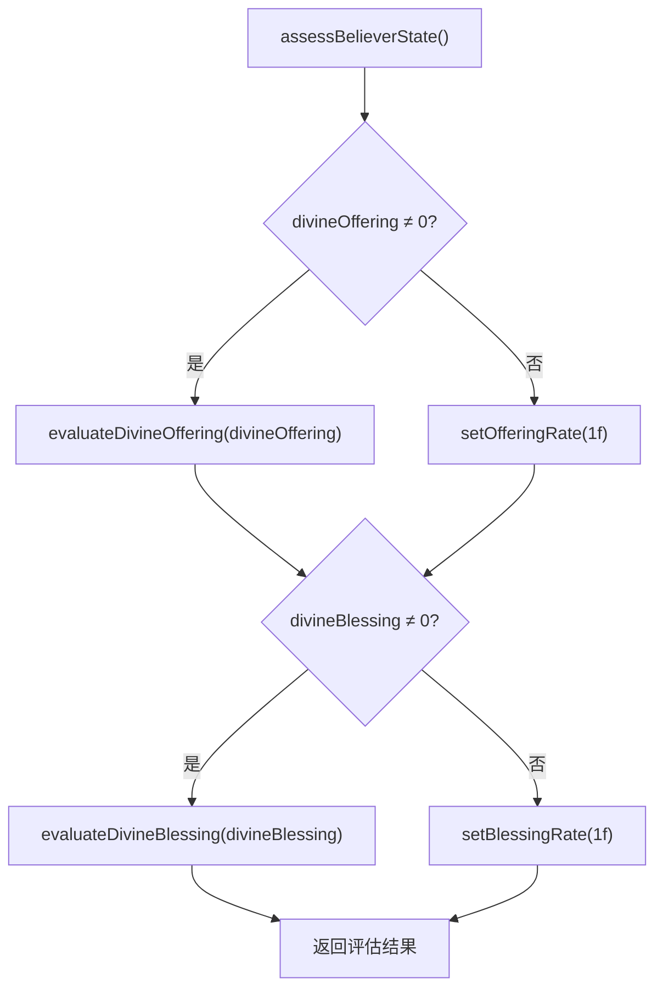
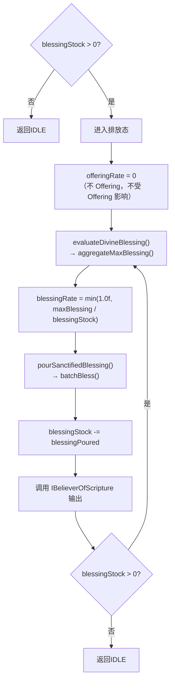

# GoblinScripture 架构文档

## 概述

GoblinScripture（哥布林经文）是 GoblinTechMotive 模组为解决原有 `RecipeLogic` 限制而设计的核心体系。原有 `RecipeLogic` 存在以下关键缺陷：

- **不支持 Working 阶段动态调整**：无法在执行过程中动态修改 `tickInput`、`tickOutput` 和配方处理速度
- **不支持数据组件动态映射**：无法根据实际输入的数据组件（如 NBT、流体属性）动态调整输出的数据组件

为克服这些限制，经文系统重新设计了配方匹配、执行和输出逻辑，形成完整的七阶段执行模型：

```
MATCHING → BAKE → SNAP → SETUP → WORKING → FINISH → PURGE
```

---

## 1. 主流程图 — ServerTick 事件总线

### 1.1 完整执行流程



### 1.2 状态机视图



---

## 2. 配方匹配阶段 (MATCHING)

### 2.1 seekAndInterpretScripture 流程

`seekAndInterpretScripture()` 在 IDLE 态触发，执行以下步骤：

1. **守卫检查**：`isAwakened()` — 神谕未觉醒则直接返回
2. **配方匹配**：通过 `recipeMatcher.matchRecipe()` 在当前输入中寻找匹配配方
3. **分流处理**：
   - 匹配到 `GoblinScripture` → 进入 BAKE 阶段
   - 匹配到普通 `GTRecipe` → 按普通配方处理
   - 未匹配 → 保持 IDLE

### 2.2 isAwakened 守卫

| 检查项 | 说明 |
|--------|------|
| `isActive()` | 机器是否激活 |
| `getLevel().isClientSide()` | 是否服务端 |
| `isSuspend()` | 是否暂停 |
| `isStructureFormed()` | 结构是否完整（如有） |

### 2.3 失败处理

匹配失败时执行：
- `retryFailedScriptureCandidates()` — 重试候选配方
- 状态保持 IDLE

---

## 3. 烘焙阶段 (BAKE)

### 3.1 整体管线流程


### 3.2 修改器链执行机制

`bakeRecipe()` 接收匹配到的 `GoblinScripture`，按固定顺序依次应用四个 Divine 修改器：

| 序号 | 修改器 | 接口限制 | 核心功能 | Builder |
|------|--------|----------|----------|---------|
| 1 | `OMNIPRESENT_ASCENSION` | 机器实现 `IOmnipresentAvatar` | 并行计算、献祭模块聚合 | `ModifierFunction.builder()` |
| 2 | `ASCENSION_BENEDICTION` | 机器实现 `IAscensionBlessed` | 完整/溢出升腾分离、祭品倍增 | `ScriptureScribe`（继承 FunctionBuilder） |
| 3 | `DIVINE_SUBTICK` | 机器实现 `IBelieverOfScripture` | 子 tick 并行补偿 | `ModifierFunction.builder()` |
| 4 | `ORACLE_FAVOR` | 机器实现 `IFavoredByOracle` | 短经文打包 | `ModifierFunction.builder()` |

任何一个修改器返回取消标记则中断链式执行。

四个修改器均为 Divine 修改器——既不通用（依赖机器内部特性），也不专用（适用于所有 Divine 机器）。每个修改器通过对应的接口将机器特性暴露给修改器逻辑，而非绑定具体机器类型。

**接口继承链**：

```
IAwakened                       ← 公共基础（isAwakened、OfferingBlessingManager）
├── IOmnipresentAvatar          ← OMNIPRESENT_ASCENSION（getOmnipresentAvatarLimit）
├── IAscensionBlessed           ← ASCENSION_BENEDICTION（getDevotionGrade）
└── IFavoredByOracle            ← ORACLE_FAVOR（getOracleFavorLevel）

IBelieverOfScripture            ← 经文信徒
├── IRecipeLogicMachine
├── IOmnipresentAvatar
└── IAscensionBlessed
```

**修改器触发机制**：修改器由**机器实现的接口**自动决定触发，无需在配方 JSON 中声明。机器在 BAKE 阶段遍历已注册修改器列表，根据 `machine instanceof` 判断哪些生效。

### 3.3 遍在化现 OMNIPRESENT_ASCENSION

通过 `IOmnipresentAvatar extends IAwakened` 接口暴露 `getOmnipresentAvatarLimit()`，机器实现此接口即可自动触发该修改器（无需配方 JSON 声明）。

并行计算委托给 `GoblinOracleOfOmnipresence`（继承 GTCEu `ParallelLogic`），计算四维度限制的最小值：
- 物品输入 → `ItemRecipeCapability.CAP.getMaxParallelByInput()`
- 流体输入 → `FluidRecipeCapability.CAP.getMaxParallelByInput()`
- 祭品输入 → `ScriptureAptitude.CAP.getMaxParallelByInput()`（内部调 `OfferingBlessingManager.aggregateMaxOffering()`）
- 祝福输出 → `ScriptureAptitude.CAP.limitMaxParallelByOutput()`（内部调 `OfferingBlessingManager.aggregateMaxBlessing()`）

#### 3.3.1 并行计算流程



#### 3.3.2 献祭模块体系

| 模块类型 | 接口 | 用途 |
|----------|------|------|
| `ThunderOfferingModule` | 电力输入 | 处理 EU 消耗 |
| `KineticOfferingModule` | 动能输入 | 处理应力消耗 |
| `FuelOfferingModule` | 燃料输入 | 处理燃料燃烧 |
| `MediumOfferingModule` | 介质输入 | 处理特殊介质 |

#### 3.3.3 祭品输入限制计算

`OfferingBlessingManager.aggregateMaxOffering()`（返回 `ActionResult`，含应急调整警告）聚合所有已安装献祭模块的产出能力：

| 献祭模块类型 | Offering 计算方式 |
|-------------|---------------|
| `ThunderOfferingModule` | 评估电力输出能力 |
| `KineticOfferingModule` | 评估动能输出能力 |
| `FuelOfferingModule` | 评估燃料输出能力（含两阶段机制） |
| `MediumOfferingModule` | 评估介质输出能力 |

各模块的 Offering 累加后形成 `maxOffering`，下游修改器可据此决定并行处理数。

### 3.4 升腾祝福 ASCENSION_BENEDICTION

通过 `IAscensionBlessed extends IAwakened` 接口暴露机器能力，`getDevotionGrade()` 作为准入门槛，祭品容量决定升腾次数。

**核心规则**：
- **准入门槛**：`devotionGrade >= scriptureRank`（`scriptureRank = floor(log4(unitDemand/8))`），达不到则返回 `cancel("虔诚等级不足")`
- **容量限制**：升腾次数完全由 `maxOffering / postParallelDemand` 决定，与虔诚等级无关
- **升腾模式分离**：完整升腾（`duration × 0.5^n >= 1`）耗时折半，溢出升腾（`duration × 0.5^n < 1`）吞吐量×4

**调用流程：**

1. 检查接口支持：`machine instanceof IAscensionBlessed`
2. 准入门槛：`devotionGrade >= scriptureRank`，不满足则 cancel
3. 获取机器祭品容量：`ScriptureAptitude.CAP.getMaxOffering(machine)`（内部调用 `OfferingBlessingManager.aggregateMaxOffering()`，返回 `ActionResult`）
4. 计算升腾次数：`totalAscends = floor(log4(maxOffering / postParallelDemand))`
5. 分离模式：`fullAscends = min(totalAscends, floor(log2(duration)))`，`overflowAscends = totalAscends - fullAscends`
6. 构建修改器：通过 **`ScriptureScribe`**（继承 `ModifierFunction.FunctionBuilder`）构建：

```java
var builder = new ScriptureScribe()
    .addOCs(totalAscends)
    .divineMultiplier(Math.pow(4, totalAscends));  // 仅倍增 Divine 内容

if (fullAscends > 0) {
    builder.durationMultiplier(Math.pow(0.5, fullAscends));
}
if (overflowAscends > 0) {
    int subtickParallel = (int) Math.pow(4, overflowAscends);
    ScriptureAptitude.CAP.setSubtickOverflow(recipe, subtickParallel);
    builder.subtickParallels(subtickParallel);
}
return builder.build();
```

**`ScriptureScribe` vs `ModifierFunction.builder()`**：

| 方法 | 来源 | 作用 |
|------|------|------|
| `divineMultiplier(n)` | `ScriptureScribe` 新增 | 仅倍增 `ScriptureAptitude.CAP`（Divine 内容），不误伤其他 tick 输入 |
| `powerMultiplier(n)` | `ScriptureScribe` 新增 | 倍增 `DivinePowerRegistry` 中所有已注册 Power 资源（默认含 EU + Divine） |
| `addOCs(n)` | 继承自 `FunctionBuilder` | 设置升腾次数 |
| `durationMultiplier(n)` | 继承自 `FunctionBuilder` | 耗时倍率 |
| `subtickParallels(n)` | 继承自 `FunctionBuilder` | 子 tick 并行度 |

**`DivinePowerRegistry` 的作用**：`ScriptureScribe` 背后依赖 `DivinePowerRegistry`（枚举单例注册表）的 `isPower()` 判断，确保 `divineMultiplier` 仅作用于 Divine 内容，不会像 `tickInputModifier` 那样误伤其他非 EU tick 输入。默认已注册 `EURecipeCapability.CAP`，`ScriptureAptitude` 在构造时自动注册。

| 组件 | 职责 |
|------|------|
| `IAscensionBlessed` | 标识机器支持升腾，提供 `getDevotionGrade()` 准入门槛 |
| `ScriptureAptitude.CAP` | 统一入口：读取经文 demand，提供 `getMaxOffering()`，`setSubtickOverflow()` |
| `OfferingBlessingManager` | 机器内部能力：聚合献祭模块的 maxOffering（由 `ScriptureAptitude.CAP` 间接调用） |
| `ScriptureScribe` | 专用 FunctionBuilder：提供 `divineMultiplier()` / `powerMultiplier()` 精准控制 |
| `DivinePowerRegistry` | 枚举单例注册表：管理"能量型资源"集合，支撑 `applyAllButPower` 排除逻辑 |

### 3.5 神圣子tick DIVINE_SUBTICK

通过 `IBelieverOfScripture` 接口判定是否支持。读取 `subtickOverflow`（由 ASCENSION_BENEDICTION 在升腾溢出时写入，值为 `4^overflowAscends`），将其转化为 `subtickParallel` 的并行补偿，实现无损吞吐量补偿。

### 3.6 神谕恩惠 ORACLE_FAVOR

通过 `IFavoredByOracle extends IAwakened` 接口判定是否支持，`getOracleFavorLevel()` 决定短经文打包容量。打包仅使用世俗资源限制（物品/流体），通过 `GoblinOracleOfOmnipresence.getMortalAvatarCount()` 排除 `ScriptureAptitude.CAP` 和 `EURecipeCapability.CAP`。

---

## 4. 快照阶段 (SNAP)

### 4.1 ScriptureContext 见证输入

`witnessInputs()` 在 `beforeWorking` 之后执行，对当前输入槽进行快照。通过 `IPresenceOfOracle` 接口暴露：

```java
public interface IPresenceOfOracle {
    void witnessInputs(GTRecipe recipe);
    void applyAugurs(List<Augur> augurs, ScriptureContext ctx);
}
```

`witnessInputs()` 的调用时机：
1. `beforeWorking()` 被执行（机器前置钩子）
2. 前置钩子可修改输入槽内容
3. `witnessInputs()` 对修改后的输入进行快照
4. `handleRecipeIO(IN)` 或 `matchRecipe()` 基于快照处理

### 4.2 Augur 预言者体系

预言者是应用于输出槽的修改器序列，通过 `IPresenceOfOracle.applyAugurs()` 调用。内置预言者列表详见 §7.3。

### 4.3 requiresVision 说明

经文可标记 `requiresVision=true`，要求机器实现 `IPresenceOfOracle` 接口。

---

## 5. 经文启动 (SETUP)

### 5.1 setupScripture 方法流程

`setupScripture()` 是经文启动阶段的核心入口（由重写的 `serverTick` 调用），执行以下步骤：

1. **检查 `devoteInput`**：经文定义是否消耗输入
   - `devoteInput=true`：执行 `handleRecipeIO(IN)`，消耗输入物品
   - `devoteInput=false`：执行 `matchRecipe()`，只验证不消耗

2. **检查预言者支持**：若经文包含 augur 序列但机器未实现 `IPresenceOfOracle`，拒绝仪式

3. **提取经文需求**：`extractDivineDemand(recipe, IO.IN)` → `divineDemand`；`extractDivineDemand(recipe, IO.OUT)` → `divineYield`

4. **设置工作状态**：记录配方、计算 `duration = recipe.duration * blessedEffort`、设置 `Status.WORKING`

5. **标记工作开始**：`getOfferingBlessingManager().beginWork()` — 创建模块状态快照（记录目标 Offering/Blessing、各模块配置节流阀）

**关键特性说明：**

| 特性 | 说明 |
|------|------|
| `devoteInput` | 控制是否消耗输入物品 |
| `IPresenceOfOracle` | 机器必须实现此接口才能使用预言者 |
| `witnessInputs()` | 在 `beforeWorking` 之后执行，快照输入 |
| `matchRecipe()` | `devoteInput=false` 时使用，只验证不消耗 |
| `beginWork()` | SETUP 末尾调用 `OfferingBlessingManager.beginWork()`，创建模块快照 |

### 5.2 RiteMode 仪式模式矩阵

| RiteMode | devoteInput | 输入行为 | 输出行为 | 典型场景 |
|----------|-------------|----------|----------|----------|
| `SACRIFICE` | true（默认） | 奉献 input | 产出独立 output | 标准仪式 |
| `SACRIFICE` | false | 保留 input | 产出独立 output | 仪式展示 |
| `BLESSING` | false（强制） | 保留 input | 原地修改 input | 添加信仰印记/NBT |
| `AURA` | N/A | 无 IO | 无 IO | 环境条件仪式 |
| `VENERATION` | false（强制） | 保留 input | 产出独立 output | 桶仪式（冷却、腌制） |

### 5.3 IPresenceOfOracle 接口

`IPresenceOfOracle` 在经文启动阶段与 setupScripture 协作：
- 若经文包含 augur 序列但机器未实现此接口，拒绝仪式
- 已实现时，后续在 SNAP 和 FINISH 阶段通过此接口调用 `witnessInputs()` 和 `applyAugurs()`

---

## 6. 逐Tick执行 (WORKING)

### 6.1 assessBelieverState 评估流程



### 6.2 evaluateDivineOffering / evaluateDivineBlessing

`evaluateDivineOffering()` 和 `evaluateDivineBlessing()` 由 `assessBelieverState()` 在每 tick 调用，分别评估祭品供给和祝福产出能力。

#### evaluateDivineOffering() — 模拟匹配阶段

**设计意图**：此阶段**不实际消耗祭品**，仅评估机器能否满足该 tick 的 `divineOffering` 需求。
（SETUP 阶段已调用 `beginWork()` 建立快照，`aggregateMaxOffering()` 基于快照检查模块可用性，必要时触发应急调整。）

评估流程：

1. 通过 `OfferingBlessingManager.aggregateMaxOffering()`（返回 `ActionResult`，含应急调整警告）聚合所有献祭模块的产出能力
   - `ThunderOfferingModule`：评估电力输出
   - `KineticOfferingModule`：评估动能输出
   - `FuelOfferingModule`：检查燃烧状态（正在燃烧 → `tickOffering()`；未燃烧 → `simulateMatch()` 不消耗燃料匹配配方）
   - `MediumOfferingModule`：评估介质输出

2. 若 `result.isFail("emergency_insufficient")`，`offeringRate = 0`
3. 否则：`maxOffering = result` 内部值
4. 计算 `offeringRate = min(1.0f, maxOffering / divineOffering)`

5. 若 `divineOffering = 0`，`offeringRate` 直接设为 1.0f

#### evaluateDivineBlessing() — 祝福产出评估

评估流程：

1. 通过 `OfferingBlessingManager.aggregateMaxBlessing()`（返回 `ActionResult`）聚合祝福槽上限
2. 计算剩余空间 = `maxBlessing - currentBlessingStock`
3. 计算 `blessingRate = min(1.0f, availableSpace / divineBlessing)`
4. 若 `divineBlessing = 0`，`blessingRate` 直接设为 1.0f
5. 若祝福槽已满（剩余空间 ≤ 0），`blessingRate = 0.0f`

#### 结果应用

`offeringRate` 和 `blessingRate` 进入后续 `calculatePietyLevel()` → `determineDivineEffort()` → `verifyDivineDecree()` 管线：

| 结果 | 说明 |
|------|------|
| `offeringRate=0` → `pietyLevel=0` | 无祭品供给，无努力值 |
| `blessingRate=0` → `pietyLevel=0` | 祝福槽已满，停止产出 |
| 两者均 > 0 | 按较小值计算 pietyLevel |
| 默认值 1.0f | 对应方向无需求时保底 |

### 6.3 calculatePietyLevel / determineDivineEffort

`calculatePietyLevel()` 取 `min(offeringRate, blessingRate)` 作为虔诚等级，`determineDivineEffort()` 将其乘以 `blessedEffort` 计算神圣努力值。

### 6.4 verifyDivineDecree / performDivineWork

`verifyDivineDecree()` 验证神谕条件是否满足，返回四种结果之一：

| 结果 | 行为 | 说明 |
|------|------|------|
| `通过` | 进入后续流程 | 条件满足 |
| `WAITING` | `ActionResult.fail()` → 设置 WAITING 态 | 外部等待 |
| `HALT_PROGRESS` | `frozen()` → 进度冻结 | 暂停执行 |
| `INTERRUPT` | `interruptScripture()` | 中断配方 |

`performDivineWork()` 在 `verifyDivineDecree()` 通过后执行，负责实际消耗祭品并产出祝福，包括燃料模块的 `ignite()` 点燃操作。

### 6.5 燃料献祭模块两阶段机制

| 阶段 | 调用时机 | 行为 |
|------|----------|------|
| **模拟阶段** `simulateMatch()` | `evaluateDivineOffering()` 阶段调用 | **不消耗燃料**，仅匹配燃料配方，返回理论 offeringPerTick |
| **执行阶段** `ignite()` | `performDivineWork()` 阶段调用 | 根据 `actualOffering = min(offeringRate, blessingRate)` 计算燃烧倍率，实际消耗燃料开始燃烧 |

**设计要点**：
- 一旦点燃，整轮燃烧期间不动态调整
- 燃烧结束后自动清除状态，等待下次 `evaluateDivineOffering()` → `performDivineWork()` 循环

---

## 7. 经文完成 (FINISH)

### 7.1 completeScriptureRite 方法流程

`completeScriptureRite()` 在 `progress >= duration` 时触发，执行以下步骤：

1. **输出产出**：`handleRecipeIO(IO.OUT)` 将配方输出物放入输出槽
2. **应用预言者序列**：若经文包含 augur 且机器实现 `IPresenceOfOracle`，调用 `applyAugurs()` 对输出槽应用预言者效果
3. **标记工作完成**：`getOfferingBlessingManager().endWork()` — 清理快照、逐个调用模块 `onWorkComplete()`、恢复应用节流阀为配置值
4. **排放态检查**：`enterBlessingPurgeIfNeeded()` 检查 `blessingStock > 0`，决定进入 PURGE 态还是返回 IDLE

### 7.2 applyAugurs 预言者应用

`applyAugurs()` 通过 `IPresenceOfOracle` 接口暴露（详见 §9.1.5），对已完成配方的输出槽应用预言者序列。

**检查流程**：

| 步骤 | 操作 |
|------|------|
| 1 | 检查 `machine instanceof IPresenceOfOracle` |
| 2 | 经文包含非空 augur 序列 |
| 3 | 调用 `applyAugurs(augurs, ctx)` 遍历预言者并逐个应用到输出槽 |
| 4 | 检查 `blessingStock` 决定进入排放态或返回 IDLE |

### 7.3 内置预言者列表

| 预言者 | requiresVision | 说明 | 归属 |
|--------|---------------|------|------|
| `EchoOfOrigin`（起源回响） | true | 复制输入的全部 DataComponents 到输出 | 核心 |
| `EchoOfSelf`（自身回响） | true | 复制输入的指定 DataComponent | 核心 |
| `ImprintOfWill`（意志烙印） | false | 设置/覆盖输出的 DataComponent | 核心 |
| `WhisperOfSustenance`（滋养低语） | true | 复制祭品的食物属性 | TFC 集成 |
| `Reflection`（镜像映射） | true | 祝福 = 祭品的副本 | TFC 集成 |
| `MarkOfFaith`（信仰印记） | false | 给祝福添加 TFC trait 标签 | TFC 集成 |
| `Banishment`（放逐术） | false | 移除祝福上的 trait 标签 | TFC 集成 |
| `TouchOfFire`（烈焰之触） | false | 修改祝福温度 | TFC 集成 |

---

## 8. 排放态 (PURGE)

### 8.1 排放态流程图

PURGE 态的核心逻辑：**不 Offering，全力 Blessing**。管线与 `assessBelieverState` 高度相似，但 `offeringRate` 固定为 0，完全不受 Offering 影响。



### 8.2 ScriptureStatus 状态枚举

经文状态枚举包含三种状态：

| 状态 | 含义 | 说明 |
|------|------|------|
| `IDLE` | 空闲态 | 等待配方匹配或排放完毕 |
| `WORKING` | 工作态 | 配方正在执行 |
| `PURGE` | 排放态 | 祝福残留未排空 |

### 8.3 serverTick 重写方案

`serverTick()` 是经文系统的主循环入口，重写后管理三种状态的切换：

```text
if (isSuspend()) → 跳过所有状态处理

switch (scriptureStatus):
  PURGE:
    conductBlessingPurge()           // 排放祝福
    若 blessingStock = 0 → 返回 IDLE

  WORKING:
    progress < duration:
      runDelay > 0 → runDelay--
      runDelay = 0 → performScriptureRite()
    progress >= duration:
      completeScriptureRite()
      enterBlessingPurgeIfNeeded()

  IDLE:
    lastRecipe != null → seekAndInterpretScripture()   // 从上次中断恢复
    shouldSeekScriptureThisTick() → seekAndInterpretScripture()
    retryFailedScriptureCandidates()

maintainOracleSubscription()  // 每 tick 订阅管理
```

**核心方法对照：**

| 方法 | 职责 |
|------|------|
| `conductActiveScripture()` | WORKING 阶段统一入口管理 progress |
| `conductBlessingPurge()` | PURGE 阶段执行体，倾倒祝福 |
| `enterBlessingPurgeIfNeeded()` | 检查 `blessingStock` 控制 PURGE 入口 |
| `maintainOracleSubscription()` | 管理 tick 订阅 |

---

## 9. 接口与数据结构参考

### 9.1 接口一览

所有接口位于 `com.goblincoders.goblintech.api.machine.feature` 包，均继承 `IMachineFeature`。

#### 9.1.0 IAwakened（已觉醒者 — 公共基础）

```java
public interface IAwakened extends IMachineFeature {
    // 获取祭品祝福管理器（支持懒加载兜底）
    OfferingBlessingManager getOfferingBlessingManager();
    // 显式初始化管理器（建议在机器构造函数中调用）
    OfferingBlessingManager initOfferingBlessingManager();
    // 配方匹配守卫 — 神谕是否觉醒
    default boolean isAwakened() { return true; }

    // 内部存储访问器（由机器实现类提供）
    OfferingBlessingManager getManagerStorage();
    void setManagerStorage(OfferingBlessingManager manager);
}
```

**初始化策略**：机器实现 `ITieredMachine` → 创建带虔诚等级限制的 `new OfferingBlessingManager(tier)`；仅实现 `IAwakened` → 无限制模式 `new OfferingBlessingManager()`。

#### 9.1.1 IBelieverOfScripture（经文信徒）

继承层级：`IBelieverOfScripture extends IRecipeLogicMachine, IOmnipresentAvatar, IAscensionBlessed`

```java
public interface IBelieverOfScripture extends IRecipeLogicMachine, IOmnipresentAvatar, IAscensionBlessed {
    // 容槽容量（Bosom / Endurance）
    default int getMaxBosom() { return 0; }
    default int getMaxEndurance() { return 0; }
    int getOfferingStock();
    void setOfferingStock(int value);
    int getBlessingStock();     // > 0 触发 PURGE 态
    void setBlessingStock(int value);

    // 安全阈值
    default int getOfferingThreshold() { return getMaxBosom() / 4; }
    default int getBlessingThreshold() { return getMaxEndurance() * 3 / 4; }

    // 速率评估（由 assessBelieverState 每 tick 计算）
    float getOfferingRate();
    void setOfferingRate(float rate);
    float getBlessingRate();
    void setBlessingRate(float rate);
    float getPietyLevel();       // = min(offeringRate, blessingRate)
    void setPietyLevel(float rate);
    int getDivineEffort();       // = pietyLevel × blessedEffort
    void setDivineEffort(int rate);

    // 神恩加持的努力（默认 16）
    default int getBlessedEffort() { return 16; }

    // 内部计数器
    int getOfferingReceived();
    void setOfferingReceived(int value);
    int getBlessingPoured();
    void setBlessingPoured(int value);

    // 评估默认实现（由 assessBelieverState() 每 tick 调用）
    default void evaluateDivineOffering(int divineOffering) { ... }
    default void evaluateDivineBlessing(int divineBlessing) { ... }

    // 子 tick 上限
    default int getMaxSubtickCount() { return 64; }

    // 排放态输出
    ActionResult pourSanctifiedBlessing();
}
```

**方法分组**：

| 分组 | 方法 | 说明 |
|------|------|------|
| 容槽容量 | `getMaxBosom()` / `getMaxEndurance()` | 机器的祭品/祝福容槽上限 |
| 容槽状态 | `getOfferingStock()` / `getBlessingStock()` | `blessingStock > 0` 触发 PURGE 态 |
| 速率 | `getOfferingRate()` / `getBlessingRate()` | 由 `assessBelieverState()` 每 tick 计算 |
| 虔诚/努力 | `getPietyLevel()` / `getDivineEffort()` | `pietyLevel = min(offeringRate, blessingRate)` |
| 子 tick | `getMaxSubtickCount()` | `DIVINE_SUBTICK` 硬件上限 |
| 排放 | `pourSanctifiedBlessing()` | PURGE 态每 tick 输出 |

#### 9.1.2 IOmnipresentAvatar（可遍在化现）

继承：`IOmnipresentAvatar extends IAwakened`，归属 `OMNIPRESENT_ASCENSION` 修改器。

```java
public interface IOmnipresentAvatar extends IAwakened {
    default int getOmnipresentAvatarLimit() { return 1; }
}
```

#### 9.1.3 IAscensionBlessed（蒙祝福可升腾）

继承：`IAscensionBlessed extends IAwakened`，归属 `ASCENSION_BENEDICTION` 修改器。

```java
public interface IAscensionBlessed extends IAwakened {
    default int getDevotionGrade() { return GoblinTechValues.ULV; }
}
```

#### 9.1.4 IFavoredByOracle（蒙神谕恩惠者）

继承：`IFavoredByOracle extends IAwakened`，归属 `ORACLE_FAVOR` 修改器。

```java
public interface IFavoredByOracle extends IAwakened {
    int getOracleFavorLevel();
}
```

#### 9.1.5 IPresenceOfOracle（神谕在场）

归属：预言者体系（SNAP 见证 / FINISH 应用）。

```java
public interface IPresenceOfOracle extends IMachineFeature {
    void witnessInputs(ScriptureContext ctx);
    default void applyAugurs(List<Augur> augurs, ScriptureContext ctx) { ... }
}
```

**调用时序**：
- `witnessInputs()`：`beforeWorking` 之后、`handleRecipeIO(IN)` 之前
- `applyAugurs()`：`completeScriptureRite()` 中 `handleRecipeIO(OUT)` 之后

### 9.2 关键数据结构

#### 9.2.1 ScriptureContext（经文上下文）

| 字段 | 类型 | 说明 |
|------|------|------|
| `recipe` | `GoblinScripture` | 当前经文 |
| `demand` | `long` | 需求总量 |
| `yield` | `long` | 产出总量 |
| `parallel` | `int` | 并行数 |
| `augurs` | `List<Augur>` | 预言者序列 |

#### 9.2.2 Augur（预言者）

```java
public interface Augur {
    void apply(ScriptContext ctx);
    boolean requiresVision();
}
```

#### 9.2.3 GoblinScripture（哥布林经文）

| 字段 | 类型 | 说明 |
|------|------|------|
| `devoteInput` | `boolean` | 是否奉献输入 |
| `augurs` | `List<Augur>` | 预言者列表 |
| `riteMode` | `RiteMode` | 仪式模式 |
| `requiresVision` | `boolean` | 是否需要神谕视野 |

#### 9.2.4 DivinePowerRegistry（神圣之力注册表）

枚举单例，管理"每 tick 能量型资源"集合，支撑 `ScriptureScribe` 和 `applyAllButPower` 排除逻辑。

```java
public enum DivinePowerRegistry {
    INSTANCE;

    private final Set<RecipeCapability<?>> powers = new HashSet<>();

    DivinePowerRegistry() {
        powers.add(EURecipeCapability.CAP);  // 默认注册 EU
    }

    public void register(RecipeCapability<?> cap) {
        powers.add(cap);
    }

    public boolean isPower(RecipeCapability<?> cap) {
        return powers.contains(cap);
    }

    public Set<RecipeCapability<?>> all() {
        return Collections.unmodifiableSet(powers);
    }
}
```

**注册时机**：`ScriptureAptitude` 在构造函数中自动调用 `DivinePowerRegistry.INSTANCE.register(this)` 注册自身。其他 Mod 可通过 `DivinePowerRegistry.INSTANCE.register(cap)` 扩展。

#### 9.2.5 ScriptureScribe（经文抄写员）

继承 `ModifierFunction.FunctionBuilder`，新增 `divineMultiplier()` 和 `powerMultiplier()` 便捷方法。

```java
public class ScriptureScribe extends ModifierFunction.FunctionBuilder {

    private ContentModifier divineModifier = ContentModifier.IDENTITY;
    private final Map<RecipeCapability<?>, ContentModifier> perPowerModifiers = new HashMap<>();

    /** 仅倍增 Divine 内容，不影响其他 tick 输入 */
    public ScriptureScribe divineMultiplier(double multiplier) { ... }

    /** 倍增所有已注册 Power 资源（EU + Divine + 其他） */
    public ScriptureScribe powerMultiplier(double multiplier) { ... }

    /** 对指定 Power 资源应用倍率 */
    public ScriptureScribe powerMultiplier(RecipeCapability<?> cap, double multiplier) { ... }

    @Override
    public ModifierFunction build() {
        // 1. 调用父类 build() 获取基础 ModifierFunction
        // 2. 包装：先执行父类修改，再应用 divineMultiplier 到 ScriptureAptitude.CAP
        // 3. 遍历 perPowerModifiers，对每个 Power 资源单独倍增
    }
}
```

**与 `ModifierFunction.builder()` 的对比**：

| 方法 | 来源 | 作用 |
|------|------|------|
| `divineMultiplier(n)` | `ScriptureScribe` 新增 | 仅倍增 Divine 内容 |
| `powerMultiplier(n)` | `ScriptureScribe` 新增 | 倍增所有 Power 资源（对标 `eutMultiplier`） |
| `powerMultiplier(cap, n)` | `ScriptureScribe` 新增 | 对指定 Power 资源精确倍增 |
| `addOCs(n)` | 继承 | 升腾次数 |
| `durationMultiplier(n)` | 继承 | 耗时倍率 |
| `subtickParallels(n)` | 继承 | 子 tick 并行度 |
| `batchParallels(n)` | 继承 | 批量并行度 |
| `modifyAllContents(cm)` | 继承 | 全内容修改器 |
| `parallels(n)` | 继承 | 并行数 |

### 9.3 RiteMode 仪式模式

```java
public enum RiteMode {
    SACRIFICE,   // 献祭转化
    BLESSING,    // 神圣祝福
    AURA,        // 灵光感应
    VENERATION   // 供奉展示
}
```

### 9.4 术语映射表

| 英文术语 | 中文术语 | 层级 | 说明 |
|----------|----------|------|------|
| Input | 输入 | 配方 | 配方层面的物品/流体输入 |
| Output | 输出 | 配方 | 配方层面的物品/流体输出 |
| demand | 需求 | 配方 | 经文定义的祭品总量 |
| yield | 产出 | 配方 | 经文定义的祝福总量 |
| Offering | 祭品 | Tick | 逐 tick 的能量消耗 |
| Blessing | 祝福 | Tick | 逐 tick 的能量产出 |
| Bosom | 胸怀 | 机器 | 机器的祭品槽上限（maxBosom） |
| Endurance | 耐力 | 机器 | 机器的祝福槽上限（maxEndurance） |

---

## 10. 实现指南

### 10.1 RecipeModifier 编写规范

#### 10.1.1 修改器分类体系

| 修改器类型 | 特点 | 设计方式 |
|-----------|------|----------|
| 通用修改器 | 不依赖机器内部特性 | 全局定义 |
| 专用修改器 | 依赖特定机器内部特性 | 随机器一起定义 |
| Divine 修改器 | 既不通用也不专用 | 接口抽象 |

#### 10.1.2 修改器实现流程

修改器的实现需遵循以下步骤：

1. **检查接口支持**：`machine instanceof` 验证机器是否支持所需特性
2. **获取机器能力**：通过接口方法获取机器内部数据
3. **获取配方数据**：通过 `ScriptureAptitude.CAP` 读取经文数据
4. **执行修改逻辑**：基于以上数据计算结果

> **重要**：实现细节参考 `divine-machine-execution-flow.md` 中对应修改器的流程描述，无需在此重复。最终实现以实际源码为准。

### 10.2 机器实现要点

实现 Divine 机器需关注以下要点：

| 关注点 | 说明 |
|--------|------|
| 接口实现 | 根据机器能力实现对应的 `IBelieverOfScripture`、`IPresenceOfOracle` 等接口 |
| OfferingBlessingManager | 每个 Divine 机器持有一个 `OfferingBlessingManager` 实例，管理献祭模块 |
| 献祭模块注册 | 在构造方法中注册机器支持的献祭模块类型（Thunder/Kinetic/Fuel/Medium） |
| serverTick 重写 | 遵循 8.3 节的 serverTick 状态机方案 |

### 10.3 需避免的坑

| 问题 | 原因 | 解决方案 |
|------|------|----------|
| 术语混淆 | Input/Offering/Blessing/Yield 混用 | 严格遵守分层原则 |
| 空指针异常 | 未检查接口实现 | 使用 `instanceof` 检查 |
| 性能问题 | 每 tick 重复计算 | 使用缓存机制 |
| 状态不一致 | PURGE 态管理不当 | 统一在 serverTick 处理 |

### 10.4 保留不变的术语

| 术语 | 用途 |
|------|------|
| `Input` / `Output` | 配方物品层面 |
| `demand` / `yield` | 经文定义层面 |
| `Offering` / `Blessing` | 逐 tick 执行层面 |
| `Bosom` / `Endurance` | 机器能力层面 |

### 10.5 推荐实施方案

#### 最小可行方案

1. 实现核心接口：`IBelieverOfScripture`、`IPresenceOfOracle`
2. 添加基础献祭模块：`FuelOfferingModule`、`ThunderOfferingModule`
3. 实现 `OMNIPRESENT_ASCENSION` 修改器
4. 完成 `serverTick` 重写

#### 完整方案

在最小可行方案基础上：

1. 添加 `ASCENSION_BENEDICTION`、`DIVINE_SUBTICK`、`ORACLE_FAVOR` 修改器
2. 实现完整的预言者体系
3. 添加 RiteMode 支持
4. 实现 PURGE 态完整流程

---

## 附录：术语使用规范

### 严格分层原则

1. **配方定义层**：使用 `Input` / `Output` / `demand` / `yield`
2. **机器能力层**：使用 `maxBosom` / `maxEndurance`
3. **逐 tick 执行层**：使用 `Offering` / `Blessing` / `divineOffering` / `divineBlessing`
4. **模块层**：使用 `ThunderOfferingModule` / `FuelOfferingModule` 等

### 避免的混淆

- ❌ 不要说"祭品输入"，要说"燃料输入"或"电力输入"
- ❌ 不要说"祝福输出"，要说"燃料燃烧产出"或"电力转换产出"
- ✅ `Offering` 仅用于描述逐 tick 的能量消耗
- ✅ `Blessing` 仅用于描述逐 tick 的能量产出
- ✅ `Input` / `Output` 用于描述物品/流体的配方层面输入输出