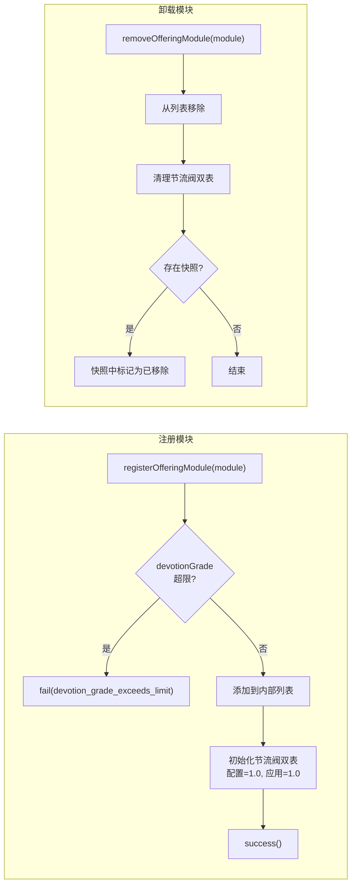
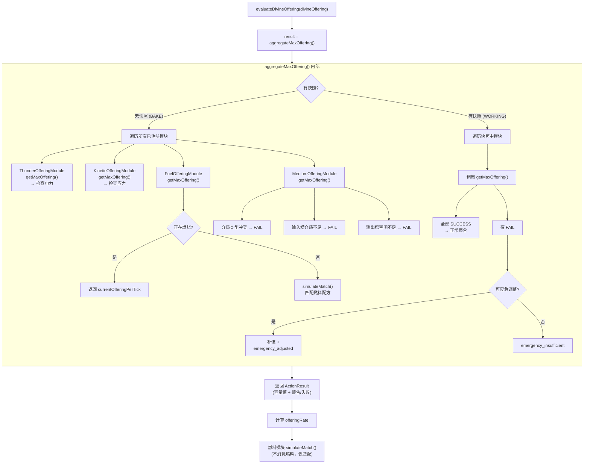
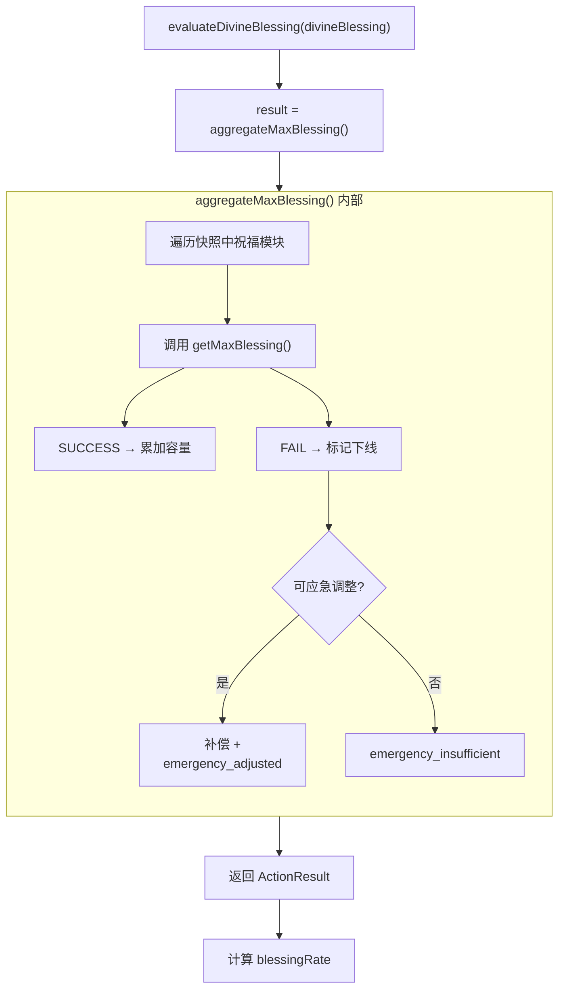
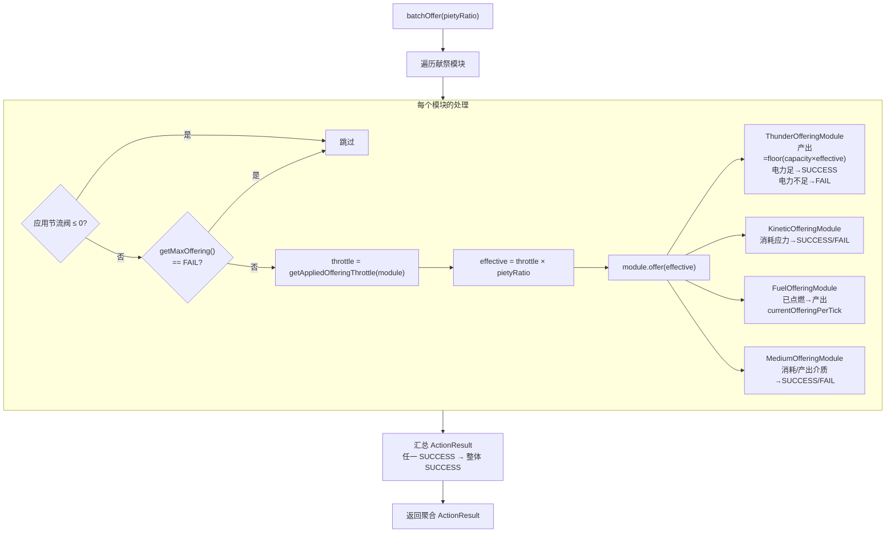
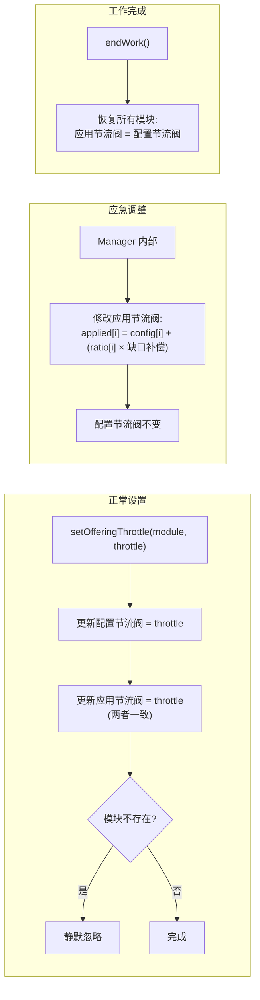

# OfferingBlessingManager — 祭品祝福管理器

## 概述

`OfferingBlessingManager` 是 Divine 机器中管理祭品（Offering）与祝福（Blessing）的核心管理器，聚合所有已安装的模块并提供批量操作。Bosom/Endurance 作为缓存值存储在 `IBelieverOfScripture` 上，各模块负责按节流阀值执行实际的产出。

**包路径**：`com.goblincoders.goblintech.api.machine.feature`

## 生命周期流程图

```mermaid
flowchart TD
    subgraph INIT["初始化阶段"]
        direction TB
        INIT1["AwakenedTieredMachine()"] --> INIT1A["initOfferingBlessingManager(devotionGrade)"]
        INIT2["AwakenedMachine()"] --> INIT2A["initOfferingBlessingManager()"]
    end

    subgraph BAKE["烘焙阶段"]
        direction TB
        BAKE1["OMNIPRESENT_ASCENSION"] --> BAKE1A["GoblinOracleOfOmnipresence.getOmnipresentAvatarCount()"]
        BAKE1A --> BAKE1B["getParallelAmount()"]
        BAKE1B --> BAKE1C["getMaxByInput()"]
        BAKE1C --> BAKE1D["ScriptureAptitude.getMaxParallelByInput()"]
        
        BAKE2["ASCENSION_BENEDICTION"] --> BAKE2A["AscensionBlessingModifier.modify()"]
        BAKE2A --> BAKE2B["ScriptureAptitude.limitMaxParallelByOutput()"]
        
        BAKE3["DIVINE_SUBTICK"] --> BAKE3A["DivineSubtickModifier.modify()"]
        BAKE3A --> BAKE3B["ScriptureAptitude.extractDemand()"]
        
        BAKE4["ORACLE_FAVOR"] --> BAKE4A["OracleFavorModifier.modify()"]
        BAKE4A --> BAKE4B["ScriptureAptitude.getMaxParallelByInput()"]
    end

    subgraph SETUP["经文启动阶段"]
        SETUP1["setupScripture()"] --> SETUP2["extractDivineDemand()"]
    end

    subgraph WORKING_EVAL["逐Tick评估"]
        WE1["assessBelieverState()"] --> WE2["evaluateDivineOffering()"]
        WE1 --> WE3["evaluateDivineBlessing()"]
    end

    subgraph WORKING_APPLY["逐Tick应用"]
        WA1["performDivineWork(pietyRatio)"]
    end

    subgraph FINISH["经文完成阶段"]
        F1["completeScriptureRite()"]
    end

    subgraph PURGE["清理剩余阶段（不 Offering，全力 Blessing）"]
        direction TB
        P1["conductBlessingPurge()"] --> P2["evaluateDivineBlessing()<br/>offeringRate = 0<br/>不受 Offering 影响"]
        P2 --> P3["pourSanctifiedBlessing()"]
        P3 --> P4["IBelieverOfScripture 输出"]
    end

    subgraph OFFERING_BLESSING_MANAGER["OfferingBlessingManager"]
        direction TB
        
        %% 构造器：等级限制模式
        OBM1["OfferingBlessingManager(devotionGrade)"]
        OBM1A["→ maxOfferingLimit = V[devotionGrade]"]
        OBM1B["→ maxBlessingLimit = V[devotionGrade]"]
        OBM1C["→ 初始化节流阀双表"]
        OBM1D["→ devotionGradeLimit = devotionGrade"]
        OBM1E["→ 注册模块时检查 ≤ limit"]
        
        %% 构造器：无限制模式
        OBM2["OfferingBlessingManager()"]
        OBM2A["→ maxOfferingLimit = Long.MAX_VALUE"]
        OBM2B["→ maxBlessingLimit = Long.MAX_VALUE"]
        OBM2C["→ 初始化节流阀双表"]
        OBM2D["→ devotionGradeLimit = Integer.MAX_VALUE"]
        
        %% beginWork：创建工作快照
        OBM3["beginWork()"]
        OBM3A["→ 清空旧快照"]
        OBM3B["→ 创建新快照对象"]
        OBM3C["→ 遍历已注册模块"]
        OBM3D{"→ 模块可用?"}
        OBM3E["→ 记录模块状态 (ENABLED)"]
        OBM3F["→ 记录模块状态 (DISABLED)"]
        OBM3G["→ 保存配置节流阀"]
        OBM3H["→ 应用节流阀 = 配置节流阀"]
        OBM3I["→ 计算目标 Offering/Blessing"]
        
        %% aggregateMaxOffering：聚合祭品容量
        OBM4["aggregateMaxOffering()"]
        OBM4A{"→ 存在快照?"}
        OBM4B["→ 遍历所有已注册模块"]
        OBM4C["→ 遍历快照中模块列表"]
        OBM4D{"→ getMaxOffering() == FAIL?"}
        OBM4E["→ 累加容量"]
        OBM4F{"→ isEmergencyAdjustAllowed?"}
        OBM4G["→ 触发应急调整"]
        OBM4H["→ 提高其他模块应用节流阀"]
        OBM4I{"→ 补偿成功?"}
        OBM4J["→ 返回 SUCCESS + emergency_adjusted"]
        OBM4K["→ 返回 FAIL(emergency_insufficient)"]
        OBM4L["→ min(总和, maxOfferingLimit)"]
        OBM4M["→ 返回 ActionResult"]
        
        %% aggregateMaxBlessing：聚合祝福容量
        OBM5["aggregateMaxBlessing()"]
        OBM5A{"→ 存在快照?"}
        OBM5B["→ 遍历所有已注册模块"]
        OBM5C["→ 遍历快照中模块列表"]
        OBM5D{"→ getMaxBlessing() == FAIL?"}
        OBM5E["→ 累加容量"]
        OBM5F{"→ isEmergencyAdjustAllowed?"}
        OBM5G["→ 触发应急调整"]
        OBM5H["→ 提高其他模块应用节流阀"]
        OBM5I{"→ 补偿成功?"}
        OBM5J["→ 返回 SUCCESS + emergency_adjusted"]
        OBM5K["→ 返回 FAIL(emergency_insufficient)"]
        OBM5L["→ min(总和, maxBlessingLimit)"]
        OBM5M["→ 返回 ActionResult"]
        
        %% performDivineWork：神谕者统一入口
        OBM9["performDivineWork(pietyRatio)"]
        OBM9A["→ batchOffer(pietyRatio)"]
        OBM9B["→ batchBless(pietyRatio)"]
        OBM9C["→ 聚合 ActionResult"]
        
        %% batchOffer：批量献祭
        OBM6["batchOffer(pietyRatio)"]
        OBM6A["→ 遍历所有献祭模块"]
        OBM6B{"→ 应用节流阀 ≤ 0?"}
        OBM6C["→ 跳过此模块"]
        OBM6D{"→ getMaxOffering() == FAIL?"}
        OBM6E["→ effective = throttle × pietyRatio"]
        OBM6F["→ module.offer(effective)"]
        OBM6G{"→ 任一 SUCCESS?"}
        OBM6H["→ 返回 SUCCESS"]
        OBM6I["→ 返回 FAIL"]
        
        %% batchBless：批量祝福
        OBM7["batchBless(pietyRatio)"]
        OBM7A["→ 遍历所有祝福模块"]
        OBM7B{"→ 应用节流阀 ≤ 0?"}
        OBM7C["→ 跳过此模块"]
        OBM7D{"→ getMaxBlessing() == FAIL?"}
        OBM7E["→ effective = throttle × pietyRatio"]
        OBM7F["→ module.bless(effective)"]
        OBM7G{"→ 任一 SUCCESS?"}
        OBM7H["→ 返回 SUCCESS"]
        OBM7I["→ 返回 FAIL"]
        
        %% endWork：结束工作
        OBM8["endWork()"]
        OBM8A{"→ 存在快照?"}
        OBM8B["→ 遍历快照中所有模块"]
        OBM8C["→ 调用 module.onWorkComplete()"]
        OBM8D["→ 应用节流阀 = 配置节流阀"]
        OBM8E["→ 清理快照对象"]
        OBM8F["→ 直接返回"]
        
        %% 构造器连接
        OBM1 --> OBM1A
        OBM1A --> OBM1B
        OBM1B --> OBM1C
        OBM1C --> OBM1D
        OBM1D --> OBM1E
        
        OBM2 --> OBM2A
        OBM2A --> OBM2B
        OBM2B --> OBM2C
        OBM2C --> OBM2D
        
        %% beginWork 连接
        OBM3 --> OBM3A
        OBM3A --> OBM3B
        OBM3B --> OBM3C
        OBM3C --> OBM3D
        OBM3D -->|"是"| OBM3E
        OBM3D -->|"否"| OBM3F
        OBM3E --> OBM3G
        OBM3F --> OBM3G
        OBM3G --> OBM3H
        OBM3H --> OBM3I
        
        %% aggregateMaxOffering 连接
        OBM4 --> OBM4A
        OBM4A -->|"否 (BAKE)"| OBM4B
        OBM4A -->|"是 (WORKING)"| OBM4C
        OBM4B --> OBM4E
        OBM4C --> OBM4D
        OBM4D -->|"否"| OBM4E
        OBM4D -->|"是"| OBM4F
        OBM4F -->|"否"| OBM4K
        OBM4F -->|"是"| OBM4G
        OBM4G --> OBM4H
        OBM4H --> OBM4I
        OBM4I -->|"是"| OBM4J
        OBM4I -->|"否"| OBM4K
        OBM4E --> OBM4L
        OBM4L --> OBM4M
        OBM4J --> OBM4M
        OBM4K --> OBM4M
        
        %% aggregateMaxBlessing 连接
        OBM5 --> OBM5A
        OBM5A -->|"否 (BAKE)"| OBM5B
        OBM5A -->|"是 (WORKING)"| OBM5C
        OBM5B --> OBM5E
        OBM5C --> OBM5D
        OBM5D -->|"否"| OBM5E
        OBM5D -->|"是"| OBM5F
        OBM5F -->|"否"| OBM5K
        OBM5F -->|"是"| OBM5G
        OBM5G --> OBM5H
        OBM5H --> OBM5I
        OBM5I -->|"是"| OBM5J
        OBM5I -->|"否"| OBM5K
        OBM5E --> OBM5L
        OBM5L --> OBM5M
        OBM5J --> OBM5M
        OBM5K --> OBM5M
        
        %% performDivineWork 连接
        OBM9 --> OBM9A
        OBM9A --> OBM9B
        OBM9B --> OBM9C
        
        %% batchOffer 连接
        OBM6 --> OBM6A
        OBM6A --> OBM6B
        OBM6B -->|"是"| OBM6C
        OBM6B -->|"否"| OBM6D
        OBM6D -->|"是"| OBM6C
        OBM6D -->|"否"| OBM6E
        OBM6E --> OBM6F
        OBM6F --> OBM6G
        OBM6C --> OBM6A
        OBM6G -->|"是"| OBM6H
        OBM6G -->|"否"| OBM6I
        
        %% batchBless 连接
        OBM7 --> OBM7A
        OBM7A --> OBM7B
        OBM7B -->|"是"| OBM7C
        OBM7B -->|"否"| OBM7D
        OBM7D -->|"是"| OBM7C
        OBM7D -->|"否"| OBM7E
        OBM7E --> OBM7F
        OBM7F --> OBM7G
        OBM7C --> OBM7A
        OBM7G -->|"是"| OBM7H
        OBM7G -->|"否"| OBM7I
        
        %% endWork 连接
        OBM8 --> OBM8A
        OBM8A -->|"是"| OBM8B
        OBM8A -->|"否"| OBM8F
        OBM8B --> OBM8C
        OBM8C --> OBM8D
        OBM8D --> OBM8E
        OBM8E --> OBM8F
    end

    %% 调用方 → OfferingBlessingManager 连接
    INIT1A -.-> OBM1
    INIT2A -.-> OBM2
    SETUP2 -.-> OBM3
    WE2 -.-> OBM4
    WE3 -.-> OBM5
    WA1 -.-> OBM6
    WA1 -.-> OBM7
    F1 -.-> OBM8
    P2 -.-> OBM5
    P3 -.-> OBM7
    BAKE1D -.-> OBM4
    BAKE2B -.-> OBM5
    BAKE3B -.-> OBM4
    BAKE4B -.-> OBM4

    INIT ==> BAKE
    BAKE ==> SETUP
    SETUP ==> WORKING_EVAL
    WORKING_EVAL ==> WORKING_APPLY
    WORKING_APPLY ==> FINISH
    FINISH ==> PURGE
```



**关键流程说明**：

| 阶段 | 方法 | 调用者 | 说明 |
|------|------|--------|------|
| 初始化 | `registerOfferingModule()` | — | 注册模块，检查 devotionGrade 上限 |
| 初始化 | `setOfferingThrottle()` | — | 设置配置节流阀（应用节流阀初始 = 配置值） |
| BAKE | `aggregateMaxOffering()` | `IOmnipresentAvatar` / `IAscensionBlessed` | 烘焙阶段评估献祭模块总容量，决定并行/升腾次数 |
| SETUP | `beginWork()` | `setupScripture()` | 建立工作快照，固定模块列表 |
| TICK | `aggregateMaxOffering()` | `IBelieverOfScripture.evaluateDivineOffering()` | 基于快照检查献祭模块可用性，必要时应急调整 |
| TICK | `aggregateMaxBlessing()` | `IBelieverOfScripture.evaluateDivineBlessing()` | 基于快照检查祝福模块可用性，必要时应急调整 |
| TICK | `performDivineWork(pietyRatio)` | `IBelieverOfScripture.applyDivineWork()` | 依次调用 batchOffer + batchBless，节流阀 × pietyRatio |
| TICK | `batchOffer(pietyRatio)` | `performDivineWork(pietyRatio)` 内部 | 使用应用节流阀 × pietyRatio 执行献祭产出 |
| TICK | `batchBless(pietyRatio)` | `performDivineWork(pietyRatio)` 内部 | 使用应用节流阀 × pietyRatio 执行祝福产出 |
| FINISH | `endWork()` | `completeScriptureRite()` | 清理快照，恢复节流阀，调用模块回调 |
| PURGE | `aggregateMaxBlessing()` | `conductBlessingPurge().evaluateDivineBlessing()` | 评估祝福模块容量（offeringRate=0，不受 Offering 影响） |
| PURGE | `batchBless(1.0f)` | `pourSanctifiedBlessing()` | 使用应用节流阀 × 1.0 执行祝福产出（全功率排放） |

---

## 模块交互细节

主生命周期之外的 Manager ↔ 模块交互细节，包括安装/卸载、评估阶段、批量执行等。

### 安装/卸载模块



祝福模块的 `registerBlessingModule()` / `removeBlessingModule()` 行为对称。

### evaluateDivineOffering 中的交互



### evaluateDivineBlessing 中的交互



### batchOffer / batchBless 中的交互



`batchBless(pietyRatio)` 行为对称，调用 `module.bless(effective)`（`effective = throttle × pietyRatio`）。

### 节流阀双表操作



---

## 1. IOfferingModule（献祭模块接口）

献祭模块的通用接口。模块不持有节流阀——节流阀由 `OfferingBlessingManager` 统一管理（GUI 通过 Manager 的 `maxOfferingLimit` 设置模块配置上限）。模块仅按 Manager 传入的 throttle 执行产出比例。

```java
package com.goblincoders.goblintech.api.machine.feature;

/**
 * 献祭模块 — 按节流阀执行祭品产出，报告自身可用性。
 * 节流阀存储于 OfferingBlessingManager，模块不自行持有。
 */
public interface IOfferingModule {

    /**
     * 全功率运行，等效于 offer(1.0f)。
     * 仅安装一个献祭模块时使用。
     */
    ActionResult offer();

    /**
     * 按节流阀值执行祭品产出。
     * 模块按自身产出比例 × throttle 产出，由 OfferingBlessingManager 统一调度。
     *
     * @param throttle 节流阀 [0, 1.0]，由 Manager 统一计算后传入
     * @return SUCCESS/FAIL，标记模块是否可用
     */
    ActionResult offer(float throttle);

    /** @return 此模块的虔诚等级 */
    int getDevotionGrade();

    /**
     * 运行时守卫检查。
     * SUCCESS 表示模块可正常参与祭品产出；
     * FAIL  表示模块被阻止（介质冲突、燃料不足、IO 空间不够等）。
     */
    ActionResult getMaxOffering();

    /**
     * 是否允许应急调整。
     * 当其他模块突然下线时，Manager 会尝试提高此模块的节流阀来弥补缺口。
     * 默认 true。
     */
    default boolean isEmergencyAdjustAllowed() { return true; }

    /**
     * 工作完成回调。
     * 由 Manager.endWork() 在经文完成时逐个调用，用于模块清理内部状态。
     * 默认空实现。
     */
    default void onWorkComplete() { }
}
```

---

## 2. IBlessingModule（祝福模块接口—暂未计划）

祝福模块与献祭模块对称。节流阀同样由 `OfferingBlessingManager` 持有，模块仅按传入的 throttle 执行。

```java
package com.goblincoders.goblintech.api.machine.feature;

/**
 * 祝福模块 — 按节流阀执行祝福产出。（暂未计划具体实现）
 */
public interface IBlessingModule {

    /** 全功率运行，等效于 bless(1.0f)。仅安装一个祝福模块时使用。 */
    ActionResult bless();

    ActionResult bless(float throttle);

    int getDevotionGrade();

    /**
     * 运行时守卫检查。
     * SUCCESS 表示模块可正常参与祝福产出；
     * FAIL  表示模块被阻止。
     */
    ActionResult getMaxBlessing();

    /** 是否允许应急调整。默认 true。 */
    default boolean isEmergencyAdjustAllowed() { return true; }

    /** 工作完成回调。默认空实现。 */
    default void onWorkComplete() { }
}
```

---

## 3. OfferingBlessingManager API

### 3.1 构造参数

提供两种构造方式：

| 构造 | 说明 |
|------|------|
| `OfferingBlessingManager()` | 无限制模式 — 不限制模块 devotionGrade，Offering/Blessing Limit 视作正无穷 |
| `OfferingBlessingManager(int devotionGrade)` | 机器虔诚等级限制模式 — 模块 devotionGrade 不能大于此值，同时决定默认容量 |

`maxOfferingLimit` / `maxBlessingLimit` 初始值对应 `GoblinTechValues.V[devotionGrade]`；无参构造下 Limit 为 `Long.MAX_VALUE`（正无穷）：

| 等级 | 0 (ULV) | 1 (LV) | 2 (MV) | 3 (HV) | 4 (EV) | 5 (IV) | 无参 |
|------|---------|--------|--------|--------|--------|--------|------|
| 默认值 | 8 | 32 | 128 | 512 | 2048 | 8192 | ∞ |

### 3.2 模块注册与节流阀管理

节流阀由 Manager 持有（`module → throttle` 映射），**不存储在模块中**。GUI 通过 Manager 的 `maxOfferingLimit` / `maxBlessingLimit` 设置模块上限。

```java
package com.goblincoders.goblintech.api.machine.feature;

import java.util.Collection;

/**
 * 祭品祝福管理器 — 聚合献祭/祝福模块，持有节流阀，管理批量调度。
 */
public class OfferingBlessingManager {

    /** 无限制模式：不限制 devotionGrade，Limit 为正无穷。 */
    public OfferingBlessingManager();

    /** 等级限制模式。默认容量取自 GoblinTechValues.V[devotionGrade]。 */
    public OfferingBlessingManager(int devotionGrade);


    // ===== 容量限制（GUI 可通过这些方法调整模块上限） =====

    /** @return 当前 Offering 上限，用于 GUI 显示 / 模块配置上限 */
    public long getMaxOfferingLimit();

    /** 设置 Offering 上限，GUI / 特殊模块可调用 */
    public void setMaxOfferingLimit(long value);

    /** @return 当前 Blessing 上限 */
    public long getMaxBlessingLimit();

    /** 设置 Blessing 上限 */
    public void setMaxBlessingLimit(long value);


    // ===== 献祭模块管理 =====

    /** 注册献祭模块。若模块 devotionGrade 超限则拒绝。 */
    public ActionResult registerOfferingModule(IOfferingModule module);

    public void removeOfferingModule(IOfferingModule module);

    public Collection<IOfferingModule> getOfferingModules();

    /**
     * 设置指定献祭模块的节流阀（Manager 内部持有映射，不存模块）。
     * 模块不存在时静默忽略。
     */
    public void setOfferingThrottle(IOfferingModule module, float throttle);


    // ===== 祝福模块管理 =====

    public ActionResult registerBlessingModule(IBlessingModule module);

    public void removeBlessingModule(IBlessingModule module);

    public Collection<IBlessingModule> getBlessingModules();

    public void setBlessingThrottle(IBlessingModule module, float throttle);


    // ===== Bosom / Blessing 聚合（返回 ActionResult，含应急调整） =====

    /**
     * 聚合所有通过 getMaxOffering() 守卫检查的献祭模块容量之和，作为 Bosom 缓存值。
     * 返回值类型为 ActionResult，附加 emergency 警告信息。
     *
     * 若 beginWork() 已调用，使用快照中的状态：
     * 1. 遍历快照中的模块列表，检查当前可用性
     * 2. 若快照中某模块已不可用（getMaxOffering() == FAIL）且该模块允许应急调整，
     *    按比例提高其他可应急调整模块的应用节流阀尝试补偿
     * 3. 补偿成功：ActionResult.success() + emergency_adjusted 警告
     * 4. 补偿失败（无法满足快照 targetOffering）：ActionResult.fail("emergency_insufficient")
     * 5. 无异常：ActionResult.success()（内部值 = 各模块容量之和与 maxOfferingLimit 的较小值）
     *
     * 若未调用 beginWork()（无快照），直接遍历所有模块正常聚合，返回 ActionResult.success()。
     */
    public ActionResult aggregateMaxOffering();

    /**
     * 聚合所有通过 getMaxBlessing() 守卫检查的祝福模块容量之和。
     * 行为与 aggregateMaxOffering() 对称，暂未实现。
     */
    public ActionResult aggregateMaxBlessing();

    /**
     * 总虔诚等级 — 取所有献祭/祝福模块 devotionGrade 中的最大值。
     */
    public int getDevotionGrade();


    // ===== 工作快照（beginWork / endWork） =====

    /**
     * 标记工作即将开始，记录当前各模块的状态快照。
     *
     * 快照内容：
     * - 当前已注册的模块列表及其可用状态（含已因冲突被禁用的模块）
     * - 各模块的配置节流阀和应用节流阀（初始时两者相等）
     * - 目标 Offering 量和目标 Blessing 量
     *
     * 快照中的模块列表固定不变——后续 aggregateMaxOffering() 逐个检查快照中
     * 模块的当前可用性，若模块突然下线则触发应急调整。
     *
     * @return ActionResult.SUCCESS（快照创建成功）
     */
    public ActionResult beginWork();

    /**
     * 标记工作完成。
     * 1. 清理当前快照
     * 2. 逐个调用快照中各模块的 onWorkComplete() 回调
     */
    public void endWork();


    // ===== 节流阀双表 =====

    /**
     * 设置指定献祭模块的配置节流阀（用户/GUI 设置的期望值）。
     * 正常运行时应用节流阀 = 配置节流阀。
     * 应急调整时应用节流阀可能被临时提高。
     */
    public void setOfferingThrottle(IOfferingModule module, float throttle);

    /**
     * 获取指定献祭模块的当前应用节流阀。
     * 正常运行时等于配置节流阀，应急调整期间可能被临时提高。
     */
    public float getAppliedOfferingThrottle(IOfferingModule module);

    /** @return 指定献祭模块的配置节流阀（用户设置值） */
    public float getConfiguredOfferingThrottle(IOfferingModule module);

    // 祝福模块对称方法
    public void setBlessingThrottle(IBlessingModule module, float throttle);
    public float getAppliedBlessingThrottle(IBlessingModule module);
    public float getConfiguredBlessingThrottle(IBlessingModule module);


    // ===== 批量调度（核心 API） =====

    /**
     * 神谕者统一入口 — 依次调用 batchOffer(pietyRatio) 和 batchBless(pietyRatio)，
     * 返回聚合后的 ActionResult，同时记录两个操作的结果。
     *
     * <p>pietyRatio 由 GoblinOracleOfScripture 从 evaluateDivineOffering/Blessing
     * 的 ActionResult.getContent() 计算得出：min(offeringCapacity/demand, blessingCapacity/yield)。
     * Manager 在模块级节流阀基础上额外乘以 pietyRatio。
     *
     * @param pietyRatio 综合献祭/祝福比 [0, 1]
     * @return 聚合 ActionResult
     */
    public ActionResult performDivineWork(float pietyRatio);

    /**
     * 遍历所有已注册的 IOfferingModule，跳过：
     *  - 节流阀 ≤ 0 的模块
     *  - getMaxOffering() 返回 FAIL 的模块
     * 对可用模块调用 offer(effective)，其中 effective = getAppliedOfferingThrottle(module) × pietyRatio。
     *
     * @param pietyRatio 综合献祭/祝福比 [0, 1]，由 performDivineWork 传入
     * @return 聚合 ActionResult（任一模块 success 则整体 success）
     */
    public ActionResult batchOffer(float pietyRatio);

    /**
     * 遍历所有已注册的 IBlessingModule，跳过节流阀 ≤ 0 或不可用的模块。
     * effective = getAppliedBlessingThrottle(module) × pietyRatio。
     * 暂未实现。
     *
     * @param pietyRatio 综合献祭/祝福比 [0, 1]
     */
    public ActionResult batchBless(float pietyRatio);
}
```

### 3.3 模块注册限制

`registerOfferingModule()` / `registerBlessingModule()` 检查：

```
if (module.getDevotionGrade() > this.devotionGrade)
    return ActionResult.fail("devotion_grade_exceeds_limit");
```

这使得机器通过管理器即可控制"能安装什么等级的子模块"，而不需要每台机器在安装逻辑中重复实现。

---

## 4. 献祭模块类型 (IOfferingModule)

| 模块类型 | 资源类型 | getMaxOffering 来源 | 是否支持多模块倍率 | 特殊机制 |
|---------|---------|-------------------|-------------------|---------|
| `ThunderOfferingModule` | 电力（EU） | Runic 阵列 | ✅ 联 ≥2 时 ×2 | 节点倍率（common/sanctified） |
| `KineticOfferingModule` | 动能（应力） | 应力输入模块 | ❌ 简单求和 | 无 |
| `FuelOfferingModule` | 燃料（流体） | 模拟匹配/燃烧 | ❌ 简单求和 | 两阶段机制 simulateMatch/ignite |
| `MediumOfferingModule` | 介质（流体） | 固定 IO 容量 | ❌ 简单求和 | mediumType 互斥 + 双槽 |

### 4.1 ThunderOfferingModule（电力献祭模块）

管理 Runic 阵列，将 EU 转换为 Offering。

**getMaxOffering 计算规则**（Bosom 缓存计算用）：

1. **单个 Runic 的 Offering 计算**：
   - 基础 Offering = `V[devotionGrade]`（ULV=8, LV=32, MV=128, HV=512...）
   - 节点倍率 = `commonRunicNodes + 2 × sanctifiedRunicNodes`
   - Runic Offering = 基础 Offering × 节点倍率

2. **总 getMaxOffering**：
   - Runic 数量 > 1：总 = (Σ各 Runic Offering) × 2（多模块倍增）
   - Runic 数量 = 1：总 = 该 Runic Offering

3. **devotionGrade**：
   - 基础值 = 所有 Runic 的 devotionGrade 中的最大值
   - 若至少有两个 Runic 同时达到最大值：额外 +1

**offer(throttle)**：
```
实际产出 = floor(getMaxOffering() × throttle)
若电力充足：产出 actual EU = 实际产出 × unitConversion → ActionResult.SUCCESS
若电力不足：ActionResult.fail("insufficient_power")
```

**示例**：

| 配置 | 总 devotionGrade | getMaxOffering |
|------|-----------------|---------------|
| LV 单 Runic + 1 commonNode | LV (1) | 32 × 1 = 32 |
| LV 单 Runic + 1 sanctifiedNode | LV (1) | 32 × 2 = 64 |
| LV 单 Runic + 4 sanctifiedNodes | LV (1) | 32 × 8 = 256 |
| LV 4联 sanctified + MV 单 common | MV (2) | (32×8 + 128×1) × 2 = 768 |
| 4个 LV 4联 sanctified | MV (2) | (4 × 32 × 8) × 2 = 2048 |

### 4.2 KineticOfferingModule（动能献祭模块）

管理应力输入模块，将 Create 动能转换为 Offering。

**getMaxOffering 计算规则**：
1. **单个应力输入模块的 Offering** = `V[devotionGrade]`（ULV=8, LV=32, MV=128, HV=512...）
2. **总** = sum(各应力输入模块的 Offering)
3. **devotionGrade** = 各应力输入模块的 devotionGrade 中的最大值

> **注意**：不支持多模块倍增，总 Offering 仅为简单求和。

### 4.3 MediumOfferingModule（介质献祭模块）

管理介质（蒸汽、熔岩、水等）的输入输出。拥有 **两个流体槽**（输入槽 + 输出槽），未来计划通过 `EnumIO` 交互面配置选择哪个面接入输入/输出流体（类似 GT 机器的 `front` / `side` / `back` 配置）。

**模块属性**（固定配置）：
- `mediumType`：介质类型标识（如 `"steam"`、`"lava"`、`"water"`）
- `inputTank`：流体输入槽
- `outputTank`：流体输出槽
- 固定 devotionGrade：模块定义时确定
- `ioSide`（**未来计划**）：指定输入/输出流体槽各自朝向哪个 IO 面

**互斥规则**（双层防护）：
- **安装时**：检查机器是否已安装其他 `mediumType` 的介质输入模块，若已安装则禁止安装
- **运行时**：`getMaxOffering()` 检查所有已安装介质输入模块的 `mediumType` 是否一致，若不一致则返回 `ActionResult.FAIL`

**getMaxOffering 守卫检查**：
- 介质类型冲突 → `ActionResult.FAIL("medium_type_conflict")`
- 输入槽有足够一 tick 消耗的介质 → 继续
- 输出槽有足够一 tick 输出的空间 → 继续
- 两者都满足 → `ActionResult.SUCCESS`（内部容量 = 固定值）
- 任一不满足 → `ActionResult.FAIL("io_insufficient")`

> **注意**：不支持多模块倍增，且同一机器只能安装一种介质类型，混装会导致全部失效。

### 4.4 FuelOfferingModule（燃料献祭模块）

管理流体燃料的燃烧。

**燃料输入模块属性**：
- `fuelRecipeType`：配方类型枚举
  - `COMBUSTION_GENERATOR_FUELS`（内燃）
  - `GAS_TURBINE_FUELS`（燃气）
  - `SEMIFLUID_GENERATOR_FUELS`（半流质）
- `fluidTank`：流体燃料输入槽
- `devotionGrade`：模块安装时基于机器 `machineTier` 确定
- **每个类型最多安装一个**（内燃/燃气/半流质各一）

#### 两阶段机制

| 阶段 | 方法 | 调用时机 | 行为 |
|------|------|----------|------|
| **模拟** | `simulateMatch()` | `evaluateDivineOffering()` | **不消耗燃料**，仅匹配配方，返回理论 offeringPerTick |
| **执行** | `ignite()` | `performDivineWork(pietyRatio)` | 按 throttle 计算燃烧倍率，实际消耗燃料 |

**模拟阶段 `simulateMatch()`**：
- 遍历所有燃料输入模块，调用 `RecipeHelper.matchRecipe()` 匹配 `fuelRecipeType` 对应的配方
- 返回 `SimulateResult`：是否匹配成功、offeringPerTick、匹配到的配方引用
- 实现 `IRecipeCapabilityHolder`，使用 dummy EU handler 绕过输出检查

**执行阶段 `ignite()`**：
- 接收 `simulateMatch()` 返回的配方 + 燃烧倍率 = `max(1, floor(throttle × maxOffering / unitOfferingPerTick))`
- 消耗 `multiplier × unitConsumption` 的燃料
- 设置燃烧状态：`activeRecipe`、`remainingBurnTicks = duration`、`currentOfferingPerTick`
- **一旦点燃，整轮燃烧期间不动态调整**

**燃烧状态管理**：

| 状态字段 | 说明 |
|---------|------|
| `activeRecipe` | 当前燃烧的配方引用，null 表示未在燃烧 |
| `remainingBurnTicks` | 剩余燃烧刻数，每 tick 递减 |
| `currentOfferingPerTick` | 当前每刻产出的 Offering 量 |

**getMaxOffering 守卫检查**：
1. **互斥检查**：相同 `fuelRecipeType` 重复安装 → 返回 `ActionResult.FAIL("fuel_type_conflict")`
2. 正在燃烧 → 返回 `ActionResult.SUCCESS`（内部 `currentOfferingPerTick`）
3. 未燃烧 → 调用 `simulateMatch()`：
   - 匹配成功 → 返回 `ActionResult.SUCCESS`（内部 `simResult.offeringPerTick`）
   - 匹配失败 → 返回 `ActionResult.FAIL("no_fuel_match")`

> **注意**：不支持多模块倍增。

---

## 5. 祝福模块类型 (IBlessingModule)

暂未计划，预留接口。

---

## 6. ServerTick 中的使用

```
serverTick()
├── IDLE 态 → seekAndInterpretScripture()
└── WORKING 态 → assessBelieverState()
    │
    ├── Manager.beginWork()   ← 标记工作开始，存快照
    │
    ├── evaluateDivineOffering()
    │   ├── result = OfferingBlessingManager.aggregateMaxOffering()
    │   │   若 result 含 emergency_adjusted 警告 → 日志记录
    │   │   若 result.fail("emergency_insufficient") → offeringRate = 0
    │   ├── maxOffering = result 内部值
    │   ├── offeringRate = min(1.0f, maxOffering / divineOffering)
    │   └── 燃料模块调用 simulateMatch()
    │
    ├── evaluateDivineBlessing()
    │   ├── result = OfferingBlessingManager.aggregateMaxBlessing()
    │   ├── maxBlessing = result 内部值
    │   ├── remainingSpace = maxBlessing - blessingStock
    │   └── blessingRate = min(1.0f, remainingSpace / divineBlessing)
    │
    ├── calculatePietyLevel() → min(offeringRate, blessingRate)
    │
    ├── determineDivineEffort() → pietyLevel × blessedEffort
    │
    ├── verifyDivineDecree() → 检查神谕条件
    │
    └── performDivineWork(pietyRatio)  ← pietyRatio = min(offeringRate, blessingRate)
        ├── Manager.batchOffer(pietyRatio)
        ├── 燃料模块 ignite()
        ├── Manager.batchBless(pietyRatio)
        └── 聚合结果
    
    └── Manager.endWork()     ← 工作完成，清理快照，调用 onWorkComplete()

└── PURGE 态 → conductBlessingPurge()
    │
    ├── evaluateDivineBlessing()
    │   ├── offeringRate = 0   ← 不 Offering，不受 Offering 影响
    │   ├── result = OfferingBlessingManager.aggregateMaxBlessing()
    │   ├── maxBlessing = result 内部值
    │   └── blessingRate = min(1.0f, maxBlessing / blessingStock)
    │
    └── pourSanctifiedBlessing()
        ├── Manager.batchBless(1.0f)  ← 全功率排放
        └── blessingStock -= blessingPoured
```

**节流阀设置逻辑**：

```
pietyRatio = min(offeringRate, blessingRate)  // 神谕者计算的综合比例

// 配置节流阀 — 用户在 GUI 手动设置，决定模块间的输出分配比例
// 应用节流阀 — 实际执行时使用，初始 = 配置值，应急调整时可能被临时提高
// Manager 持有配置节流阀 / 应用节流阀双表：
for (module : offeringModules) {
    float config = getConfiguredOfferingThrottle(module);   // 用户通过 GUI 设置
    float applied = getAppliedOfferingThrottle(module);     // 实际执行值（可能被应急调整）
}

// batchOffer(pietyRatio) 内部 — 有效节流阀 = 应用节流阀 × pietyRatio：
for (module : modules) {
    float throttle = getAppliedOfferingThrottle(module);  // 取应用节流阀（应急调整可能提高）
    if (throttle <= 0) continue;
    if (module.getMaxOffering() == FAIL) continue;  // 运行时守卫
    float effective = throttle × pietyRatio;         // 模块节流阀 × 神谕者比例
    module.offer(effective);
}
```

---

## 7. 应急调整机制

当 `beginWork()` 已建立工作快照后，`aggregateMaxOffering()` / `aggregateMaxBlessing()` 会逐模块检查快照中记录的模块是否仍然可用。

### 7.1 触发条件

| 场景 | 示例 | 是否触发应急 |
|------|------|------------|
| 燃料耗尽（燃烧中断） | `FuelOfferingModule.simulateMatch()` 返回 FAIL | ✅ 触发 |
| 介质槽空间不足 | `MediumOfferingModule.getMaxOffering()` 返回 FAIL | ✅ 触发 |
| 电力不足 | `ThunderOfferingModule` 电力不够 | ✅ 触发 |
| 模块被物理移除 | 外部破坏等 | ✅ 触发 |

### 7.2 应急调整流程

```
aggregateMaxOffering() (在 beginWork() 已调用的场景下)
│
├── 1. 遍历快照中的模块
│   ├── module.getMaxOffering() == SUCCESS → 累加容量
│   └── module.getMaxOffering() == FAIL  → 标记为"下线"
│
├── 2. 无模块下线 → ActionResult.success(总容量)
│
├── 3. 有模块下线 →
│   │   计算缺口 = targetOffering - 正常可用容量
│   │
│   ├── 筛选快照中 isEmergencyAdjustAllowed() == true 的正常模块
│   │
│   ├── 按原配置节流阀比例分配缺口，提高各模块的应用节流阀
│   │   appliedThrottle[i] = configThrottle[i] + (configRatio[i] × 缺口补偿)
│   │
│   ├── 补偿后总容量 ≥ targetOffering
│   │   └── ActionResult.success(总容量).withWarn("emergency_adjusted", details)
│   │       其中 details 记录：哪些模块下线、哪些模块被提高节流阀、新节流阀值
│   │
│   └── 补偿后总容量 < targetOffering
│       └── ActionResult.fail("emergency_insufficient")
```

### 7.3 节流阀双表

| 表 | 写入者 | 用途 |
|----|--------|------|
| **配置节流阀** | GUI / 用户设置 | 记录用户期望的节流阀值，应急调整后恢复时使用 |
| **应用节流阀** | Manager 内部 | `batchOffer()` 实际使用；正常时 = 配置值，应急时被临时提高 |

应急调整结束后（`endWork()` 调用时），应用节流阀自动恢复为配置节流阀值。

### 7.4 ActionResult 警告信息

| ActionResult 值 | 内部值 | 说明 |
|-----------------|--------|------|
| `success()` | 聚合容量 | 无异常，正常聚合 |
| `success() + warn("emergency_adjusted")` | 聚合容量 | 有模块下线但应急调整成功，附详细离线/调整信息 |
| `fail("emergency_insufficient")` | 聚合容量 | 应急调整后仍无法满足快照目标，报告缺口 |

---

## 8. 术语映射

| 分层 | 术语 | 对应 |
|------|------|------|
| **配方层** | `demand` / `yield` | 配方定义的祭品需求 / 祝福产出 |
| **机器层** | `Bosom` / `Endurance` | `IBelieverOfScripture` 上的缓存值 |
| **tick 层** | `divineOffering` / `divineBlessing` | 每 tick 评估的祭品 / 祝福量 |
| **模块层** | `IOfferingModule` / `IBlessingModule` | 按节流阀执行实际产出 |
| **调度层** | `throttle` | 节流阀 [0, 1.0]，控制产出强度 |

---

## 9. 与 Divine 接口的关系

| 接口 | 获取管理器 | 用途 |
|------|-----------|------|
| `IOmnipresentAvatar` | `getOfferingBlessingManager()` → `ScriptureAptitude.CAP` | 供 `OMNIPRESENT_ASCENSION` 通过 `ScriptureAptitude.CAP.getMaxParallelByInput()` 间接调用 |
| `IAscensionBlessed` | `getOfferingBlessingManager()` → `ScriptureAptitude.CAP` | 供 `ASCENSION_BENEDICTION` 通过 `ScriptureAptitude.CAP.getMaxOffering()` 间接调用 |
| `IBelieverOfScripture` | （通过聚合父接口继承） | 持有 Bosom/Endurance 缓存；Tick 层调用 `applyDivineWork(pietyRatio)` → `performDivineWork(pietyRatio)` → `batchOffer(pietyRatio)`/`batchBless(pietyRatio)` |
| `ScriptureAptitude.CAP` | — | 外部统一入口；`getMaxOffering()` / `getMaxParallelByInput()` 内部调 `OfferingBlessingManager` |
