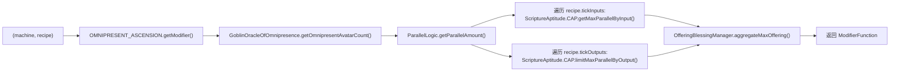
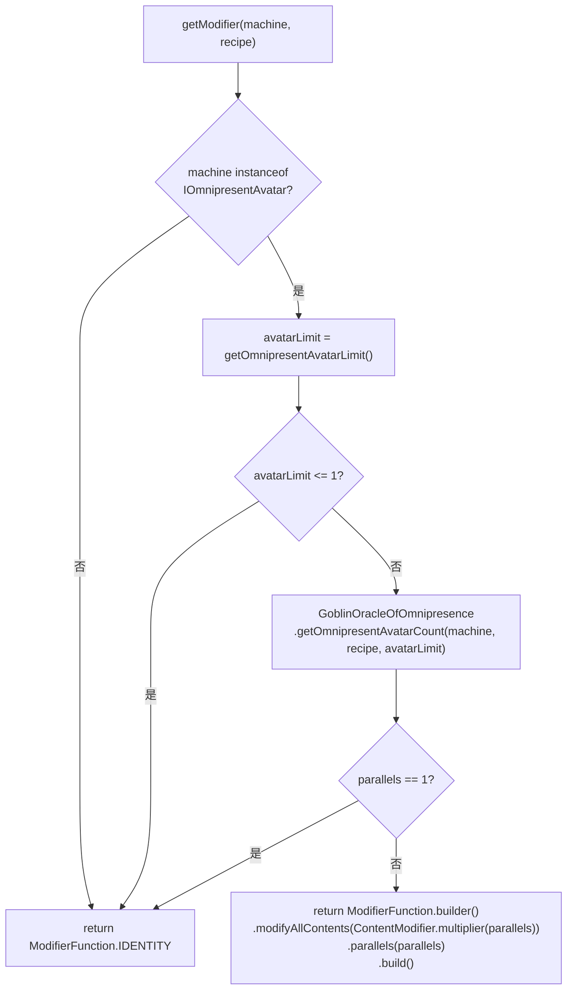
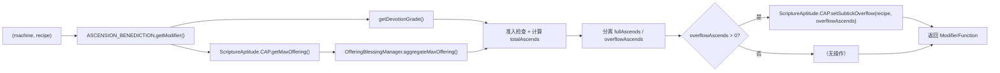
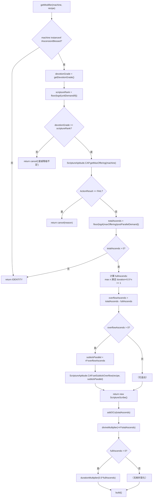
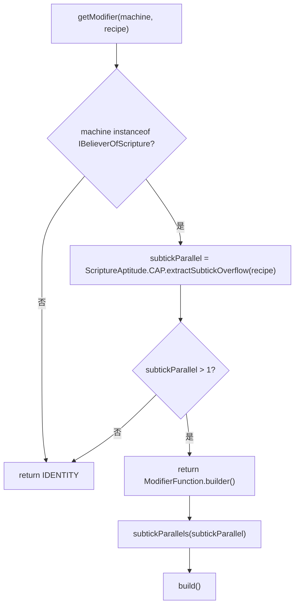
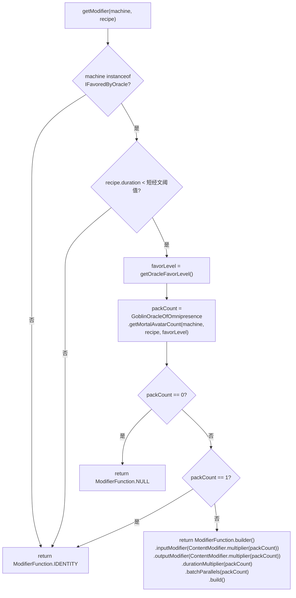
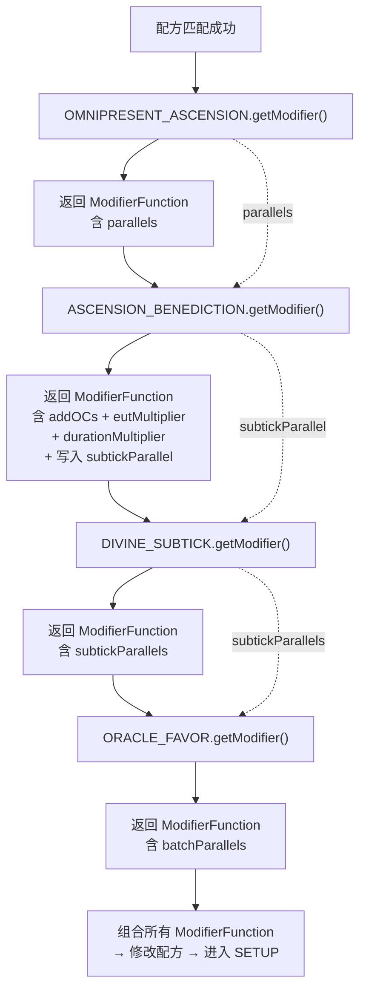

# Scripture Modifiers — 经文配方修改器

## 概述

经文系统在 **BAKE（烘焙）阶段** 提供四个核心配方修改器，用于调整并行数量和执行参数。每个修改器遵循 GTCEu 的 `RecipeModifier` 模式：

```java
@FunctionalInterface
public interface RecipeModifier {
    ModifierFunction getModifier(MetaMachine machine, GTRecipe recipe);
}
```

即：接收 `(machine, recipe)`，返回一个 `ModifierFunction`（`GTRecipe → GTRecipe` 的变换函数），由 `ModifierFunction.builder()` 构建。

**包路径**：`com.goblincoders.goblintech.api.recipe.modifier`

---

## 1. OMNIPRESENT_ASCENSION — 遍在化现

### 1.1 功能定位

`OMNIPRESENT_ASCENSION`（遍在化现）修改器负责计算机器的**并行副本数量**（化现数量），决定同一经文可同时执行的最大份数。类比 GTCEu 的 `PARALLEL_HATCH`。

### 1.2 调用链



### 1.3 准入条件

机器需实现 `IOmnipresentAvatar` 接口（继承自 `IAwakened`）：

```java
public interface IOmnipresentAvatar extends IAwakened {
    default int getOmnipresentAvatarLimit() { return 1; }
}
```

### 1.4 流程图



### 1.5 伪代码

```java
public static ModifierFunction omnipresentAscension(MetaMachine machine, GTRecipe recipe) {
    if (!(machine instanceof IOmnipresentAvatar avatar)) return ModifierFunction.IDENTITY;
    int avatarLimit = avatar.getOmnipresentAvatarLimit();
    if (avatarLimit <= 1) return ModifierFunction.IDENTITY;

    int parallels = GoblinOracleOfOmnipresence.getOmnipresentAvatarCount(machine, recipe, avatarLimit);
    if (parallels == 1) return ModifierFunction.IDENTITY;

    return ModifierFunction.builder()
            .modifyAllContents(ContentModifier.multiplier(parallels))
            .parallels(parallels)
            .build();
}
```

### 1.6 关键特性

| 特性 | 说明 |
|------|------|
| **化现上限** | 通过 `getOmnipresentAvatarLimit()` 限制最大并行数 |
| **祭品制约** | 通过 `ScriptureAptitude.CAP.getMaxParallelByInput()` 间接调用 `OfferingBlessingManager` |
| **GTCEu 集成** | 继承 `ParallelLogic`，融入标准并行计算管线 |
| **返回类型** | `ModifierFunction`（IDentity / builder） |

---

## 2. ASCENSION_BENEDICTION — 升腾祝福

### 2.1 功能定位

`ASCENSION_BENEDICTION`（升腾祝福）修改器在 BAKE 阶段基于机器的**虔诚等级**（DevotionGrade）和**祭品容量**计算升腾次数（超频等级）。

每次升腾固定消耗 **祭品 × 4**，但根据配方剩余时长分为两种模式：

| 模式 | 条件 | 效果 | 性质 |
|------|------|------|------|
| **完整升腾** | 升腾后 `duration × 0.5 >= 1` | `duration × 0.5` | 有损（时间折半） |
| **溢出升腾** | 升腾后 `duration × 0.5 < 1` | `吞吐量 × 4`（子Tick并行） | 无损（吞吐量翻四倍） |

类比 GTCEu 的 `ELECTRIC_OVERCLOCK`：完整升腾 ≈ 非完美超频，溢出升腾 ≈ 完美超频的子Tick补偿。

### 2.2 调用链



### 2.3 准入条件

机器需实现 `IAscensionBlessed` 接口（继承自 `IAwakened`）：

```java
public interface IAscensionBlessed extends IAwakened {
    default int getDevotionGrade() { return GoblinTechValues.ULV; }
}
```

**关键规则**：`devotionGrade >= scriptureRank` 是配方可执行的必要条件，否则返回 `ModifierFunction.cancel()`

### 2.4 流程图



### 2.5 伪代码

```java
public static ModifierFunction ascensionBenediction(MetaMachine machine, GTRecipe recipe) {
    if (!(machine instanceof IAscensionBlessed blessed)) return ModifierFunction.IDENTITY;

    int devotionGrade = blessed.getDevotionGrade();
    int scriptureRank = (int) Math.floor(Math.log(unitDemand / 8.0) / Math.log(4));

    // 准入门槛：虔诚等级必须 >= 经文等级
    if (devotionGrade < scriptureRank) {
        return ModifierFunction.cancel("虔诚等级不足: 需要等级 " + scriptureRank + ", 当前等级 " + devotionGrade);
    }

    ActionResult offeringResult = ScriptureAptitude.CAP.getMaxOffering(machine);
    if (offeringResult.isFail()) return ModifierFunction.cancel(offeringResult.getReason());

    long maxOffering = offeringResult.value();
    int totalAscends = (int) Math.floor(Math.log(maxOffering / (double) postParallelDemand) / Math.log(4));
    if (totalAscends <= 0) return ModifierFunction.IDENTITY;

    // 分离完整升腾和溢出升腾
    int fullAscends = Math.min(totalAscends, (int) (Math.log(recipe.duration) / Math.log(2)));
    int overflowAscends = totalAscends - fullAscends;

    // 构建 ModifierFunction — 使用 ScriptureScribe 替代 ModifierFunction.builder()
    var builder = new ScriptureScribe()
            .addOCs(totalAscends)
            .divineMultiplier(Math.pow(4, totalAscends));  // 每次升腾祭品消耗×4，仅改 Divine

    if (fullAscends > 0) {
        builder.durationMultiplier(Math.pow(0.5, fullAscends));
    }

    if (overflowAscends > 0) {
        int subtickParallel = (int) Math.pow(4, overflowAscends);
        ScriptureAptitude.CAP.setSubtickOverflow(recipe, subtickParallel);
        builder.subtickParallels(subtickParallel);
    }

    return builder.build();
}
```

> **关于祭品倍增方式**：`ScriptureScribe` 继承自 `ModifierFunction.FunctionBuilder`，用法完全一致，额外提供 `divineMultiplier()` 和 `powerMultiplier()` 便捷方法。`divineMultiplier()` 仅倍增 Divine 内容，不影响其他 tick 输入。
> ```java
> // 在 ScriptureAptitude 中
> public void multiplyContent(GTRecipe recipe, double multiplier) {
>     var contents = recipe.tickInputs.get(this);
>     if (contents != null) {
>         for (var content : contents) {
>             content.content = copyWithModifier(content.content, ContentModifier.multiplier(multiplier));
>         }
>     }
> }
> 
> // 在 ASCENSION_BENEDICTION 中使用
> // 替代 builder.tickInputModifier(...)
> ScriptureAptitude.CAP.multiplyContent(recipe, Math.pow(4, totalAscends));
> ```

> **性能备选方案**：当前 `Math.log` 和 `Math.pow` 均为 JVM intrinsic，JIT 后直接映射为 x86 FPU 指令（`FYL2X`、`F2XM1` 等），对 BAKE 阶段（非 tick 路径）已足够。若未来 profiling 显示此处为热点，可替换为：
> - `floor(log2(duration))` → `63 - Long.numberOfLeadingZeros(duration)`（x86 `BSR` 指令，~1 cycle）
> - `4^overflowAscends` → `1 << (2 * overflowAscends)`（位运算，~1 cycle，无内存访问）

### 2.6 升腾效果示例（duration = 12）

| totalAscends | fullAscends | overflowAscends | 祭品倍率 | 最终 duration | subtickParallel | 等效吞吐量 |
|:---:|:---:|:---:|:---:|:---:|:---:|:---:|
| 0 | 0 | 0 | ×1 | 12 | 1 | ×1 |
| 1 | 1 | 0 | ×4 | 6 | 1 | ×2 |
| 2 | 2 | 0 | ×16 | 3 | 1 | ×4 |
| 3 | 3 | 0 | ×64 | 1.5 | 1 | ×8 |
| 4 | 3 | 1 | ×256 | 1.5 | ×4 | ×32 |
| 5 | 3 | 2 | ×1024 | 1.5 | ×16 | ×128 |
| 6 | 3 | 3 | ×4096 | 1.5 | ×64 | ×512 |

**解释**（totalAscends=6）：
- 前 3 次完整升腾：12 → 6 → 3 → 1.5（每次耗时×0.5）
- 后 3 次溢出升腾：1.5 不变，每次吞吐量×4
- 最终：duration=1.5，subtickParallel=64，等效吞吐量 = 2^3 × 4^3 = 8 × 64 = 512

### 2.7 核心公式

```
// 完整升腾次数：duration × 0.5^n >= 1 → n <= log2(duration)
fullAscends = min(totalAscends, floor(log2(duration)))

// 溢出升腾次数
overflowAscends = totalAscends - fullAscends

// 子Tick并行度（每次溢出升腾吞吐量×4）
subtickParallel = 4^overflowAscends

// 最终 ModifierFunction
addOCs(totalAscends)
tickInputModifier(×4^totalAscends)        // 每次升腾祭品消耗×4
durationMultiplier(×0.5^fullAscends)      // 仅当 fullAscends > 0
subtickParallels(subtickParallel)         // 仅当 overflowAscends > 0
```

### 2.8 与 GTCEu ELECTRIC_OVERCLOCK 的对应关系

| 特性 | GTCEu ELECTRIC_OVERCLOCK | ASCENSION_BENEDICTION |
|------|--------------------------|----------------------|
| OC 等级 | `addOCs(n)` | `addOCs(totalAscends)` |
| 祭品倍率 | `tickInputModifier(×4^n)` | `tickInputModifier(×4^totalAscends)` |
| 耗时倍率 | ×0.5^OC（非完美） | ×0.5^fullAscends（仅完整升腾） |
| 子Tick补偿 | 自动处理（完美超频） | 溢出升腾 → subtickParallel = 4^overflowAscends |
| 等级限制 | 无 | 虔诚等级作为准入门槛 |

---

## 3. DIVINE_SUBTICK — 神圣子Tick

### 3.1 功能定位

`DIVINE_SUBTICK`（神圣子Tick）修改器读取 `ASCENSION_BENEDICTION` 存储的 `subtickParallel` 值，将其应用到配方上，实现**无损吞吐量补偿**。

当 `ASCENSION_BENEDICTION` 产生溢出升腾时，`subtickParallel = 4^overflowAscends` 被写入配方。DIVINE_SUBTICK 将其取出并应用。

### 3.2 调用链


### 3.3 准入条件

机器需实现 `IBelieverOfScripture` 接口。

### 3.4 流程图



### 3.5 伪代码

```java
public static ModifierFunction divineSubtick(MetaMachine machine, GTRecipe recipe) {
    if (!(machine instanceof IBelieverOfScripture)) return ModifierFunction.IDENTITY;

    int subtickParallel = ScriptureAptitude.CAP.extractSubtickOverflow(recipe);
    if (subtickParallel <= 1) return ModifierFunction.IDENTITY;

    return ModifierFunction.builder()
            .subtickParallels(subtickParallel)
            .build();
}
```

### 3.6 效果说明

| overflowAscends | subtickParallel | 实际效果 |
|:---:|:---:|------|
| 0 | 1 | 无变化 |
| 1 | 4 | 单Tick内完成 4 份配方 |
| 2 | 16 | 单Tick内完成 16 份配方 |
| 3 | 64 | 单Tick内完成 64 份配方 |
| n | 4^n | 单Tick内完成 4^n 份配方 |

### 3.7 设计意图

- **无损补偿**：溢出升腾不损失时间，通过子Tick并行实现 祭品×4 : 吞吐量×4 的完美比例
- **Batch 模式**：将多个小于 1 tick 的配方合并，使处理总时长回到 1 tick 以上
- **渐进加速**：溢出升腾越多，单Tick吞吐量呈 4^n 增长

---

## 4. ORACLE_FAVOR — 神谕恩惠

### 4.1 功能定位

`ORACLE_FAVOR`（神谕恩惠）修改器用于**打包短经文**，允许将多个快速完成的经文合并为一个批次执行，减少状态切换开销。类比 GTCEu 的 `BATCH_MODE`。

### 4.2 调用链


### 4.3 准入条件

机器需实现 `IFavoredByOracle` 接口（继承自 `IAwakened`）：

```java
public interface IFavoredByOracle extends IAwakened {
    int getOracleFavorLevel();
}
```

### 4.4 流程图



### 4.5 伪代码

```java
public static ModifierFunction oracleFavor(MetaMachine machine, GTRecipe recipe) {
    if (!(machine instanceof IFavoredByOracle favored)) return ModifierFunction.IDENTITY;
    if (recipe.duration >= SHORT_SCRIPTURE_THRESHOLD) return ModifierFunction.IDENTITY;

    int favorLevel = favored.getOracleFavorLevel();
    int packCount = GoblinOracleOfOmnipresence.getMortalAvatarCount(machine, recipe, favorLevel);

    if (packCount == 0) return ModifierFunction.NULL;
    if (packCount == 1) return ModifierFunction.IDENTITY;

    return ModifierFunction.builder()
            .inputModifier(ContentModifier.multiplier(packCount))
            .outputModifier(ContentModifier.multiplier(packCount))
            .durationMultiplier(packCount)
            .batchParallels(packCount)
            .build();
}
```

### 4.6 打包规则

| 条件 | 行为 |
|------|------|
| 经文 duration < 短经文阈值 | 尝试打包 |
| 恩惠等级 > 可打包数量 | 按容器容量决定打包数 |
| 容器容量不足 | 减少打包数量 |
| 非短经文 | 返回 IDENTITY |

### 4.7 设计意图

- **批量执行**：减少短经文的启动/结束开销
- **资源效率**：提高机器利用率，减少状态切换
- **神谕主题**：呼应 Divine 系统的神谕叙事设定

---

## 5. 四修改器协作关系

### 5.1 BAKE 阶段执行顺序



### 5.2 协作数据流图

```mermaid
flowchart LR
    subgraph INPUT["输入"]
        A["(machine, recipe)"]
    end
    
    subgraph MODIFIERS["修改器链（每个返回 ModifierFunction）"]
        direction TB
        OMNIP["OMNIPRESENT_ASCENSION"]
        ASC["ASCENSION_BENEDICTION"]
        SUB["DIVINE_SUBTICK"]
        ORACLE["ORACLE_FAVOR"]
        
        OMNIP -->|"ModifierFunction<br/>.parallels(n)"| ASC
        ASC -->|"ModifierFunction<br/>.addOCs(n) + .subtickParallels(n)"| SUB
        SUB -->|"ModifierFunction<br/>.subtickParallels(n)"| ORACLE
    end
    
    subgraph OUTPUT["返回"]
        B["组合后的 ModifierFunction"]
    end
    
    A --> OMNIP
    ORACLE --> B
```



### 5.3 能力依赖关系

| 修改器 | 依赖接口 | 依赖能力 |
|--------|---------|---------|
| `OMNIPRESENT_ASCENSION` | `IOmnipresentAvatar` | `ScriptureAptitude.CAP.getMaxParallelByInput()` |
| `ASCENSION_BENEDICTION` | `IAscensionBlessed` | `ScriptureAptitude.CAP.getMaxOffering()` |
| `DIVINE_SUBTICK` | `IBelieverOfScripture` | `ScriptureAptitude.CAP.extractSubtickOverflow()` |
| `ORACLE_FAVOR` | `IFavoredByOracle` | `GoblinOracleOfOmnipresence.getMortalAvatarCount()` |

### 5.4 数据流

```
OMNIPRESENT_ASCENSION ──> parallels ──> ASCENSION_BENEDICTION
                                              │
                                    ┌─────────┴──────────┐
                                    ▼                    ▼
                              fullAscends          overflowAscends
                              duration×0.5^n       subtickParallel=4^n
                                    │                    │
                                    ▼                    ▼
                              DIVINE_SUBTICK ◄──────────┘
                                    │
                                    ▼
                              subtickParallels
                                    │
                                    ▼
                              ORACLE_FAVOR
                                    │
                                    ▼
                              batchParallels
```

---

## 6. 与 ScriptureAptitude 的交互

所有修改器均通过 `ScriptureAptitude.CAP` 间接访问 `OfferingBlessingManager`，确保接口一致性：

| 修改器 | ScriptureAptitude 方法 | 用途 |
|--------|------------------------|------|
| `OMNIPRESENT_ASCENSION` | `getMaxParallelByInput()` | 计算并行限制 |
| `ASCENSION_BENEDICTION` | `getMaxOffering()` | 获取祭品容量 |
| `ASCENSION_BENEDICTION` | `setSubtickOverflow()` | 存储 subtickParallel |
| `DIVINE_SUBTICK` | `extractSubtickOverflow()` | 读取 subtickParallel |

---

## 7. 修改器与机器的对应关系

修改器不由配方 JSON 声明，而是由**机器实现的接口**自动决定：

| 修改器 | 触发条件 | 机器接口 |
|--------|---------|---------|
| `OMNIPRESENT_ASCENSION` | 机器实现 `IOmnipresentAvatar` 且 `avatarLimit > 1` | `IOmnipresentAvatar extends IAwakened` |
| `ASCENSION_BENEDICTION` | 机器实现 `IAscensionBlessed` 且 `devotionGrade >= scriptureRank` | `IAscensionBlessed extends IAwakened` |
| `DIVINE_SUBTICK` | 机器实现 `IBelieverOfScripture` 且 `subtickParallel > 1` | `IBelieverOfScripture` |
| `ORACLE_FAVOR` | 机器实现 `IFavoredByOracle` 且 `duration < 短经文阈值` | `IFavoredByOracle extends IAwakened` |

配方 JSON 只需声明 Divine 的 tick 输入/输出：

```json
{
  "tickInputs": { "divine": [32] },
  "tickOutputs": { "divine": [16] },
  "duration": 12
}
```

机器在 BAKE 阶段自动遍历已注册的修改器列表，根据机器实现的接口决定哪些修改器生效。

修改器按固定顺序执行，后序修改器可基于前序结果进行调整：

1. **OMNIPRESENT_ASCENSION** — 基础并行计算
2. **ASCENSION_BENEDICTION** — 升腾放大（含完整/溢出分离）
3. **DIVINE_SUBTICK** — 子Tick补偿
4. **ORACLE_FAVOR** — 批量打包

---

## 8. 关键术语对照

| 术语 | 英文 | 含义 |
|------|------|------|
| 化现数量 | Avatar Count | 并行副本数上限 |
| 完整升腾 | Full Ascend | duration ≥ 1，耗时×0.5 |
| 溢出升腾 | Overflow Ascend | duration < 1，吞吐量×4 |
| 子Tick并行 | Subtick Parallel | 单Tick内完成多份配方 |
| 神谕恩惠 | Oracle Favor | 短经文打包能力 |
| 虔诚等级 | Devotion Grade | 机器神圣等级（准入门槛） |
| 修改器函数 | ModifierFunction | GTRecipe → GTRecipe 变换 |
| 身份函数 | IDENTITY | 不做任何修改，透传 |
| 空函数 | NULL | 取消配方 |

---

## 9. Power 资源体系

### 9.1 问题

当前 `ASCENSION_BENEDICTION` 使用 `tickInputModifier` 倍增 Divine 内容，但该修饰器会作用于**所有非 EU 的 tick 输入**。若配方中 Divine 与其他非 EU tick 输入共存，就会误伤。

而 `eutMultiplier` 又只认 EU 槽位，不适用于独立的 `ScriptureAptitude.CAP`。

### 9.2 方案：ScriptureScribe

继承 `ModifierFunction.FunctionBuilder`，命名为 **`ScriptureScribe`**（经文抄写员——抄写即构建修改器）：

```java
/**
 * 经文抄写员 — 神圣修改器建造者。
 * 在标准 FunctionBuilder 基础上，新增便捷方法：
 * - divineMultiplier()：仅倍增 Divine 内容
 * - powerMultiplier()：倍增所有已注册的 Power 资源（对标 eutMultiplier）
 */
public class ScriptureScribe extends ModifierFunction.FunctionBuilder {

    private ContentModifier divineModifier = ContentModifier.IDENTITY;

    /** 仅倍增 Divine 内容，不影响其他 tick 输入 */
    public ScriptureScribe divineMultiplier(double multiplier) {
        this.divineModifier = ContentModifier.multiplier(multiplier);
        return this;
    }

    /**
     * 倍增所有已注册的 Power 资源（EU + Divine + 其他）。
     * 对标原版 eutMultiplier，但作用于 DivinePowerRegistry 中所有能力。
     */
    public ScriptureScribe powerMultiplier(double multiplier) {
        var cm = ContentModifier.multiplier(multiplier);
        for (var cap : DivinePowerRegistry.INSTANCE.all()) {
            perPowerModifiers.put(cap, cm);
        }
        return this;
    }

    @Override
    public ModifierFunction build() {
        var parent = super.build();
        if (divineModifier == ContentModifier.IDENTITY && perPowerModifiers.isEmpty()) return parent;

        return recipe -> {
            var result = parent.apply(recipe);
            if (result == null) return null;
            if (divineModifier != ContentModifier.IDENTITY) {
                ScriptureAptitude.CAP.multiplyContent(result, divineModifier);
            }
            for (var entry : perPowerModifiers.entrySet()) {
                var cap = entry.getKey();
                var modifier = entry.getValue();
                // 对每个 Power 资源单独倍增
                var contents = result.tickInputs.get(cap);
                if (contents != null) {
                    for (var content : contents) {
                        content.content = cap.copyWithModifier(content.content, modifier);
                    }
                }
            }
            return result;
        };
    }

    // 存储按能力类型区分的 Power 倍率
    private final Map<RecipeCapability<?>, ContentModifier> perPowerModifiers = new HashMap<>();
}
```

### 9.3 Power 枚举注册表

不引入标记接口，改用**枚举注册表**统一管理"能量型资源"：

```java
/**
 * 神圣之力注册表 — 标识哪些 RecipeCapability 属于"每 tick 能量型资源"。
 * 默认包含 EURecipeCapability.CAP，其他能力可通过 register() 加入。
 * 
 * 用于改造 ModifierFunction.FunctionBuilder.build() 中的 applyAllButEU，
 * 将其替换为 applyAllButPower()，排除所有已注册的 Power 能力。
 */
public enum DivinePowerRegistry {
    INSTANCE;

    private final Set<RecipeCapability<?>> powers = new HashSet<>();

    DivinePowerRegistry() {
        // 默认注册 EU
        powers.add(EURecipeCapability.CAP);
    }

    /** 注册一个能力为 Power 资源 */
    public void register(RecipeCapability<?> cap) {
        powers.add(cap);
    }

    /** 判断指定能力是否为 Power 资源 */
    public boolean isPower(RecipeCapability<?> cap) {
        return powers.contains(cap);
    }

    /** 获取所有已注册的 Power 能力 */
    public Set<RecipeCapability<?>> all() {
        return Collections.unmodifiableSet(powers);
    }
}
```

对应修改 `ModifierFunction.FunctionBuilder.build()`：

```java
// 原：applyAllButEU(tickInputModifier, recipe.tickInputs)
// 改：排除所有已注册的 Power 能力
private Map<RecipeCapability<?>, ContentModifier> perPowerModifiers = new HashMap<>();

public FunctionBuilder powerMultiplier(RecipeCapability<?> cap, double multiplier) {
    perPowerModifiers.put(cap, ContentModifier.multiplier(multiplier));
    return this;
}
```

`applyAllButPower` 的实现逻辑：

```java
private Map<RecipeCapability<?>, List<Content>> applyAllButPower(
        ContentModifier modifier,
        Map<RecipeCapability<?>, List<Content>> contents) {
    if (modifier == ContentModifier.IDENTITY) return contents;
    var result = new HashMap<>(contents);
    for (var entry : result.entrySet()) {
        // 跳过所有已注册的 Power 资源
        if (DivinePowerRegistry.INSTANCE.isPower(entry.getKey())) continue;
        entry.setValue(modifier.applyContents(entry.getValue()));
    }
    return result;
}
```

### 9.4 使用方式
 
 ```java
 // ASCENSION_BENEDICTION 中
 new ScriptureScribe()
     .addOCs(totalAscends)
     .divineMultiplier(Math.pow(4, totalAscends))  // 仅改 Divine
     .durationMultiplier(Math.pow(0.5, fullAscends))
     .subtickParallels(subtickParallel)
     .build();
 
 // 或通过 powerMultiplier 统一倍增所有 Power 资源（对标 eutMultiplier）
 new ScriptureScribe()
     .addOCs(totalAscends)
     .powerMultiplier(Math.pow(4, totalAscends))   // 同时倍增 EU + Divine
     .durationMultiplier(Math.pow(0.5, fullAscends))
     .subtickParallels(subtickParallel)
     .build();
 
 // 或通过 Power 注册表精确控制
 builder()
     .addOCs(totalAscends)
     .powerMultiplier(ScriptureAptitude.CAP, Math.pow(4, totalAscends))  // 仅改 Divine
     .powerMultiplier(EURecipeCapability.CAP, 2.0)                        // 也改 EU
     .build();
 ```

### 9.5 注册扩展

其他 Mod 可通过 `DivinePowerRegistry.INSTANCE.register(cap)` 将自己的能力注册为 Power 资源，自动获得 `applyAllButPower` 排除和 `powerMultiplier` 支持：

```java
// 在 Mod 构造阶段
DivinePowerRegistry.INSTANCE.register(MyModCustomPower.CAP);
```

### 9.6 计划状态

**正式计划**，优先级中等。误伤问题是实际存在的隐患——只要出现 Divine 与其他非 EU tick 输入共存的配方，当前 `tickInputModifier` 方案就会出问题。

实施步骤：
1. 实现 `DivinePowerRegistry` 枚举注册表
2. 在 `ScriptureAptitude` 构造/注册阶段调用 `DivinePowerRegistry.INSTANCE.register(ScriptureAptitude.CAP)`
3. 改造 `ModifierFunction.FunctionBuilder.build()` 中的 `applyAllButEU` → `applyAllButPower`
4. 实现 `ScriptureScribe` 作为备选 Builder
